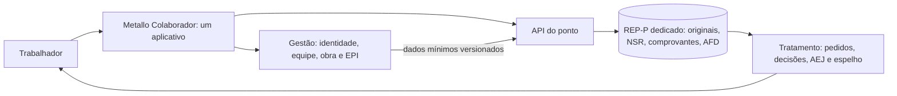

# Marco 0 — diagnóstico e arquitetura do Metallo Colaborador / REP-P

**Estado vigente — 27/09/2026:** Marco0 fechado tecnicamente; Marco1A/T05/T15 concluídos e auditados estritamente em laboratório (base682/682); **MARCO 1B — FUNCIONAL EM LABORATÓRIO**, com interface aprovada e fechamento expressamente autorizado pelo responsável. Decisão, baseline e pendências no [relatório27](27_PREVIA_VISUAL_COLABORADOR_MARCO_1B.md). **NÃO IMPLANTADO NO SUPABASE REMOTO; NÃO LIBERADO PARA FUNCIONÁRIOS REAIS; NÃO É PRODUÇÃO, PONTO OFICIAL OU REP-P; NÃO AUTORIZA PUBLICAÇÃO.** Os estados/contagens inferiores deste documento são históricos, salvo seção explicitamente vigente.

**Estado:** proposta de arquitetura, sem implementação de ponto. **Levantamento:** 25/09/2026. **Nomes:** provisórios. Este documento não atesta conformidade legal nem autoriza uso oficial.

**Continuação técnica em 25/09/2026:** a fundação de identidade foi preparada/testada **apenas localmente**; o relatório de [pendências do Marco 0](23_FECHAMENTO_PENDENCIAS_MARCO_0.md) registra o que foi resolvido e o que ainda impede ativar o colaborador. O [Marco 1A](19_IDENTIDADE_COLABORADOR_MARCO_1A.md), a [reconciliação](20_RECONCILIACAO_MIGRATIONS_E_TIPOS.md), a [auditoria das RPCs](21_AUDITORIA_SECURITY_DEFINER.md), o [plano de recuperação](PLANO_DE_BACKUP_E_RECUPERACAO.md) e o [roadmap revisado](22_AMBIENTE_REP_P_E_ROADMAP.md) complementam este diagnóstico sem alterá-lo retroativamente.

## Em linguagem simples

O Metallo Gestão já tem estruturas para equipes, obras e funcionários cadastrados para EPI. **O projeto ainda não é usado pela empresa em sua operação.** Segundo o responsável, **todos os dados atuais** — inclusive históricos, movimentações, entregas e relatórios de EPI — foram criados para testes. Os 10 registros de funcionários são de teste; os 3 perfis são contas usadas pela administração para testar. O banco ainda não sabe, de forma confiável, qual conta de login pertence a cada funcionário. Por isso, o aplicativo do colaborador pode ser planejado, mas não deve registrar ponto nem mostrar dados individuais antes de resolver essa ligação e testar as regras de acesso. O REP-P será um núcleo separado, dedicado às marcações originais; correções ficarão em um programa de tratamento separado.

As setas são proposta, não integração existente. O aplicativo pode reunir serviços; o REP-P conserva seu domínio e suas credenciais separados.

## Como o diagnóstico foi feito

Leitura do repositório e documentação; consulta **somente de metadados** ao projeto Supabase conectado (esquema, políticas, migrações, buckets e avisos); contagem agregada das cinco entidades centrais. Não houve leitura de nomes/CPF, alteração de dados, migração, criação de projeto, teste automatizado ou publicação. A árvore local já continha mudanças de outro trabalho, preservadas aqui.

O projeto remoto conectado se chama **Almoxarifado Online**, está ativo em `sa-east-1` e usa PostgreSQL 17.6. É um ambiente de desenvolvimento/testes, **não uma operação em uso pela empresa**. O histórico remoto lista migrações desde 31/08/2026 até `20260912073518_site_operations`; o histórico local começa depois e não representa integralmente o remoto, conforme [referência do banco](08_REFERENCIAS_TECNICAS/database.md). Existe uma migração local não rastreada `20260912190000_unify_existing_operations.sql`; ela **não consta** na lista remota consultada. Não presumir que código ou esquema local não aplicado existe no projeto conectado.

## O que existe e pode ser reaproveitado

| Parte | Estado observado | Reuso seguro / limite |
| --- | --- | --- |
| Web | Next.js para gestão, com sessão no servidor, ações e repositórios; `01_WEB/03_FUNCOES_E_LOGICA/Autenticacao/session.ts:7-45` | Reusar padrões de autenticação e validação; não expor telas de gestão como portal pessoal. |
| Mobile | Flutter operacional, login Supabase; `02_MOBILE/lib/main.dart:9`, `02_MOBILE/lib/06_ACESSO_A_DADOS/auth_repository.dart:16-20` | Reusar infraestrutura e componentes após definir fronteira de identidade; novo acesso do trabalhador deve ser próprio. |
| Auth | `auth.users` ligado a `public.profiles.id`; criação administrativa via Edge Function `create-employee` gera conta e perfil, não `epi_employees`; `04_BANCO_E_SUPABASE/supabase/functions/create-employee/index.ts:39-50,97-139` | Pode autenticar, mas exige vínculo explícito e auditado com funcionário. Nome ou equipe não são chave segura. |
| Funcionários | `public.epi_employees`: UUID, nome, matrícula opcional, profissão, equipe, tamanhos, status e datas de ASO; `04_BANCO_E_SUPABASE/supabase/migrations/20260902231312_epi_management.sql:4-22` | É a entidade de funcionário existente. Evitar segundo cadastro de pessoa; ampliar com cuidado ou criar vínculo de identidade. Não misturar datas de saúde no portal geral. |
| Equipes e obras | `teams.worksite_id`, `worksites` e `employee_assignments`; `04_BANCO_E_SUPABASE/supabase/migrations/20260912073518_site_operations.sql:4-45` | Reusar IDs e atribuições com histórico. `worksites` ainda não contém coordenadas/cerca geográfica. |
| EPI | Entregas, solicitações e confirmações referenciam `epi_employees.id`; `04_BANCO_E_SUPABASE/supabase/migrations/20260902231312_epi_management.sql:55-94` | Dados úteis para “Meus EPIs”, após política de leitura própria e revisão das evidências. |
| Banco e RLS | 30 tabelas `public` consultadas com RLS ligado; políticas atuais são operacionais | RLS ativo não equivale a isolamento individual. Regras pessoais novas precisam de revisão e teste dedicado. |
| Storage | **0 buckets** no projeto conectado | Criar buckets privados apenas quando houver finalidade e política; não presumir armazenamento atual de documentos/comprovantes. |
| Testes | Web em `01_WEB/10_TESTES`, Mobile em `02_MOBILE/test`, banco/qualidade em `06_TESTES_E_QUALIDADE` | Há base de testes, mas não suíte REP-P. Nenhuma foi executada neste marco, conforme a preferência do projeto. |

Contagens agregadas da consulta remota: **3 perfis** (2 com papel `admin` e 1 com papel `leader`), **10 funcionários de EPI**, **5 equipes**, **1 obra**, **0 atribuições temporárias**. O responsável pelo projeto esclareceu que os 10 cadastros são de teste e os 3 perfis são usados pela administração para testar. Esses números não indicam trabalhadores reais habilitados no aplicativo nem representam uma base pronta para ponto oficial.

## Achados que impedem avançar diretamente ao ponto

São impedimentos para **futura ativação com empregados reais**. No estado atual, os registros existentes são testes e não constituem marcações ou históricos trabalhistas oficiais.

1. **Identidade sem ligação:** não há chave estrangeira ou tabela de associação entre `profiles.id` e `epi_employees.id`. `epi_employees.created_by` identifica quem cadastrou, não a conta do empregado. Precisa de ligação 1:1 verificada, com ativação, desligamento e trilha de quem confirmou.
2. **Leitura ampla de perfis:** `profiles_read` permite que qualquer usuário ativo leia todos os perfis. `teams_read` e `works_read` dão leitura de equipes/obras a todos os ativos. Isso pode servir à gestão atual, mas contradiz o objetivo do colaborador de ver apenas seus dados. A consulta não demonstrou vazamento de ponto, pois não existe ponto; mostrou uma política inadequada para reutilização direta.
3. **EPI sem leitura pessoal:** as políticas de `epi_employees`, `epi_deliveries` e `epi_requests` usam `can_operate('epi:write', ...)`, não titularidade do empregado. Um app de trabalhador não deve contornar isso com chave de serviço no cliente.
4. **Dados e cadastros insuficientes para REP-P:** não há tabelas de marcação, NSR, ARP, comprovantes, tratamento, jornada, estabelecimento/CPF do trabalhador ou geofence no esquema observado. `registration_code` é opcional; validar identificação exigida com DP.
5. **Superfície privilegiada já existente:** o advisor do Supabase sinalizou 34 funções `SECURITY DEFINER` executáveis por `authenticated`. A [documentação de segurança atual](08_REFERENCIAS_TECNICAS/security.md) explica que diversas RPCs são intencionais e checam acesso internamente; a lista não prova vulnerabilidade. O novo REP-P não deve herdar essa superfície. Revisão específica das funções continua necessária. O advisor também sinalizou proteção contra senhas vazadas desativada e 3 tabelas de snapshots em schemas separados com RLS sem política ([aviso 0029](https://supabase.com/docs/guides/database/database-linter?lint=0029_authenticated_security_definer_function_executable), [aviso 0008](https://supabase.com/docs/guides/database/database-linter?lint=0008_rls_enabled_no_policy)).
6. **Recuperação não demonstrada:** o documento local de backup trata de uma cópia de código anterior, não de restauração testada do Supabase, e [backups do banco não incluem objetos do Storage](https://supabase.com/docs/guides/platform/backups). Exigir plano e ensaio de restauração do banco **e** dos arquivos antes de uso oficial.
7. **Tipos locais incompletos para obras:** o arquivo `03_COMPARTILHADO/01_TIPOS/src/database.ts` no estado local consultado não declara `worksites`, `employee_assignments` nem `site_operation_receipts`, embora essas tabelas existam no remoto. Regenerar tipos somente após reconciliar esquema e ambiente, sem sobrescrever mudanças locais de outro trabalho.

## Arquitetura proposta

**Gestão:** fonte operacional de perfil, funcionário, equipe, obra e EPI. Uma associação `employee_identity` (nome técnico provisório) ligará `auth.users.id` a `epi_employees.id`, com unicidade dos dois lados, período de vigência, responsável pela verificação e evento de auditoria. Não ligar automaticamente por nome, email ou equipe. Matrícula/CPF devem ser validados por DP, com minimização e sem copiá-los à interface sem necessidade.

**Colaborador:** um app com módulos independentes. Primeira etapa: login e início com conteúdo de demonstração ou dados próprios autorizados. “Meu Ponto” terá selo **AMBIENTE DE TESTE** até o checklist legal completo. EPI, documentos e contracheques entram depois, cada qual com finalidade, RLS e Storage próprios.

**REP-P:** preferir projeto Supabase dedicado, com migrations, credenciais, backup, logs e Storage separados. Nenhum cliente recebe `service_role` nem grava diretamente em originais. Uma API controlada autentica a sessão operacional, resolve associação ativa no servidor, aplica idempotência e encaminha somente o necessário. O REP-P mantém uma fotografia versionada dos atributos usados na marcação (empregador/estabelecimento, trabalhador, vínculo, coletor) e registra a origem/sincronização. Não depender da alteração futura de um cadastro operacional para reescrever uma prova antiga. O programa de tratamento consome originais somente para leitura e acrescenta solicitações/decisões com autoria e motivo.

**Invariantes propostos:** horário recebido do serviço confiável, não do relógio do aparelho; NSR transacional no escopo legal confirmado; originais sem `UPDATE/DELETE` para papéis de app, gestão e tratamento; separação de funções; recibo e exportações reproduzíveis; logs sem segredos; revisão humana de anomalias. Superusuários de infraestrutura ainda podem afetar dados: exigir segregação operacional, backups independentes e verificação externa de integridade. Hash sozinho não fornece autoria nem impede alteração por quem pode recalculá-lo.

### Auth, RLS e Storage antes do código

| Operação | Regra-alvo |
| --- | --- |
| Entrar | Conta pessoal ativa, vínculo único verificado; MFA administrativo e política de sessões a definir; desligamento revoga acesso e mantém registros legais. |
| Consultar dados próprios | `auth.uid()` resolve a associação ativa; políticas por `employee_id`; visões/DTOs mínimos para evitar ASO e dados de colegas. `TO authenticated` sozinho não basta. |
| Marcar teste | Só API autenticada e ambiente isolado, trabalhador vinculado; gravação com idempotência, tempo de servidor e evidência de localização apenas no evento. Se localização falhar, registrar condição para revisão, conforme política aprovada. |
| Corrigir | Trabalhador solicita; aprovador distinto decide; original permanece. O tratamento não tem permissão de escrita no armazenamento original. |
| Administrar/Auditar | Papéis separados e acessos temporários auditados. A conta administrativa operacional não recebe poder de editar originais. |
| Guardar arquivos | Buckets privados separados por finalidade; políticas por titular/papel; URL temporária e verificações server side; retenção e backup de objetos definidos. |

As políticas atuais têm semântica operacional: não substituí-las globalmente sem mapear impacto na Gestão. Planejar novas políticas e consultas mínimas, depois verificar com identidades de dois empregados, gestor e conta revogada em ambiente isolado. A [documentação do Supabase](https://supabase.com/docs/guides/database/postgres/row-level-security) será consultada novamente na implementação.

### Escolha do ambiente REP-P

1. Levantar organização/plano, custos de projeto e branches, região disponível, DPA/subprocessadores, transferência internacional, backup e SLA. **Nenhum recurso pago foi criado.** Branch do Supabase pode copiar esquema e funções e nasce sem dados por padrão; revisar esse comportamento e o custo antes de usar ([documentação](https://supabase.com/docs/guides/deployment/branching)).
2. Reconciliar histórico remoto/local; obter exportação e plano de rollback antes de qualquer migration no projeto remoto de testes. Não usar reset, replay cego ou `db push` nesse ambiente compartilhado.
3. Para desenvolvimento inicial, usar dados sintéticos e projeto/instância isolada. Os cadastros atuais de teste não devem ser confundidos com identidade laboral validada. Não registrar batidas reais como teste.
4. Comparar projeto dedicado com isolamento por schema no mesmo projeto. O projeto dedicado é a hipótese preferida pela separação de chaves, credenciais, migrations e recuperação. A decisão final depende de custo, contrato, operação e ensaio de recuperação.

## Roadmap e pontos de decisão

O [roadmap revisado](22_AMBIENTE_REP_P_E_ROADMAP.md) divide o antigo Marco 1 em **1A (identidade e isolamento)** e **1B (app base)**, acrescenta Marco 6 (conformidade final) e mantém a liberação dependente de decisão formal. A tabela abaixo registra a proposta original do Marco 0.

| Marco | Entrega verificável | Condição para seguir |
| --- | --- | --- |
| 0 — diagnóstico | Este documento, [inventário e riscos](REGISTRO_DE_RISCOS_JURIDICOS.md), [matriz](MATRIZ_DE_CONFORMIDADE_REP_P.md) e modelo de ameaças | Revisão da arquitetura por DP, jurídico e privacidade; resolver dúvidas de identidade e ambiente. |
| 1 — identidade | Associação conta–funcionário auditada, login pessoal e Home local com selo de teste | Dois empregados não conseguem ler dados um do outro; revisão de RLS; prévia local aprovada antes de publicar. |
| 2 — marcação experimental | API e esquema isolados, marcação sintética com idempotência e histórico próprio | Ensaios direcionados autorizados; sem pretensão de REP-P oficial. |
| 3 — núcleo REP-P | Originais, NSR, ARP, comprovantes, AFD, assinatura e recuperação | Leiautes atuais, concorrência, evidências e auditorias independentes. |
| 4 — tratamento | Solicitações, decisões, AEJ e Espelho | Regras por CCT/ACT e validação DP/jurídico. |
| 5 — Colaborador ampliado | EPI próprio, solicitações, documentos, contracheques e treinamentos | Política de dados, Storage e evidência própria por módulo. |
| Liberação oficial | Checklist regulatório, testes e revisões humanas completos | Decisão formal da empresa; só então retirar “AMBIENTE DE TESTE”. |

**Ciclo atualizado pelo responsável nesta continuação:** desenvolver → testes automáticos e de segurança → prévia local de interface → pacote de revisão → SuperGrok sem escrita → conferir críticas → corrigir → testar novamente → fechar. O [pacote de revisão do Marco 0](18_PACOTE_REVISAO_MARCO_0.md) contém materiais, pendências e prompt de auditoria; nenhuma auditoria SuperGrok foi executada aqui.

## Fontes oficiais e manutenção regulatória

Base consultada em 25/09/2026: [Portaria 671 compilada em 07/01/2026](https://www.gov.br/trabalho-e-emprego/pt-br/assuntos/legislacao/portarias-1/portarias-vigentes-3/PDFPortarian671de8denovembrode2021compilada07.01.2026.pdf), [página REP do MTE](https://www.gov.br/trabalho-e-emprego/pt-br/assuntos/inspecao-do-trabalho/fiscalizacao-do-trabalho/rep), [perguntas e respostas do MTE](https://www.gov.br/trabalho-e-emprego/pt-br/assuntos/inspecao-do-trabalho/fiscalizacao-do-trabalho/Perguntas%20e%20Respostas%20REP), [leiaute AFD](https://www.gov.br/trabalho-e-emprego/pt-br/assuntos/inspecao-do-trabalho/fiscalizacao-do-trabalho/leiaute-do-arquivo-fonte-de-dados-afd.pdf), [leiaute AEJ](https://www.gov.br/trabalho-e-emprego/pt-br/assuntos/inspecao-do-trabalho/fiscalizacao-do-trabalho/leiaute-do-arquivo-eletronico-de-jornada-aej.pdf), [LGPD](https://www.planalto.gov.br/ccivil_03/_ato2015-2018/2018/lei/l13709compilado.htm), [Marco Civil](https://www.planalto.gov.br/ccivil_03/_ato2011-2014/2014/lei/l12965.htm) e [ANPD](https://www.gov.br/anpd/pt-br/canais_atendimento/agente-de-tratamento/relatorio-de-impacto-a-protecao-de-dados-pessoais-ripd). Antes de implementar leiaute, assinatura ou cálculo, confirmar novamente a versão oficial e registrar data/versão na matriz.

**Revisões humanas:** advogado trabalhista (REP-P, CCT/ACT, retenção, correção), DP/contabilidade (identidade e jornada), SST (EPI/ASO), privacidade/segurança (LGPD, RIPD, localização, contratos e incidentes). Nenhum item está aprovado por essas áreas neste marco.
