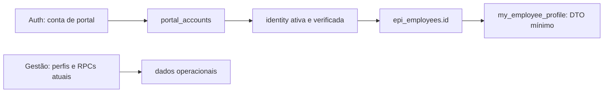

# Marco 1A — identidade pessoal em laboratório

**Estado vigente — 27/09/2026:** Marco0 fechado tecnicamente; Marco1A/T05/T15 concluídos e auditados estritamente em laboratório (base682/682); **MARCO 1B — FUNCIONAL EM LABORATÓRIO**, com interface aprovada e fechamento expressamente autorizado pelo responsável. Decisão, baseline e pendências no [relatório27](27_PREVIA_VISUAL_COLABORADOR_MARCO_1B.md). **NÃO IMPLANTADO NO SUPABASE REMOTO; NÃO LIBERADO PARA FUNCIONÁRIOS REAIS; NÃO É PRODUÇÃO, PONTO OFICIAL OU REP-P; NÃO AUTORIZA PUBLICAÇÃO.** Os estados/contagens inferiores deste documento são históricos, salvo seção explicitamente vigente.

**SUPERADA EM 26/09/2026 PELA DECISÃO DE EQUIPE OPCIONAL:** a regra histórica que escondia o DTO pela equipe inativa. DTO próprio permanece com team_name=null; revogação pessoal/funcionário inativo continuam negando. Na Gestão, NULL não amplia autorização; can_operate global inalterada, correção específica de policies/escrita na migration20260926224000.

## Fronteira escolhida

O papel `profiles.role='collaborator'` continua pertencendo à Gestão. O futuro acesso pessoal exige conta Auth provisionada por **fluxo servidor dedicado**, marcada em `auth.users.raw_app_meta_data.metallo_account_type='employee_portal'`, registrada em `private.employee_portal_accounts` e ligada por `private.employee_identity` a um `epi_employees.id`. O marcador é requisito de provisionamento, **não autorização suficiente**; o banco consulta `auth.uid()` e estado atual do vínculo em cada leitura. `create-employee` não provisiona essas contas. A tabela de contas é marcador de fronteira, não novo cadastro de funcionário.

A migration local [20260925120000_employee_identity_foundation.sql](../04_BANCO_E_SUPABASE/supabase/migrations/20260925120000_employee_identity_foundation.sql) mantém perfil de Gestão da conta pessoal **inativo**. Um trigger impede ativá-lo depois do registro no portal, inclusive por caminho privilegiado. Assim `private.is_active_user()` e políticas de leitura da Gestão não abrem o catálogo para essa conta. `public.stock_team` e `public.employee_work_team`, antes consultáveis com IDs arbitrários por `authenticated`, retornam vazio para conta de portal, preservando o comportamento de Gestão. A execução por `authenticated` continua no catálogo; a guarda explícita é a fronteira local a testar novamente no ambiente fiel.

## Associação e leitura

Somente administrador **ativo** chama `admin_register_portal_account`, `admin_link_employee_identity` e `admin_revoke_employee_identity`. O vínculo exige UUID interno do funcionário, nome exato e matrícula/identificador empresarial confirmados pelo operador, além do método `in_person` ou `hr_record`. Isso registra a conferência, não comprova independentemente o ato do DP. CPF não entra no DTO nem no vínculo. Para alto risco/homônimos, estudar dupla confirmação do DP. Uma conta só pode pertencer a uma pessoa historicamente (`auth_user_id unique`); um funcionário tem no máximo uma identidade ativa (índice parcial). Ao recontratar, a escolha entre reativar identidade antiga ou criar nova conta **permanece decisão formal pendente**. O SQL atual não reativa nem reaproveita conta revogada.

`my_employee_profile()` não recebe `employee_id`; deriva a pessoa de `auth.uid()` → conta do portal → vínculo ativo → funcionário ativo. Retorna somente `employee_id`, `full_name`, `profession`, `team_name`; ASO, CPF, tamanhos, notas e cadastro completo não entram. `epi_employees` e tabelas privadas continuam sem leitura direta do portal; nenhuma API pessoal de EPI foi criada. **Decisão de produto aprovada em 26/09/2026:** funcionário ativo com identidade/vínculo pessoal ativo mantém acesso ao portal sem equipe. Equipe inativa, ausente ou removida produz `team_name=null`, apresentado como **Sem equipe atribuída**. Não altera identidade, login ou auditoria. A revogação pessoal e o funcionário inativo continuam negando o DTO.

**RLS pessoal nesta etapa:** as três tabelas privadas têm RLS habilitado, nenhuma policy permissiva e nenhum grant de tabela ao cliente. As tabelas operacionais mantêm as policies da Gestão, mas o perfil da conta portal fica inativo, impedindo sua leitura operacional. O único caminho pessoal positivo é a RPC `SECURITY DEFINER` de DTO, que verifica titularidade e estado no banco. Isso precisa de inventário completo de todas as rotas no PostgREST antes de abrir o app; uma policy ampla de `SELECT` em `epi_employees` seria indevida porque a tabela contém ASO.

## Revogação e sessões

O fluxo local servidor já implementado chama primeiro `admin_revoke_employee_identity`, que revoga o vínculo e grava auditoria, e depois aplica ban Auth. O estado atual no banco bloqueia o DTO mesmo para access token ainda aceito pelo gateway. A prova real cobre resposta 502 após falha de transporte Auth, refresh intermediário sem dados, repetição com mesmo motivo concluindo o ban sem duplicar auditoria e recusa de motivo diferente. Depois do ban, refresh e novo login são negados. Essa prova foi repetida com João **sem equipe**.

Ambos os erros 502 do handler representam operação não concluída; o ramo de falha do transporte SQL continua não injetado. Não chamar a RPC isolada como se fosse desligamento Auth completo. Ver fontes e limites no relatório 30.

## Provas e gates

O teste [identidade-colaborador-banco.test.mjs](../06_TESTES_E_QUALIDADE/identidade-colaborador-banco.test.mjs) cobre cenários de SQL com João, Maria, admin e conta revogada sintéticos: vínculo, bloqueio de não admin, unicidade, DTO próprio, leitura cruzada negada, helper/operacional negado, revogação com sujeito antigo e regressão básica da Gestão. A simulação usa `SET ROLE authenticated` e `request.jwt.claim.sub` em PGlite; **não produz JWT assinado, PostgREST nem reproduz o schema remoto inteiro**. A identidade pode ser chamada de ativa no vínculo de laboratório, enquanto o perfil de Gestão permanece inativo por projeto.

O gate exigia reconciliar o esquema remoto efetivo, reproduzi-lo em ambiente descartável e provar João/Maria por Auth, REST, RPC e RLS, incluindo enumeração das rotas inventariadas, troca de `employee_id`, token antigo, sessão/refresh e regressão Gestão. **Essas provas passaram no laboratório** conforme relatório 26. A interface pessoal pertence à prévia local do Marco 1B; esta migration de banco ainda não existe no remoto.

O [inventário por tabela, RPC, Edge Function e Storage](25_INVENTARIO_SUPERFICIE_PORTAL_MARCO_1A.md) é o roteiro obrigatório dessa prova. O [manifesto do catálogo remoto](../06_TESTES_E_QUALIDADE/fixtures/supabase-remoto-catalogo-20260926.json) e seu [comparador local](../06_TESTES_E_QUALIDADE/comparar-schema-remoto-local.mjs) mostram que os grants e gatilhos Auth do fixture não representam o projeto conectado; portanto as aprovações dos testes de fixture isoladamente não bastam para fechar 1A.

**Prova Supabase real, 26/09:** a [baseline compatível, comparação de catálogo, matriz Auth/JWT/PostgREST/RPC e ensaios de revogação](26_LABORATORIO_SUPABASE_MARCO_1A.md) foram concluídos localmente. João e Maria recebem apenas o próprio DTO, sem ASO; o token antigo não recupera o DTO; refresh e novo login da conta banida falham. Os schemas Data API remoto e local coincidem em `public` e `graphql_public`. O isolamento A foi comprovado novamente e a pilha está desligada. **Implantação remota é um marco futuro distinto.**

## Regras após o confronto final

Nenhuma API pessoal pode fazer SELECT * em epi_employees. DTO permitido: employee_id, full_name, profession, team_name; a regressão real exige exatamente essa lista e exclui ASO/CPF e campos sensíveis. Antes de Meus EPIs, avaliar e preferencialmente separar SST/saúde.

**Decisão de produto aprovada em 26/09/2026:** funcionário ativo com identidade/vínculo pessoal ativo mantém acesso ao portal sem equipe. Equipe inativa, ausente ou removida produz `team_name=null`, apresentado como **Sem equipe atribuída**. Não altera identidade, login ou auditoria. A revogação pessoal e o funcionário inativo continuam negando o DTO. Revogação exige fluxo servidor SQL+ban Auth; 502 significa pendência e retry, nunca sucesso completo. Refresh intermediário pode funcionar, mas o banco já nega os dados. Ver [confronto final e decisão vigente](30_CONFRONTO_AUDITORIA_FINAL_E_FECHAMENTO_1A.md).

A migration `20260926213000_portal_profile_optional_team.sql` complementa a fundação auditada sem reescrevê-la. Somente o laboratório permite `epi_employees.team_id` nulo e usa LEFT JOIN com equipe ativa. A FK permanece: exclusão física de equipe exige desvinculação prévia e respeita outras referências da Gestão. Não há UUID órfão nem remoção automática de histórico. O DTO conserva os quatro campos e a mesma autorização pessoal.
