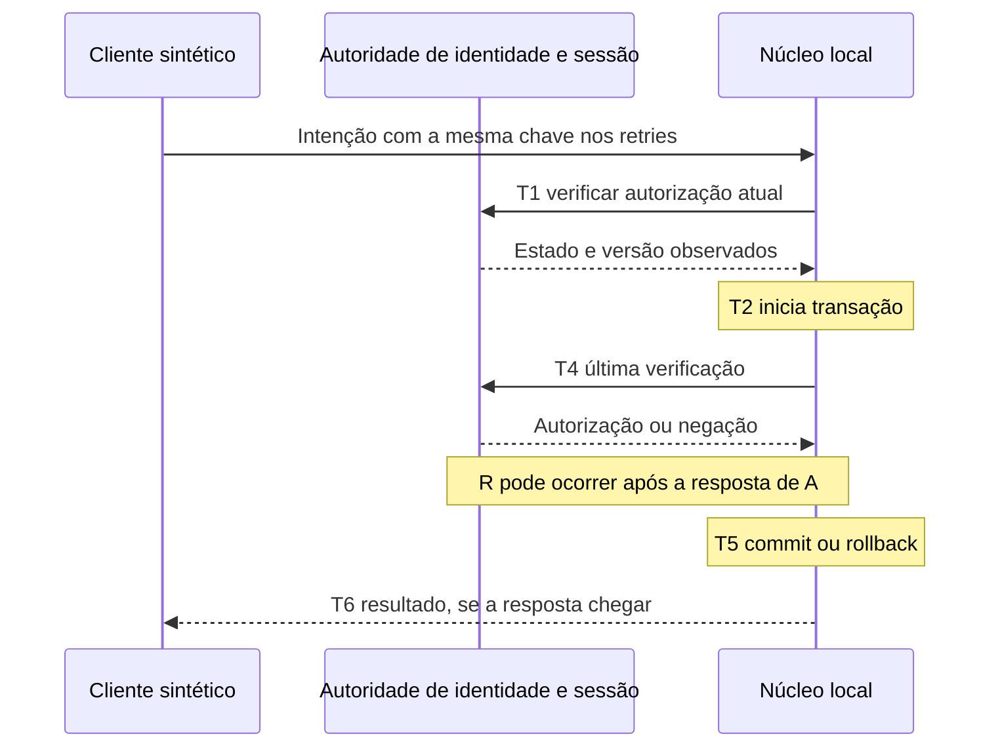

# Marco 2C — consistência de revogação, recuperação e resiliência

**27/09/2026 — PLANEJAMENTO CONCLUÍDO; implementação não autorizada por este documento.**

**SIMULAÇÃO SEM VALOR OFICIAL.** Referência imutável: `METALLO-2B-LAB-20260927-R1`, ZIP [baseline 2B](../outputs/Metallo-Marco2B-BaselineAprovada-20260927-R1.zip), **205 arquivos**, SHA-256 `7df0935cd75e5b1e822b08fbaf40f53f2b1f4f8c98b5d2dcdb10610c4928b1d0`. Hash, inventário e correspondência dos quatro arquivos do núcleo foram conferidos por leitura. O [documento 34](34_MARCO_2B_PONTO_EXPERIMENTAL.md) permanece o relato do fechamento 2B, com suas provas e limitações.

Nesta rodada há apenas documentação. Não são entregues código, migrations, API/Auth/UI modificados, testes executáveis, backup agendado, nova baseline ou publicação. Não há acesso ao Supabase remoto. GPS, foto, biometria, identificador persistente de dispositivo, offline funcional, jornada, NSR oficial, AFD/AEJ, INPI, ICP-Brasil, comprovante legal e REP-P continuam fora. Propostas abaixo são hipóteses de engenharia para o laboratório; não são regras trabalhistas.

## 1. Como ler e o que já existe

Este documento concentra decisões, política de autorização, invariantes e gates do 2C. Reutiliza os documentos transversais, sem duplicar suas responsabilidades:

| Assunto | Documento responsável |
| --- | --- |
| Ameaças herdadas A–H e administrador privilegiado | [Modelo de ameaças — complemento 2C](THREAT_MODEL_COLABORADOR_REP_P.md#marco-2c--riscos-residuais-do-nucleo-sintetico) |
| Epoch, versões e entrega outbox/inbox | [Contrato — complemento 2C](CONTRATO_GESTAO_REP_P.md#complemento-2c--autorizacao-do-nucleo-sintetico) |
| Procedimentos de backup, restore e rollback temporal | [Plano de recuperação — complemento 2C](PLANO_DE_BACKUP_E_RECUPERACAO.md#marco-2c--backup-e-restore-do-nucleo-sintetico) |
| Resultados executados e dois pareceres Grok | [Fechamento 2B](34_MARCO_2B_PONTO_EXPERIMENTAL.md) |

### Constatações por leitura da baseline, sem novo ensaio

| Evidência | Estado 2B | Consequência para o planejamento |
| --- | --- | --- |
| `laboratorio-marco-2b/auth-local.mjs` | JWT ES256/JWKS local, claims, `/auth/v1/user` e `my_employee_profile`; `session_id` tem formato validado, mas não há consulta explícita à existência da sessão. | Usuário válido e JWT válido não serão tratados como prova de sessão ainda ativa depois de logout. |
| `nucleo.mjs` + `schema.sql` | Original e resultado idempotente na mesma transação; chave global única, original protegido contra UPDATE/DELETE ordinários. | São a base do retry; restauração/corrupção e proprietário do banco precisam de provas próprias. FKs separadas não bastam, sozinhas, para provar coerência entre titular, chave e evento perante escrita privilegiada. |
| `nucleo.mjs` | `authorizeCurrent` é chamado depois dos INSERTs e antes de resolver a transação. O caminho de duplicata retorna antes desse callback, após a verificação inicial da API/contexto. | Distinguir novo original de leitura de resultado existente; testar ambos sob revogação. |
| `seedSynthetic` | Renova snapshot válido e incrementa `context_version` local; API prepara validade de 24 horas na inicialização. | Não é uma versão emitida pela autoridade de identidade; não usar esse contador como epoch de revogação. |
| Criação do núcleo | Abre PGlite no diretório local e executa schema, incluindo recriação do trigger. | Futuro startup deve detectar banco ausente/adulterado antes de qualquer criação/reparo; não apagar a evidência de alteração ao recriar silenciosamente. |
| Campo `server_committed_at_utc` | É preenchido pela aplicação antes dos INSERTs e da última consulta Auth. | Não demonstra instante exato do commit. Manter os bytes antigos; eventual mudança de semântica exige versão nova, sem rebatizar retroativamente o histórico. |
| `servidor.mjs` | `127.0.0.1:3103`, Auth em `127.0.0.1:54321`, prévia em `127.0.0.1:3101`; `/health` retorna `LAB_ONLINE`; fechamento normal usa `server.close` e `core.close`. | Saúde detalhada, prazos e recuperação de queda não estão comprovados por esse HTTP 200. |
| Provas 64/64 e 5/5 | Falhas lançadas e intercalação controlada fazem rollback; transporte 13/13 e Web 114/114 preservados. | Não equivalem a matar o processo, perder energia, preencher disco ou restaurar cópia antiga. Nenhuma dessas contagens é reclassificada como prova nova. |

PGlite instalado: **0.5.8**; Supabase CLI do projeto: **2.117.0**. API pública do PGlite documenta commit ao resolver o callback, rollback ao rejeitá-lo e fechamento limpo por `close`; isso não prova, por si, durabilidade na combinação Windows/Node/filesystem usada. [Referência PGlite](https://pglite.dev/docs/api).

## 2. Autoridades, política de revogação e limite de tempo

**Proposta:** o estado empresarial de funcionário/vínculo e a identidade pessoal são autorizados no servidor de identidade existente; Auth é autoridade de conta, sessão, expiração e refresh. O núcleo é autoridade da admissão/commit de seus próprios eventos e da aplicação local de bloqueios recebidos. Cliente não escolhe titular, versão, estado ou momento da revogação. Equipe ausente/inativa continua sem revogar acesso: **Sem equipe atribuída**. Equipe nula não amplia permissões da Gestão.

Separar três instantes: **Rₐ**, revogação durável na autoridade; **Rₙ**, bloqueio aplicado duravelmente no núcleo; **Rₑ**, encerramento reconhecido pelo fluxo que o solicitou. Um ACK de transporte não é Rₙ. O operador só poderá ver “bloqueio aplicado no núcleo” depois de Rₙ; antes, “revogação na origem concluída; sincronização pendente”. Isso não significa que todos os dispositivos já limparam a tela.

| Caso | Autoridade / descoberta proposta | Nova marcação e pedidos em andamento | Retry / retorno à atividade |
| --- | --- | --- | --- |
| 1. Vínculo pessoal revogado/inativo ou funcionário desligado | Estado pessoal no servidor → consulta atual + mensagem versionada | Negar; transação ainda não confirmada é revertida quando o bloqueio vence a ordem local. | Negar consulta/retry pessoal enquanto revogado; preservar original prévio. Reativação explícita e nova versão, nunca por reinício. |
| 2. Identidade portal revogada | Registro de identidade pessoal; mesmo canal, causa independente | Mesmo bloqueio; não depende do estado da equipe. | Novo login não recompõe vínculo. Resultado antigo continua preservado sem ser exposto à conta revogada. |
| 3. Conta Auth banida | Auth administrativo + estado de suspensão comunicado ao núcleo | Tratar suspensão como negação; testar JWT, sessão e refresh, sem presumir que ban revoga tudo. | Após retirar ban, exigir identidade/vínculo ativo, nova sessão autorizada e reconciliação; não desfazer revogação pessoal. |
| 4. Sair da sessão atual | Ação explícita do titular; sessão atual, não todas as sessões | Limpar UI local imediatamente; negar futuros pedidos dessa sessão depois do bloqueio confirmado no servidor/núcleo. Ordem de request em andamento segue seção 3. | Outras sessões permanecem; se houve commit antes do bloqueio, original permanece. Nova sessão válida pode consultar o mesmo resultado. |
| 5. Sair de todos os dispositivos | Ação explícita autenticada, incremento de geração de sessões e encerramento Auth | Negar todas as sessões anteriores ao corte; login novo posterior pode ser permitido se vínculo continua ativo. | Repetição da ação é idempotente. Falha parcial aparece como pendência, não sucesso global fictício. |
| 6. Access token expirado | `exp` do JWT, relógio do servidor; limites de sessão também validados | Negar token expirado; repetir validação no ponto de admissão final proposto. | Refresh válido pode gerar token novo, mas não restaura identidade/vínculo revogado. |
| 7. Refresh token ainda existente | Auth controla uso/rotação; estado pessoal é controle adicional | A existência do refresh não concede autorização para gravar. | Resultado de refresh deve voltar a passar por todas as verificações; não testar nem armazenar token em logs. |
| 8. JWT antigo ainda válido | Assinatura/claims + vínculo, sessão e versão atuais | Assinatura válida não supera bloqueio de vínculo, sessão ou epoch. | Token roubado após logout não ganha exceção de idempotência/leitura. |
| 9. Duas abas | Abas normalmente compartilham sessão; sincronização visual é conveniência | Cancelar uso local da sessão e descartar respostas antigas; servidor aplica a mesma regra às duas abas. | Não gerar nova chave só porque houve troca de aba. Logout não pode fazer perfil reaparecer após resposta atrasada. |
| 10. Dois dispositivos | Sessões distintas, identificadas pelo Auth existente, sem fingerprint novo | Logout local em A preserva B; global bloqueia ambas as sessões anteriores. | Testar A/B e sessão roubada separadamente; não confundir dispositivo físico com `session_id`. |

**Janela proposta, sem promessa de zero:** consultas síncronas continuam obrigatórias no laboratório; indisponibilidade da fonte nega novas marcações. Para uma ponte futura, propor **5 s como objetivo de ensaio de Rₐ→Rₙ em ambiente saudável**, medido por relógio monotônico do controlador; não é limite garantido sob falha, partição ou processo suspenso. Propor deadline total de autorização/pedido de **5 s** e tolerância **zero a STALE para nova marcação**; ambos dependem de decisão A e teste de latência. Timeout depois de envio/commit pode dar resultado incerto. TTL de snapshot de 24 h não limita janela de revogação.

Se Rₙ foi serializado e confirmado **antes** da transação do evento, o gate futuro exige **zero novos originais** daquela autorização antiga. Entre Rₐ e Rₙ ainda existe risco; não há limite finito incondicional. Se a exigência for “nenhum evento após Rₐ em qualquer interleaving”, esta arquitetura não satisfaz sem ampliar o protocolo/autoridade de commit. Pausa entre última consulta e commit também impede prometer prazo absoluto. Reduzir timeout sozinho não elimina isso.

## 3. Linha temporal autorização → commit

T0: token autenticado; T1: API consulta identidade/contexto; T2: transação do núcleo começa; T3: revogação acontece em alguma posição; T4: última verificação; T5: commit durável; T6: resposta recebida. A variável R nas linhas abaixo ocupa o papel de T3. Entre esses marcos podem ocorrer timeout, queda e reordenação.

| Ordem da revogação Rₐ | Consulta síncrona 2B / risco | Regra proposta com bloqueio local serializado | Original / marca adicional |
| --- | --- | --- | --- |
| Antes de T0 ou T1 | Negação ao consultar estado atualizado; não confiar apenas em JWT | Negar admissão; sessão/versão também precisam estar válidas | Não criar original |
| Entre T1 e T2 | T4 pode perceber e abortar | Rₙ antes da trava/admissão local impede gravação | Rollback se houver transação |
| Entre T2 e INSERT | T4 pode perceber | Se revogação já venceu a ordem local, negar; se evento segura a trava, ele pode vencer o corte local | Sem evento se rollback; se commit venceu, preservar |
| Após INSERT e antes de T4 | Negação em T4 causa rollback; há prova controlada 5/5 dessa ordem | Mesma regra, com prova futura de queda e disputa real | Não deixar original nem resultado parcial |
| Durante consulta T4 | Resposta pode refletir estado anterior; timestamp de parede não decide a ordem | Exigir resultado da autoridade e depois ordem local explícita | Ambiguidade entre sistemas permanece |
| Imediatamente após T4 e antes de T5 | Janela residual: pode confirmar mesmo com Rₐ anterior ao commit | Se Rₙ venceu a transação, abortar; se só Rₐ ocorreu, o núcleo pode ainda confirmar | Preservar eventual original; registrar ocorrência de segurança separada ao reconciliar |
| Simultânea a T5 | Não existe simultaneidade global confiável entre dois bancos | O recurso de serialização local determina quem confirmou primeiro; não usar relógios para fingir ordem total | Evento vencedor permanece; bloqueio vencedor impede novo original |
| Após T5 e antes de T6 | Commit já existe, ainda que cliente não saiba | Bloquear novos eventos, não reverter o anterior | Resultado pode ficar oculto da sessão agora revogada; preservar original |
| Após T6 | Confirmação já entregue | Bloquear próximos eventos | Nunca apagar/reescrever o confirmado |

Essas classes cobrem todas as posições de uma revogação relativamente às etapas; revogações múltiplas, reativações e entrega fora de ordem são tratadas por versões. “Revogar durante request” não significa cancelar retroativamente uma transação confirmada. Se não for possível determinar a ordem, registrar **resultado incerto** e consultar o estado durável; não inferir rollback de um erro HTTP.

A serialização proposta exige que atualização do bloqueio e gravação do evento usem o **mesmo recurso local**: uma ordem de transações no PGlite de processo único; em PostgreSQL multiwriter, protocolo explícito de locks/versionamento e isolamento. Uma consulta ao Auth não participa dessa trava. [Locks PostgreSQL](https://www.postgresql.org/docs/current/explicit-locking.html). Marcação suspeita após Rₐ será evidência técnica separada, sem editar o original nem atribuir consequência trabalhista.

## 4. Alternativas arquiteturais comparadas

Todas são propostas, com complexidade relativa ao laboratório atual. “Janela” indica o que continua possível, não uma garantia comercial.

| Alternativa | Segurança / consistência | Janela residual | Complexidade | Disponibilidade / recuperação |
| --- | --- | --- | --- | --- |
| A. Consulta síncrona antes do commit | Melhora atualidade; exige validar vínculo e sessão, não só usuário | Entre resposta e commit; atraso/partição/fonte restaurada | Baixa a média | Fonte indisponível bloqueia; repetir consultas após reinício, sem cache permissivo |
| B. Versão de autorização/snapshot | Detecta divergência quando comparada com autoridade atual | Versão antiga em ambos os lados não revela revogação desconhecida | Média | Precisa reconciliação e versão externa ao restore do núcleo |
| C. Epoch/revocation_version | Corte por vínculo/identidade/sessão e rejeição de versão anterior | Até entrega/observação do novo epoch; claims sozinhas não resolvem | Média | Preservar máximos/geração de origem; versão nunca diminui |
| D. Lista local de revogações | Negação rápida por sujeito/sessão já conhecidos | Ausência na lista não prova que não houve revogação | Média | Lista deve ser durável; entradas não expiram antes dos tokens/ações que bloqueiam; restore exige replay |
| E. Evento de revogação enviado ao núcleo | Propaga bloqueio e permite ACK explícito | Perda de evento se só enviar HTTP após commit da origem | Média | Retry e reconciliação obrigatórios; sem outbox há intervalo de perda |
| F. Outbox/inbox | Alteração+outbox atômicas **na origem**; inbox+estado atômicos **no núcleo**; deduplicação | Entre os dois commits; entrega pelo menos uma vez não é transação distribuída | Alta | Retoma de cursor, replay e detecção de gaps; retenção/restore coordenados |
| G. Token interno curto para o núcleo | Restringe audiência, ação, sessão e versão; reduz exposição do JWT geral | Até expiração ou revogação local; roubo permite replay durante validade | Alta | Emissor vira dependência; rotação e rejeição após restore; não substitui idempotência |
| H. Consulta + versão + bloqueio local + outbox/inbox | Defesa complementar e ponto de corte local observável | Persiste Rₐ→Rₙ; pode declarar bloqueio aplicado somente após ACK durável | Alta, incremental | Nega quando fonte/estado são incertos; recuperação exige reconciliar os dois lados |

**Recomendação arquitetural:** H como direção, sem implementar toda a ponte agora. Manter A no primeiro endurecimento local; preparar C/D e protocolo de corte para fase própria, somente após decidir semântica/autoridade. F resolve perda/replay de mensagens; não resolve sozinho último intervalo antes do commit. G não se justifica no mínimo 2D sem necessidade demonstrada. Não substituir consultas atuais por snapshot permissivo para ganhar disponibilidade.

O desenho de `authorization_version`, geração da origem, sessão e recuperação está no [contrato 2C](CONTRATO_GESTAO_REP_P.md#complemento-2c--autorizacao-do-nucleo-sintetico). Não reutilizar `context_version` do 2B sem migração e contrato futuros explicitamente aprovados.

## 5. Estados do snapshot e autorização

Separar validade descritiva do snapshot, autorização pessoal e sessão. Equipe/obra são contexto, não autoridade de acesso. Propõe-se:

| Estado | Quando ocorre | Nova marcação | Recuperação |
| --- | --- | --- | --- |
| ACTIVE | Identidade/vínculo/sessão válidos, snapshot vigente, origem/geração/versões reconciliadas | Somente com fonte acessível, saúde pronta e verificação final | Expira ou muda de estado quando as condições deixam de valer |
| STALE | Prazo expirou, sincronização passou do limite ou nova versão é conhecida mas não aplicada | Negar; tolerância proposta **0 s** para nova marcação | Consulta autoritativa + replay/snapshot validado, sem renovar só pela passagem do tempo |
| REVOKED | Bloqueio definitivo conhecido para identidade/vínculo/sessão | Negar | Reativação explícita, auditada e versionada quando a regra permitir; nunca por retry/startup |
| SUSPENDED | Ban ou suspensão temporária, conflito de segurança controlado | Negar | Autoridade remove suspensão em versão posterior; continuar verificando vínculo e sessão |
| UNKNOWN | Contexto ausente/ambíguo, fonte inacessível, gap conflitante, restore sem reconciliação, origem não reconhecida | Negar | Reconciliar com autoridade e âncora; se isso não for possível, permanecer indisponível |

`REVOKED` prevalece sobre snapshot ACTIVE atrasado; erro de rede nunca converte REVOKED em ACTIVE. Histórico requer autorização atual própria: proposta mínima é negar também histórico/resultado quando não puder comprovar titularidade/autorização. Uma política futura de leitura limitada durante falha exigiria decisão separada, sem abrir lista de colegas nem dados locais persistidos no browser.

## 6. Invariantes formais propostas

Escopo: `D` identifica o banco/linhagem do laboratório, `U` o titular obtido no servidor, `K` a chave idempotente, `E` o original, `R` seu resultado. O contrato 2B mantém chave global única dentro de D; não mudar silenciosamente para chave por sessão. Linhagem não pode ser reiniciada para aceitar novamente K antigo após restore.

| ID | Invariante e limite |
| --- | --- |
| I01 | Para todo `(D,K)`, há no máximo um E. Uma chave de João usada por Maria não concede acesso e não cria outro original. |
| I02 | Original confirmado não é alterado/apagado por operação comum; falha de infraestrutura exige detecção, não promessa de invulnerabilidade. |
| I03 | Retry autorizado do mesmo K e pedido semântico retorna o mesmo `event_id`, horário e hash, inclusive após restart/restore válido. |
| I04 | Em estado confirmado, existe exatamente um R coerente com E em K, titular e hash do pedido; não basta igualdade de contagem. |
| I05 | Nenhum endpoint expõe evento/resultado de U a outro titular, inclusive por erros, conflito de chave ou consulta de intenção. |
| I06 | Timestamp e contexto originais não mudam na repetição, mudança de equipe, refresh ou restauração. |
| I07 | Payload/hash antigos são verificáveis pelo contrato original; versão desconhecida não é reinterpretada. |
| I08 | Bloqueio Rₙ que venceu a ordem transacional local impede commit novo baseado na autorização anterior. Rₐ sem Rₙ não dá essa garantia. |
| I09 | Restore aprovado não duplica originais, chaves ou resultados; se o estado não é demonstrável, novas escritas permanecem bloqueadas. |
| I10 | Versão/geração de autorização nunca retrocede silenciosamente; mudança de geração invalida confiança até reconciliação. |
| I11 | Confirmação ao cliente só após commit confirmado e requisitos de durabilidade do runtime validados. Timeout/desconexão não provam ausência. |
| I12 | Falha antes do commit deixa zero linhas da intenção ou, se houve confirmação concorrente da mesma chave, o par coerente já existente; nunca meio par. |
| I13 | Retry conflitante não sobrescreve E/R, não altera a autorização e não gera confirmação de payload distinto. |
| I14 | Refresh/login novo não reativa vínculo; logout de sessão A não revoga sessão B sem escopo global explícito. |
| I15 | Fonte indisponível, contexto inválido ou readiness falsa impedem nova marcação; nunca gravar substituto na Gestão/browser. |
| I16 | Startup de banco existente não cria um banco vazio nem repara proteção ausente sem ação explícita e evidência. |
| I17 | A passagem 24 h, startup ou entrega atrasada não remove tombstone de revogação. |
| I18 | Eventos de identidade e de ponto têm tipos/IDs/domínios separados; mensagem de autorização nunca vira original de ponto. |
| I19 | Logs/métricas não contêm JWT, senha, refresh token, service role, corpo pessoal ou chave idempotente como rótulo de alta cardinalidade. |
| I20 | Respostas/sessões antigas não repõem dados de conta anterior; nenhuma fila offline ou confirmação local é criada. |
| I21 | Divergência de âncora/restore gera quarentena; âncora e banco com mesmo administrador não provam resistência a esse administrador. |

## 7. Matriz de crash durante gravação

Precondição dos testes: banco descartável com `N` eventos coerentes, uma intenção K nova e autoria válida. “Retry” abaixo sempre passa de novo por autorização e readiness. Injetar barreiras observáveis no futuro; `sleep` e erro lançado não substituem morte real do processo filho. Nada é executado no 2C.

| Corte | Estado esperado após recuperação validada | Retry esperado | Duplicidade / órfão e prova necessária |
| --- | --- | --- | --- |
| Antes de iniciar transação | N, sem K | Pode criar uma vez com mesmo K | Nenhum novo par; matar antes de T2, reiniciar e inspecionar |
| Depois de validar Auth, antes da transação | N; autorização não persiste como permissão | Validar Auth novamente; se revogado, negar | Não reutilizar decisão anterior ao crash |
| Após INSERT do original | Rollback na recuperação: N, sem E/R de K | Criar uma vez, se ainda autorizado | Zero órfãos; matar no intervalo antes do resultado |
| Após persistir resultado, antes do commit | N, nenhuma das duas linhas da transação | Mesmo K pode criar uma vez | Ambas devem desaparecer juntas, não só R |
| Imediatamente antes/durante o commit | Pode haver N ou N+1 conforme corte efetivo; jamais estado parcial | Consultar K e reconciliar; não presumir que erro significa rollback | Capturar corte externamente; ambos os estados coerentes são aceitáveis antes de confirmação ao cliente |
| Imediatamente após commit confirmado | N+1, E/R íntegros | Mesmo evento, sem nova linha | Processo morre antes de resposta; comprovar persistência em disco com novo processo |
| Durante envio da resposta | N+1 se commit foi confirmado | Recuperar mesmo evento | Resposta incompleta não justifica nova chave |
| Após commit com cliente desconectado | N+1 | Mesmo evento após sessão válida | Desconexão não desfaz transação; observar servidor e banco separadamente |

Se corte de energia/VM perder dado que o processo havia confirmado, isso é **falha do gate de durabilidade daquela topologia**, não um resultado a esconder com novo UUID. Perda de energia é ensaio posterior em VM isolada, nunca desligar o computador do responsável nesta rodada. Teste de crash só de processo não permite afirmar resistência a falha de disco/energia.

## 8. Retry, recuperação do processo e falhas de storage

Fluxo proposto após 3103 cair: fechar admissão; reabrir o **mesmo banco existente** em modo de recuperação validado; conferir linhagem/schema/versões/invariantes/âncora; reconciliar autorização; tornar readiness verdadeira; então autenticar e consultar K. Se E/R existe coerente, devolver o mesmo E. Se não existe e há certeza de que a geração não retrocedeu, pode tentar novamente com K. Se existir inconsistência, manter quarentena; não criar R a partir de suposição nem apagar E.

O resultado idempotente não fica vinculado à sessão antiga, mas ao titular e contrato. Sessão nova do **mesmo titular ainda autorizado** pode recuperar resultado confirmado. Revogação nega acesso pessoal, não apaga o resultado. Mesmo K com outro conteúdo retorna conflito; outro titular recebe negativa mínima, sem metadados. Se a chave original se perdeu, não há deduplicação garantida por “mesmo horário”; informar limitação, sem gerar replay automático com chave nova.

| Falha | Estado técnico / UI conceitual | Recuperação segura |
| --- | --- | --- |
| Diretório/arquivo PGlite ausente onde se esperava banco existente | Readiness falsa; LABORATÓRIO DE PONTO INDISPONÍVEL | Não inicializar vazio. Confirmar incidente e restaurar cópia verificada em destino novo. Criação de laboratório descartável novo é ação distinta. |
| Arquivo bloqueado / segundo writer | Negar abertura/escrita; indisponível | Impedir dois processos no mesmo diretório; não remover lock à força sem comprovar proprietário encerrado. |
| Corrupção / schema incompatível | Quarentena e indisponível | Preservar origem, restaurar em cópia isolada, comparar tudo; sem reparo destrutivo automático. |
| Diretório sem permissão / storage read-only | Não aceitar marcações | Corrigir somente escopo local autorizado; não ampliar permissões globais. |
| Disco cheio / erro de escrita / I/O interrompido | Se nada foi submetido: indisponível; se commit/resposta incertos: RESULTADO NÃO CONFIRMADO | Consultar estado durável depois de recuperar; não afirmar registrado nem rollback sem prova. |
| Cliente recebe timeout, mas servidor pode continuar | RESULTADO NÃO CONFIRMADO | Consultar K quando núcleo estiver pronto; tratar erro de consulta como incerteza, não ausência definitiva. |

Não armazenar intenção offline funcional nem criar evento no browser. A chave já existente pode ser mantida transitoriamente para recuperação da requisição online; sobrevivência a fechar/reinstalar navegador não é prometida. UI não é alterada neste marco.

## 9. Integridade, hash e administração privilegiada

**HASH != ASSINATURA DIGITAL.** SHA-256 detecta alteração somente quando comparado a uma referência confiável; se o proprietário muda conteúdo e hash juntos, autoverificação interna pode continuar passando.

Proposta: documentar a serialização atual como **hash legado v1**, sem escrever novo campo nos registros antigos nesta rodada. Especificar ordem/tipos/codificação UTF-8, normalização temporal, nulos, números e domínio do objeto, com vetores de teste sintéticos. Preservar verificador v1; uma v2 deve carregar identificador explícito de versão/algoritmo e aplicar-se somente ao novo contrato aprovado. Verificador desconhecido → estado não verificável, nunca recalcular silenciosamente como se fosse v1. Novos campos semânticos entram também no hash do pedido para detectar conflito idempotente. O par `(versão, bytes originais)` continua verificável após upgrade/restore.

Opções de ancoragem, como inferência arquitetural para avaliação:

| Opção | Ajuda a detectar | Limite / recomendação |
| --- | --- | --- |
| Manifesto periódico com inventário ordenado, total e hashes | Alteração/exclusão em relação ao corte preservado | Precisa cópia fora do controle do escritor; eventos após o último corte ficam fora. Boa opção inicial de ensaio. |
| Hash encadeado | Modificação no meio da cadeia | Recalcular tudo ou truncar final é possível sem cabeça externa confiável; ordem deve ser definida. |
| Merkle tree | Diferenças e provas parciais em conjuntos grandes | Raiz precisa ancoragem externa e prova de completude; não resolve restauração por si. Excesso para o mínimo local. |
| Journal append-only separado | Replay, diagnóstico e recuperação além do backup | Dois locais de escrita introduzem crash entre commits; definir autoridade e protocolo antes de usá-lo para garantia de perda zero. |
| Storage separado / terceiro custodiante | Comprometimento de somente um domínio administrativo | Outra pasta/disco sob o mesmo administrador não é terceiro independente; custo/operação dependem de decisão futura. |
| Assinatura futura | Autenticidade perante verificador com chave confiável | Exige custódia/rotação; não torna conteúdo correto nem imutável. Sem ICP-Brasil nem valor jurídico neste plano. |

Matriz ação→detecção→prevenção→evidência externa está no [modelo de ameaças 2C](THREAT_MODEL_COLABORADOR_REP_P.md#marco-2c--riscos-residuais-do-nucleo-sintetico). RLS e triggers operacionais não vencem proprietário/superusuário; a documentação PostgreSQL explicita exceções de owner/superuser. [RLS PostgreSQL](https://www.postgresql.org/docs/current/ddl-rowsecurity.html).

### Inventário conceitual de operações privilegiadas futuras

Nomes abaixo descrevem responsabilidades, não endpoints criados. Reaproveitar camadas existentes após autorização; nenhuma credencial administrativa deve chegar à prévia.

| Responsabilidade | Chamador permitido / privilégio mínimo | Revisão obrigatória e risco |
| --- | --- | --- |
| Consultar autorização e sessão atuais | API servidor; retorno mínimo booleano/versão/estado do próprio sujeito autenticado | Sem listar `auth.sessions` ao portal; sessão+titular derivados do token validado, argumentos confrontados no servidor. Não confundir `getUser` com introspecção completa. |
| Revogar identidade/vínculo | Administrador autorizado no fluxo já existente | Reusar decisão/RPC pessoal; revisão de owner, grants e `search_path`; registrar ator/causa sem segredos; falha Auth posterior não reabre vínculo. |
| Suspender conta / encerrar sessão(s) | Serviço servidor restrito, ação explícita do titular ou administrador conforme escopo | Não aceitar `user_id` arbitrário de cliente; local/global separados; auditar efeitos parciais. |
| Publicar/receber evento de autorização | Emissor/inbox de serviço com audiência/tipo restritos | Origem e entidade autenticadas, replay idempotente, nenhuma rota SQL genérica nem permissão para editar originais. |
| Verificar catálogo/schema/integridade | Startup/auditor técnico, leitura onde possível | Owner/grants/search_path/corpo de funções/constraints/triggers contra referência; não reparar antes da comparação. |
| Backup, restore e ativar geração | Executor técnico fora da API pessoal | Credencial de manutenção separada; origem preservada, destino descartável, autorização e registro de retomada. |
| Atualizar contrato/hash/schema | Processo de mudança autorizado, nunca request pessoal | Compatibilidade, vetores antigos, escopo de privilégios e rollback documentado. Sem migration nesta rodada. |

Para qualquer função `SECURITY DEFINER` futura: owner sem login e poderes mínimos quando suportado; `search_path` fixo com referências qualificadas; retirar grants públicos desnecessários; tipos/argumentos validados; caller verificado; impedir impersonação; log auditável separado; revisar possibilidade de o owner alterar funções/tabelas. Um controle no SQL não restringe quem controla o processo/arquivo PGlite.

## 10. Logout, token roubado e múltiplos dispositivos

Supabase distingue encerramento local/global e mantém JWTs de acesso já emitidos válidos criptograficamente até `exp`. A documentação recomenda verificar a sessão quando a aplicação precisa detectar logout; expiração por políticas também deve ser considerada, não só presença da linha. [Signout](https://supabase.com/docs/guides/auth/signout), [sessões](https://supabase.com/docs/guides/auth/sessions). Esses fatos não provam o comportamento completo da versão local sob ban, que exige ensaio.

**UX futura proposta:** “Sair” encerra a sessão atual e limpa todas as abas que a compartilham; “Sair de todos os dispositivos” é outra ação explícita. Limpar apenas memória/storage durante indisponibilidade informa que o encerramento no servidor não foi confirmado. A tela não promete que cópia roubada do token desapareceu. Ban não é logout, desligamento não é só logout e refresh não é reativação.

| Defesa contra JWT roubado após logout | Vantagem | Limitação |
| --- | --- | --- |
| TTL curto | Reduz período de uso de token sem renovação | Não encerra imediatamente; relógios, refresh roubado e disponibilidade. Não alterar TTL do Auth nesta rodada. |
| Introspecção de sessão ativa | Detecta encerramento conhecido no servidor | Dependência online e intervalo consulta→commit; não presumir endpoint `/user` como prova suficiente. |
| Epoch por pessoa e por sessão | Invalida classes de autorizações e permite logout global/local | Precisa comparação atual e propagação; claim antigo sozinho não informa versão nova. |
| Denylist de sessão | Corte local rápido depois de aplicado | Retenção, perda/restore da lista e entrega pendente; não pode ser só memória. |
| Vínculo/identidade atuais | Impede atuação de desligado mesmo com refresh | Vínculo ativo não detecta logout nem roubo de uma sessão. |
| Token próprio do núcleo | Audiência/ação específicas; vida curta | Credencial também pode ser roubada; emissor/chaves/protocolo adicionam risco. |

**Cenários desejados:** PC A sai, celular B continua com sessão distinta; global corta A+B anteriores ao pedido; sessão C roubada é revogada especificamente sem confundir colegas; duas abas de A limpam dados; login de Maria em A invalida respostas antigas de João. Novo login posterior ao global depende de vínculo ativo e nova geração válida. Corrida entre novo login e global deve ser ordenada na autoridade; não escolher por relógio do cliente. Não coletar identificador de aparelho. Se futuramente precisar associar sessões a dados novos de dispositivo, abrir decisão de privacidade antes de coletar.

## 11. Disponibilidade, startup, shutdown e observabilidade

| Situação | Nova marcação | Consulta pessoal / comunicação |
| --- | --- | --- |
| Auth/fonte fora; núcleo disponível | Fail closed | Proposta mínima: negar também consulta sem autorização atual; informar indisponibilidade. Alternativa de leitura limitada exige decisão própria. |
| Núcleo fora; Auth disponível | Não enviar evento à Gestão/browser | LABORATÓRIO DE PONTO INDISPONÍVEL; se requisição já foi enviada, RESULTADO NÃO CONFIRMADO. |
| Ambos fora | Nenhum evento local substituto | Sem fallback remoto nem fila offline. |
| Ponte atrasada/estado com gap/âncora ausente | Readiness falsa para a entidade ou todo núcleo, conforme falha | Preservar histórico no banco; não transformar incerteza em ACTIVE. |

### Startup proposto

1. Verificar modo LAB, hosts exatos/loopback, ausência de vínculo remoto, versão do runtime e identidade do diretório esperado. Separar criação intencional de banco descartável de reabertura de existente.
2. Obter exclusividade do diretório; abrir banco existente sem criar/reparar schema automaticamente. Conferir identidade de banco/linhagem e geração de restore externa.
3. Conferir versão de schema/contrato, tabelas, FKs/uniques/coerência E↔R, triggers e funções/grants críticos. Detectar mudanças antes de aplicar qualquer reparo.
4. Recalcular hashes pelos verificadores correspondentes e comparar contagens/conjunto/âncora do último corte. No volume pequeno do laboratório, propor verificação integral, não amostra apresentada como completa.
5. Reconciliar versões e bloqueios com a fonte; testar autorização/sessão disponível. Banco restaurado antigo não é promovido só porque abriu sem erro.
6. Só aceitar marcações quando todos os requisitos forem verdadeiros. Falha → diagnóstico sem segredo, readiness falsa e quarentena quando necessária.

### Shutdown proposto

Retirar readiness e parar admissão; drenar requests/transações por prazo proposto de **10 s** no ensaio. Transação ainda não confirmada pode ser cancelada com rollback comprovado; transação já confirmada não é invertida. Fechar conexões persistentes, concluir flush/fechamento suportado do banco e encerrar listener. Expirou prazo sem resultado verificável: registrar encerramento anormal e exigir recuperação na próxima abertura. Não chamar `close` enquanto houver gravação sem resolução nem apresentar kill abrupto como fluxo normal. O suporte de cancelamento exato será verificado na versão local antes da implementação; prazo não autoriza interrupção insegura.

### Saúde: liveness diferente de readiness

| Sinal conceitual | Prova futura |
| --- | --- |
| PROCESSO_ONLINE | Processo responde; não demonstra banco/autorização prontos |
| BANCO_OK | Banco existente, versão, constraints/triggers e integridade verificadas; leitura apenas não garante próxima escrita em disco cheio |
| AUTH_ACESSIVEL | Verificação do serviço/estado com timeout; não expõe dados pessoais nem tokens |
| CONTEXT_SYNC_OK | Geração/versão/cursor válidos e sem bloqueio de reconciliação; validade por titular ainda é conferida no pedido |
| NUCLEO_PRONTO_PARA_MARCACAO | Conjunção anterior + modo LAB/loopback + exclusividade + estado fora de recuperação/shutdown |

Readiness pode se tornar falsa imediatamente após uma checagem; operações continuam tratando I/O e autorização. Não usar inserções de “ponto teste” em healthcheck; eventual prova de escrita técnica deve ter área própria e escopo aprovado. Diagnóstico detalhado restrito à operação local; UI recebe estado mínimo.

**Métricas futuras:** requests recebidos/rejeitados, motivos de negação, duplicatas, conflitos idempotentes, contexto revogado/STALE/UNKNOWN, rollback, recovery por chave, falhas de banco, latência de autorização/commit/resposta, idade e atraso da sincronização, gaps, divergência de hashes, duração de startup/restore e resultado de shutdown. Rótulos por classe/método/rota, sem IDs pessoais ou K. Logs usam correlação técnica efêmera e código de erro sanitizado; não registrar erro bruto do banco, JWT, senha, refresh token, service role, payload ou dados pessoais desnecessários. IDs estritamente necessários à auditoria de identidade ficam em trilha restrita, não em métricas públicas; retenção/acesso são decisões futuras de privacidade.

## 12. Plano de testes futuro e gates

Todos abaixo são **NÃO EXECUTADOS NO 2C**. Só se executarão após autorização específica de implementação/ensaio. Usar processos filhos e diretórios descartáveis, nunca banco ativo, disco do Windows inteiro ou Supabase remoto. Reutilizar os testes existentes; não apagar falhas antigas ou enfraquecer asserções.

| ID | Cenário reproduzível futuro | Critério de aprovação / evidência |
| --- | --- | --- |
| R01 | Para cada posição da seção 3, pausar em barreira e revogar identidade/vínculo com Auth real local | Ordem registrada; nenhum original se Rₙ venceu; casos residuais Rₐ→Rₙ classificados, jamais ocultos; validar E/R após cada rodada |
| R02 | JWT sintético roubado; logout local, global, ban, expiração, refresh, login novo | Negativas do escopo correto; vínculo revogado nunca reativado; sessão A/B diferenciadas; conservar evidências sem tokens |
| R03 | Mensagens v15/v16/v17 duplicadas, invertidas, com gap, mesmo ID/payload divergente, origem falsa | Não regressão, deduplicação, quarentena/conflito; nenhum ACTIVE indevido; retomada por replay confiável |
| R04 | Repetir R01 com atraso, timeout e pausa do processo depois de T4 | Demonstrar limite real; não alegar janela zero/limite absoluto de 5 s; falha/ambiguidade registrada |
| C01 | Matar processo antes do INSERT, depois do INSERT, após R, junto ao commit e depois dele | Matriz seção 7: N ou N+1 conforme ponto; zero órfãos; restart independente e invariantes completas |
| C02 | Desconectar cliente durante resposta; reiniciar e consultar/repetir K | Mesmo event_id/timestamp/hash, no máximo um original, sem nova chave automática |
| S01 | Diretório ausente, bloqueado, sem permissão ou read-only em cópia isolada | Startup não recria banco; readiness falsa; UI não confirma; origem preservada |
| S02 | Simular disco cheio/escrita interrompida em filesystem de ensaio limitado | Sem encher disco do host; resultado incerto tratado; par consistente ou quarentena |
| S03 | Corromper cópia descartável; remover trigger/constraint; alterar titular/hash | Detecção antes da admissão e antes de auto-reparo; comparação com referência externa |
| B01 | Backup consistente com N; restaurar destino novo e reabrir em novo processo | Mesmos N registros e tuplas completas, mesmas chaves/titulares/hashes/contextos, nenhum órfão; RPO/RTO medidos |
| B02 | E1→backup→E2/E3→restore antigo→retry K1 e K2 | K1 aponta E1; K2 ausente não autoriza novo original; rollback temporal detectado e escritas bloqueadas |
| B03 | Restaurar autorização v15 após revogação v16; perder/atrasar âncora | Não reativar; UNKNOWN/quarentena até reconciliação; sem geração inventada |
| H01 | Vetores hash v1/v2, fuso, encoding, números/nulos, bytes adulterados e versão desconhecida | Verificação legada preservada; alteração detectada; nenhum recálculo silencioso |
| A01 | Auth fora, núcleo fora, ambos fora e retorno em ordens diferentes | Nenhuma nova marcação sem pré-condições; sem fallback/registro na Gestão/browser |
| L01 | Duas abas, dois clientes com sessões distintas, logout durante pedido e troca João/Maria | Não repor perfil antigo, não vazar resultado; preservar commit que venceu o corte; novas ações negadas corretamente |
| P01 | Chamadores anon/João/Maria/admin Gestão/serviço contra cada função privilegiada futura | Grants mínimos, identidade/argumentos fixos, sem impersonação; rastreio sanitizado |
| O01 | Startup/shutdown concorrentes, timeout de drenagem, health degradado | Sem admissão antes de pronto ou durante parada; fechamento limpo ou incidente explícito; listeners somente loopback |
| N01 | Loopback positivo, Ethernet negativo, namespace Docker independente + controle positivo | Preservar 2B; não desativar firewall. Segundo host físico é prova futura separada, não falha retroativa do 2B |
| G01 | Regressões 2B/1C/1A, banco, qualidade, Web, types/lint/build e scan | Definir casos/contagens antes da execução, guardar saídas completas; não somar suítes sobrepostas nem usar skip como aprovação |

**Concorrência por topologia:** (a) PGlite em um processo: mesmas/diferentes chaves e revogação concorrente; (b) dois processos no mesmo diretório: segundo deve ser recusado, não suportar escrita compartilhada por inferência; (c) PostgreSQL local futuro com múltiplas conexões: locks/isolamento, unique conflict, deadlock/retry; (d) múltiplas instâncias/writers: protocolo compartilhado de corte, idempotência e falhas de rede; (e) PostgreSQL remoto: somente em autorização futura própria. Nenhum sucesso em (a) aprova (b–e). Propor 100 repetições por corte de crash/interleaving e lotes de 1/5/20 requests no ensaio local, ajustáveis antes da execução com recursos medidos; não é prova matemática nem teste de carga de produção.

**Rede física:** antes de eventual piloto, testar um segundo equipamento autorizado na rede correspondente e o perímetro real do piloto, sem abrir portas para fazer o teste passar. Isso não é necessário para reabrir ou invalidar o fechamento 2B: a limitação está preservada, não classificada como falha do marco.

## 13. Decisões do responsável e próximo marco

Todas estão **propostas, ainda não aprovadas**. Não é necessário decidir itens C agora.

| Classe | Decisões curtas e recomendação |
| --- | --- |
| A1 — antes do endurecimento local | Aprovar primeiro **2D mínimo de recuperação local** em processo único, banco descartável e sem mudar Auth/UI/contrato pessoal; ponte/epoch aplicados ficam para escopo posterior próprio. |
| A2 — antes de implementar controle de revogação | Aceitar corte comprovável em Rₙ, residual Rₐ→Rₙ explícito, fail closed/STALE zero; objetivo de ensaio 5 s, não promessa absoluta. Se exigir corte em Rₐ, ampliar estudo de coordenação antes de implementar. |
| A3 — antes do ensaio de recuperação | Aprovar destino isolado, executor/revisor, RPO/RTO de ensaio e manutenção fechada; restore antigo nunca retoma escrita automaticamente. Escolher uma âncora de ensaio com limites declarados. |
| A4 — antes de implementar sessão/logout | Confirmar “Sair” atual versus “Sair de todos”, política de histórico em falha e fonte autorizada de sessão; recomendado negar quando não comprovável. Novos dados de sessão/auditoria exigem minimização/retenção definidas. |
| B — antes de piloto | Fonte oficial de identidade e operadores, prazos toleráveis de revogação/indisponibilidade, segunda máquina/perímetro real, backup independente e recuperação demonstrada, política de sessão/roubo, privacidade/acesso/retenção e autorização de qualquer dado real. |
| C — antes de produção | Topologia/custos/alta disponibilidade, custódia externa independente, privilégios e segregação de administração, durabilidade/RPO/RTO demonstrados, resposta a incidente e revisão regulatória especializada. Sem decidir REP-P/ICP/AFD/AEJ neste marco. |

### Recomendação objetiva: Marco 2D — recuperação local e verificação de integridade

**Recomendo implementar apenas após autorização A1/A3, com escopo mínimo:** separar inicialização de banco novo/reabertura; validar schema/integridade antes de pronto; proteger par E/R e recuperação pela mesma K; shutdown com drenagem; testes reais de queda de processo; backup consistente e restore descartável; detectar cópia antiga e impedir retomada silenciosa. Reusar interface e Auth atuais e manter todos os limites do 2B. Os primeiros testes de sessão/revogação podem caracterizar a limitação existente, sem mudar política por acidente.

Entregas/gates mínimos: C01/C02, S01–S03, B01–B03, O01 e regressões G01; API de saúde/internos só poderão mudar dentro da autorização futura detalhada. UI continua com mensagens já existentes quando possível; mudança visual exige nova prévia. Backup externo contra administrador hostil, journal, tokens internos, outbox/inbox e protocolo completo de epoch **não entram automaticamente** no 2D mínimo. O risco de revogação residual permanece até escopo próprio A2/A4 aprovado e R01–R04/L01/P01 executados. Não recomendar piloto ou produção com este mínimo.

### Arquivos e governança desta rodada

- **Criado:** este documento 35, com responsabilidade nova e exclusiva de decisões/gates do 2C; não substitui relatório 34 nem cria outra implementação.
- **Atualizados:** `THREAT_MODEL_COLABORADOR_REP_P.md` (mapa A–H/DBA), `CONTRATO_GESTAO_REP_P.md` (versões/outbox/inbox), `PLANO_DE_BACKUP_E_RECUPERACAO.md` (procedimentos 2C), `22_AMBIENTE_REP_P_E_ROADMAP.md` (estado/próxima decisão) e `34_MARCO_2B_PONTO_EXPERIMENTAL.md` (apenas referência à continuação documental).
- Baseline 2B e anteriores permanecem imutáveis; 01–07 mantêm responsabilidades e nomes. Não há novo resultado de execução nem ensaio de crash/backup/restore nesta rodada.
- Conferência documental final: **649 arquivos técnicos/de evidência** enumerados nas camadas 01–04/06–07 e configurações da raiz permaneceram com os mesmos hashes; caches/artefatos gerados em execução não integram essa contagem. **Quatro ZIPs de baseline** permaneceram idênticos. Foram alterados somente os cinco documentos citados e criado este documento. Links locais/âncoras foram conferidos sem destinos ausentes; isso é verificação de documentação, não execução das provas futuras.
- Não houve envio ao Grok. Auditoria futura, se solicitada, permite listar/abrir/extrair ZIP/hash/busca textual passivos; proíbe executar projeto, SQL, testes, Auth, rede do laboratório ou alterar arquivos/serviços.

### Cobertura da entrega solicitada

| Itens | Local da entrega |
| --- | --- |
| 1 mapa de riscos / 14 administrador | Modelo de ameaças, complemento 2C; seção 9 deste plano |
| 2–4 revogação, temporalidade e alternativas | Seções 2–4 |
| 5 epoch / 18 outbox-inbox | Contrato, complemento 2C |
| 6 estados / 7 invariantes | Seções 5–6 |
| 8 crash / 9 retry | Seções 7–8 |
| 10 backup / 11 restore / 12 rollback temporal | Plano de recuperação, complemento 2C |
| 13 hash | Seção 9 |
| 15 logout / 16 token residual / 17 dispositivos | Seção 10 |
| 19 indisponibilidade / 20 startup-shutdown / 21 saúde-métricas | Seção 11 |
| 22 testes | Seção 12 |
| 23 decisões / 24 arquivos / 25 recomendação | Seção 13 |

**Fontes técnicas consultadas em 27/09/2026:** somente documentação pública primária Supabase/PGlite/PostgreSQL, vinculada aos fatos específicos acima e nos documentos transversais. Propostas e números de ensaio são decisões de engenharia deste plano, não exigências dos fornecedores. Nenhum endpoint do projeto Supabase remoto foi consultado.

## Execução autorizada posterior — Marco 2D

Em 27/09/2026 o responsável autorizou o mínimo local de recuperação/integridade. A implementação e as provas estão no documento 36. Este documento 35 permanece como planejamento; os itens de revogação distribuída, sessões/logout, energia/disco e produção não foram automaticamente implementados. A baseline 2B continua imutável; não há autorização de baseline 2D.
