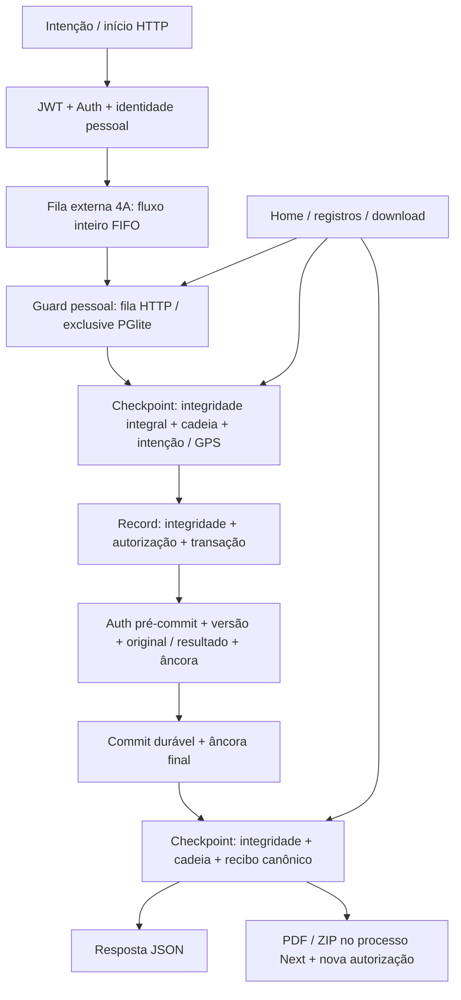
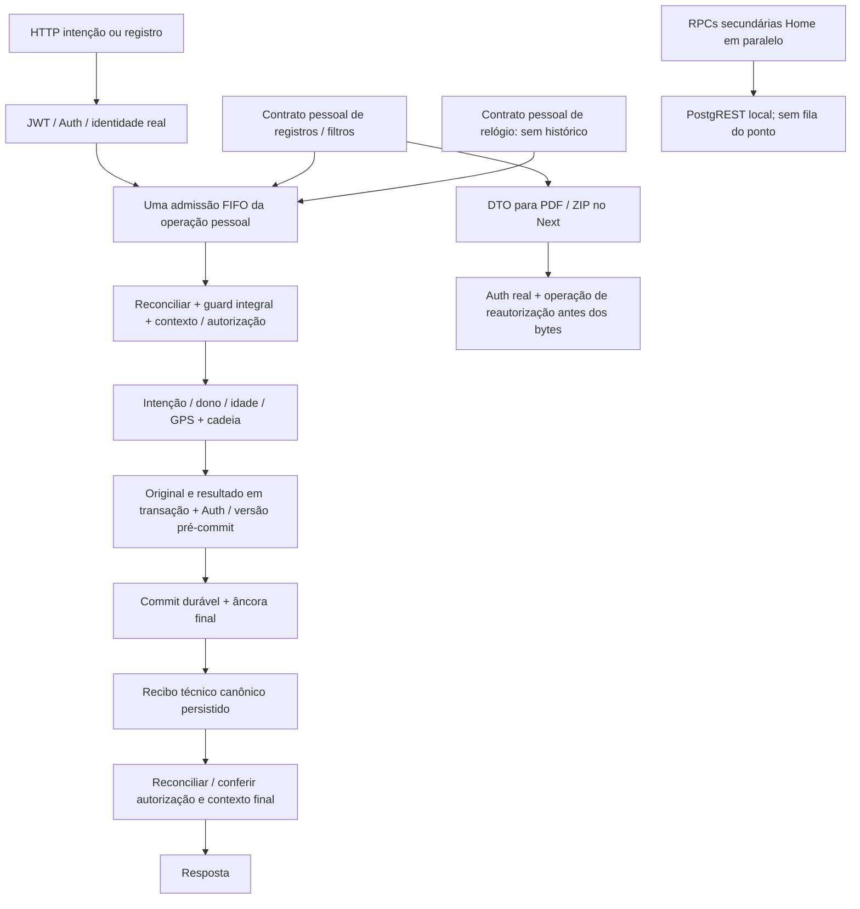

# Marco 4C — Disponibilidade e desempenho local do Meu Ponto

**SIMULAÇÃO SEM VALOR OFICIAL. Exclusivamente em laboratório sintético.**

## 1. Estado e autorização

Primeira rodada técnica autorizada pelo responsável em 01/10/2026. Não acrescenta
funcionalidade ao funcionário. Instrumentar, medir antes de otimizar, preservar os
controles, repetir carga e regressões, comparar e **parar para revisão**.

Origem imutável: **METALLO-4B-LAB-20261001-R1**, arquivo
`outputs/Metallo-Marco4B-BaselineAprovada-20261001-R1.zip`, SHA-256
`2ff3076d3a9bee5b33a363ae4264dde392bce7f4662273309b5a5085726c3c71`.
O ZIP não foi modificado. O documento 48 continua registrando o fechamento do 4B.

**Esta rodada não cria baseline 4C, não executa Grok, não inicia 4D, não publica
e não acessa Supabase remoto.** O risco médio de disponibilidade permanece aberto.

**Estado vigente após o Android físico, 03/10/2026:** avaliação interrompida por
**F-4C-ANDROID-01, ALTO de disponibilidade local**: a marcação não concluiu quando
o Android bloqueou a localização. Há também **F-4C-ANDROID-02, MÉDIO**, corte de
interface ao dobrar a escala de exibição. Nenhuma correção de produto foi feita.
O Marco 4C permanece **ABERTO**; não encaminhar ao Grok antes de tratar o bloqueador
e repetir os casos afetados. Resultados e limites completos na seção 26.

## 2. Ambiente e reprodução

Windows, Ryzen 7 5700X3D, 16 GB RAM, Node 24.19.0, Next 16.3.4,
PostgreSQL 17.6 local, Supabase CLI **2.117.0**, PGlite 0.5.8 com
`relaxedDurability=false`, um writer. As versões instaladas foram preservadas.

Responsabilidade das novas fontes, em `04_BANCO_E_SUPABASE/laboratorio-marco-4c/`:

| Fonte | Responsabilidade nova |
|---|---|
| `perfil.mjs` | Correlation ID, spans, fila, filesystem, CPU/RAM/event loop e observador PostgreSQL |
| `ambiente-carga.mjs` | Perfil LOCAL e futura HOMOLOGACAO desabilitada, sem URL/credencial |
| `executar-carga.mjs` | Build isolado, execução e hashes das fontes; impede sobrescrever ensaio |
| `analisar-perfil.mjs` | Agregação e comparação sem somar tempos inclusivos |
| `diagnostico-banco.mjs` | EXPLAIN e verificação integral em núcleo descartável parado |
| `integridade-paridade.test.mjs` | Paridade com bytes da baseline e bloqueio de adulterações reais |
| `validar-regressoes.mjs` | Reutilização das suítes vigentes sem sobrescrever suas provas anteriores |
| `memoria-sustentada.mjs` | Investigação moderada de RAM sem retenção integral de traces |

O helper `01_WEB/03_FUNCOES_E_LOGICA/Ponto/telemetria-laboratorio-4c.ts` mede
Next/PDF/ZIP somente com flags locais explícitas. Não devolve telemetria no DTO.
Os geradores e validadores da carga 4B são reutilizados, incluindo o parser
independente pypdf/zipfile. Nenhuma pasta macro 01–07 foi reorganizada.

Alterações adicionais: dois gateways Next (instrumentação opt-in), configuração
do build isolado e seus ignores, agendamento HTTP (somente hooks de medição),
servidor 4A (hooks locais de medição/falha controlada), ambiente local de testes,
destinos de resultados das provas 4A/4B/2F/revogação/rede e seleção 4C no validador
de downloads. Nenhuma tela, regra empresarial ou contrato público foi alterado.

O inventário também identifica sete diferenças prévias entre checkout e ZIP 4B,
**não editadas por esta rodada**: teste `colaborador-epis`, lockfile pnpm, resultados
históricos 3A/3B e documentos 39/46. Seus timestamps precedem o ensaio antes; foram
preservados e examinados no scan, sem atribuí-los às otimizações 4C.

Comandos PowerShell, na raiz do projeto (permissão para Docker local necessária):

```powershell
node 04_BANCO_E_SUPABASE/laboratorio-marco-4c/executar-carga.mjs build
node 04_BANCO_E_SUPABASE/laboratorio-marco-4c/executar-carga.mjs antes
node 04_BANCO_E_SUPABASE/laboratorio-marco-4c/executar-carga.mjs depois
$env:METALLO_4C_RUN='depois'
python 04_BANCO_E_SUPABASE/laboratorio-marco-4b/validar-carga-4b.py
node 04_BANCO_E_SUPABASE/laboratorio-marco-4c/analisar-perfil.mjs
node 04_BANCO_E_SUPABASE/laboratorio-marco-4c/diagnostico-banco.mjs depois
node 04_BANCO_E_SUPABASE/laboratorio-marco-4c/validar-regressoes.mjs
node 04_BANCO_E_SUPABASE/laboratorio-marco-4c/memoria-sustentada.mjs
```

Os ensaios `antes`/`depois` existentes não podem ser sobrescritos; uma repetição
precisa de outra identificação explícita. O build `.next-4c-preview` é isolado
dos ambientes manuais 3101/3102. Gateway/núcleo/sessão descartáveis: 3103/3107/3108,
todos em 127.0.0.1. A HOMOLOGACAO vazia falha antes de qualquer chamada.

## 3. Medição antes de otimizar e gargalos

Evidência integral em `antes/`: resultado por requisição, traces do núcleo e
Next, CPU/RAM/event loop, conexões/locks PostgreSQL, EXPLAIN, comandos/exit code
e hashes. As otimizações foram aplicadas somente após esse ensaio passar.

**Gargalo principal confirmado:** verificações completas repetidas dentro da fila
serializada. No ensaio antes, 3.840 operações de writer; espera média 4,114 s,
p95 6,117 s, máximo 6,798 s, profundidade máxima 50. Cada requisição pode passar
pela fila várias vezes; esse p95 por operação não é o p95 HTTP.

`writer.history` levou em média 93,757 ms e `writer.checkpoint` 126,918 ms.
O guard lê todos os originais/resultados, verifica schema, trigger, constraints,
hashes, coerência, âncora, autorização e capacidade de escrita. O checkpoint
produzia ainda outro inventário integral que os callbacks 4A/4B não consumiam.
O verificador comparava eventos/resultados por buscas repetidas em arrays.

Não se confirmou N+1 de consultas por recibo como causa principal. O problema
observado foi trabalho integral redundante por fronteira/guard. A recuperação
de recibos pendentes continua lendo apenas contextos pessoais; não foi removida.

**Custos secundários:** Auth/PostgREST, conversão/serialização de inventários,
hashing, fila do event loop e revalidação posterior aos downloads. Geração
isolada de PDF: média 126,160 ms antes/124,798 ms depois. ZIP incluindo PDFs:
143,549 ms antes/144,935 ms depois. O custo predominante dos downloads HTTP
é esperar/revalidar no núcleo, não produzir o arquivo. PDF/ZIP já são derivados
fora da transação de marcação; erro de arquivo não desfaz original confirmado.

Não se comprovou gargalo de locks PostgreSQL: zero aguardando Lock e zero novos
deadlocks nos dois ensaios. Pico do observador: 51 conexões antes/46 depois,
incluindo serviços locais existentes e uma conexão observadora; ociosas 41/36,
transação mais antiga observada 0,484/0,985 s. O tempo exato de aquisição do pool
interno PostgREST não é exposto; não foi inventado. Há aquisição do observador e
tempos HTTP completos de Auth/PostgREST, incluindo rede, no perfil.

EXPLAIN antes: execução 1,704 ms em OFFSET 0, 0,485 ms em OFFSET 20 e 0,471 ms em
OFFSET 100000. Já existe índice por `auth_user_id` e horário. **Nenhum índice,
DDL, RLS, grant ou migration foi alterado.** O OFFSET alto foi ensaiado neste
dataset de 1.100 originais; não equivale a uma base grande real.

## 4. Otimizações e controles preservados

1. `laboratorio-marco-2b/integridade.mjs`: índices em memória **por invocação**
   para relacionar contextos/eventos/resultados. Todas as linhas continuam sendo
   lidas e todos os checks conservados. Sem cache entre requisições.
2. `laboratorio-marco-2b/nucleo.mjs`: opção explícita `includeInventory=false`
   omite somente o **segundo inventário não consumido**, após o guard integral.
   O padrão continua incluindo snapshot, preservando contratos de backup/restore.
3. Adaptadores `laboratorio-marco-4a/extensao.mjs` e `laboratorio-marco-4b/registros.mjs`
   usam essa opção exclusivamente nos callbacks que consomem apenas `db`.

O custo médio de checkpoint caiu de 126,918 para 68,849 ms considerando os
ensaios completos, com a extensão moderada identificada separadamente. Os
valores por operações comparáveis ficam em `comparable_inclusive_ms` da análise.
No recorte comparável: checkpoint **126,976→69,410 ms**, history 93,732→78,942 ms,
record 304,828→296,406 ms; espera média do writer 4,040→2,673 s,
p95 por entrada 6,104→3,911 s. Inventários PGlite 11.308→7.496 chamadas,
sem omitir a leitura integral de cada guard. Auth médio 152,962→116,862 ms e
PostgREST 81,422→49,947 ms incluem efeitos do host/concorrência, não cache de sessão.
Verificação integral quente: 105,699/104,545 ms antes; 78,812/75,986 ms depois.

As duas fontes compartilhadas do núcleo foram alteradas para desempenho dentro
do escopo autorizado 4C; **não se declara que seus bytes permanecem congelados**.
As baselines ZIP anteriores permanecem imutáveis. As demais mudanças são
instrumentação, transporte/configuração do executor e destino de evidências.

Mantidos: Auth/JWT real, sessão vigente, vínculo pessoal, fonte autoritativa,
authorization_version, revalidação antes do commit, transação, fsync/durabilidade,
originais/hashes/âncora, recibos, idempotência, revalidação após leitura/PDF/ZIP,
logout/revogação, 60 dias, página de 20, GPS opcional e funcionário sem equipe.

**21/21 provas de paridade e adulteração:** comparação integral com o verificador
extraído da baseline, hash/timestamps/version/schema/constraints/trigger,
contextos/resultados/duplicatas/órfãos e adulteração real entre dois checkpoints.
O opt-out não permite rodar o callback quando o guard falha. Backup/restore e
revogação durante transação são novamente exercidos nas regressões.

Rejeitados: cache de autorização/sessão, cache compartilhado de arquivos,
cache de integridade entre operações, remoção de guards/probe, durabilidade
relaxada, redução de carga, aumento de timeout/conexões para esconder fila,
novo índice sem benefício e reestruturação de PDF sem causa demonstrada.

## 5. Caminho crítico T0–T10

Exemplo de um POST confirmado, tempos acumulados desde o recebimento no núcleo:

| Fronteira | Antes ms | Depois ms |
|---|---:|---:|
| T0 recebida | 0 | 0 |
| T1 assinatura/JWT validado | 6,020 | 4,828 |
| T2 identidade e sessão resolvidas | 127,181 | 122,129 |
| T3 autorização pessoal | 127,182 | 122,131 |
| T4 intenção validada | 519,872 | 385,406 |
| T5 entrada na fila de record | 519,892 | 385,456 |
| T6 início da transação de original | 715,293 | 574,126 |
| T7 commit de original | 873,463 | 763,057 |
| T8 recibo disponível | 1.072,173 | 896,762 |
| T9 resposta preparada | 1.072,177 | 896,765 |
| T10 Node finish | 1.072,474 | 896,985 |

São exemplos individuais, não p95 do conjunto. T2/T3 compartilham o helper atual;
não se atribuiu um tempo exclusivo fictício a cada subetapa. T10 é `finish` do
Node, não confirmação do cliente; o cliente mede até receber todos os bytes.
Spans de banco, filesystem, Auth e writer **são inclusivos e se sobrepõem**.
Não somar como etapas exclusivas. A serialização JSON tem medição adicional no
ensaio de memória; os primeiros ensaios medem sua fronteira, sem span exclusivo.

## 6. Comparação de carga preservada

| Métrica | 4B aprovado | 4C antes instrumentado | 4C depois comparável |
|---|---:|---:|---:|
| Requisições | 902 | 902 | 900 |
| Throughput req/s | 2,114 | 2,138 | 3,097 |
| p50 s | 11,286 | 11,124 | 8,294 |
| p95 s | 61,257 | 60,629 | 40,630 |
| p99 s | 63,763 | 63,073 | 42,224 |
| Máximo s | 64,425 | 64,145 | 42,650 |
| HTTP 5xx | 2 | 2 | 0 |
| Retries/recuperações | 7 | 7 | 5 |
| Conexões máximas (mesmo amostrador WMI) | 46 | 49 | 45 |
| CPU máxima do host % | 50 | 97 | 69 |
| RAM livre mínima do host GB decimais | 2,670 | 2,713 | 2,611 |
| Duplicações/perdas confirmadas/vazamentos | 0/0/0 | 0/0/0 | 0/0/0 |

Redução frente ao 4B: **p95 33,67%; p99 33,78%; p50 26,51%; throughput +46,46%**.
900 versus 902 significa somente dois retries de 503 evitados. Os mesmos 50
usuários, operações lógicas, barreiras, validações e cinco respostas descartadas
deliberadamente foram preservados. Não se reduziu o cenário para melhorar números.

A análise compara apenas operações originais. O denominador de throughput 4C
soma suas janelas antes/depois da extensão, excluindo Home adicional, duração e
cooldown. O 4B é histórico; o novo ensaio instrumentado antes confirma proximidade.
Variações de host e overhead da instrumentação impedem atribuição causal perfeita.
As linhas de recursos abrangem cada ensaio completo e os demais processos do
host; não isolam exclusivamente as operações comparáveis. O 4B não coletou RSS
por processo. A observação independente PostgreSQL 4C aparece na seção 3.

| Fase com 50 identidades | Antes p95 s | Depois p95 s |
|---|---:|---:|
| Begin | 11,349 | 7,432 |
| Commit | 32,616 | 25,885 |
| Replay/retry | 34,016 | 22,852 |
| Dia/60 dias/paginação | 39,989 | 26,931 |
| 50 PDFs concorrentes | 63,880 | 42,494 |
| 50 ZIPs concorrentes | 62,937 | 42,298 |
| Home completa adicional | 39,071 | 26,261 |
| Misto + logout/revogação/IDs | 43,171 | 29,688 |

**Meta desejável p95 misto <15 s não alcançada; excelência <5 s não alcançada.**
O risco médio fica aberto mesmo com zero 503 no ensaio depois. Não há SLA,
capacidade de produção, HA ou garantia comercial comprovada. 75/100 usuários
não foram necessários para resolver esta rodada e não foram executados.

Antes ampliado: 1.152 requests (902 originais +250 Home), 745 2xx, 405 4xx esperados,
dois 503. Depois ampliado: **2.400 requests**, 1.995 2xx, 405 4xx esperados, zero 5xx,
zero timeout/erro de transporte. Seu p50 global 0,221 s é influenciado pelas
leituras moderadas; **não deve substituir o p50 comparável 8,294 s**.

50 identidades/Auth/sessões/JWT próprios, cinco sem equipe; pico **54 requests
nas operações comparáveis**, como no 4B. A Home adicional dispara cinco consultas
por usuário, chegando a **250 requests em andamento** no ensaio ampliado.
70 novos originais e 70 recibos; 1.100 originais anteriores sem alteração;
zero duplicação, perda confirmada, recibo órfão/ausente ou conteúdo cruzado;
READY final. **60 PDFs +60 ZIPs** verificados independentemente nos dois ensaios,
conjunto pessoal exato, hashes e formato A4 corretos.

Home completa: 50 perfis pessoais e 250 chamadas reais (dia, perfil e três RPCs
de pendência em paralelo), todos 2xx. Cinco perfis sem equipe preservados. As
pendências dessas fixtures são vazias; houve chamada real a cada contrato, mas
não 50 instâncias de DOM/hidratação nem conteúdos volumosos de pendências.
A UI vigente já paraleliza pendências; não se reescreveu essa arquitetura.

## 7. Erros 503, retry e revogação

Os dois 503 originais 4B foram em `begin`, após ~60,097 s, com
`SERVIDOR_INDISPONIVEL`. O antes 4C reproduziu dois em ~60,053 s. Correlation ID
e trace Next comprovaram timeout de `core_http` em ~60,004–60,005 s. A espera
serializada excedeu o limite do gateway; não era falha do gerador PDF nem
deadlock PostgreSQL. O núcleo terminou READY e a recuperação não duplicou eventos.
Os dois sockets cancelados não geraram trace `Node finish`; não se inventou T10
ou duração completa do handler que perdeu essa fronteira. A evidência de camada
é o timeout real do gateway e a fila observada, não uma suposição de corrupção.

O depois evitou os dois 503 sem aumentar timeout. Cinco recuperações deliberadas
de respostas pós-commit descartadas conservaram chave/horários/original/recibo.
Prova adicional fora da carga: **503 injetado após commit → retry com conteúdo
descartado → retry final**, uma chave, um evento, um recibo, `duplicate=true`.
É falha controlada local, sem alegação de queda física de energia/rede.

Cinco revogações reais durante carga; zero operação bem-sucedida iniciada após
conclusão da revogação. Janela observada depois **0,503–2,838 s** até resposta
negada, incluindo intervalo de consulta e fila/rede. Não se promete instantaneidade.
As regressões mantêm logout, token residual, refresh, novo login, restore antigo
e rollback de revogação observada antes do commit. Janela residual Auth→commit
e autorização→envio completo de bytes permanecem limites conhecidos.

## 8. CPU, memória, duração e conexões

Os ensaios completos ocuparam aproximadamente um núcleo do processo de carga:
média 94,33% antes/94,60% depois; esse percentual usa **um núcleo como 100%**.
Inclui bootstrap nativo e workloads diferentes após a extensão. Não prova queda
de CPU. Event loop: p95 dos p99 de amostra 219,94/217,71 ms; picos ~3,93/3,98 s
incluem bootstrap. CPU total do host atingiu 97% antes/69% depois; RAM livre
mínima 2,71/2,61 GB decimais, incluindo todos os serviços locais.

RSS do processo antes: 84→554 MB, pico 637 MB; depois: 83→691 MB. O coletor
guarda os traces até o flush; esses valores não comprovam vazamento da aplicação.
Ensaio moderado adicional do depois: **139,400 s**, dez usuários simultâneos
revezando as 50 identidades, cinco rodadas, 1.250 chamadas, zero falhas. p95 HTTP
5,271 s; não se confunde essa carga moderada com a rajada mista de 50 usuários.
Retenção cresceu de 115.747 para 159.347 spans entre rodadas; RSS de 648 para677 MB.
Após 15 s sem tráfego o RSS não caiu, e a retenção permaneceu intacta.

Investigação separada em `memoria/`: **204,058 s de carga +30 s de cooldown**,
50 identidades/cinco sem equipe, 1.100 originais, dez usuários simultâneos,
400 operações/2.000 chamadas reais, zero falhas, READY e 1.100 originais ao fim.
Não substitui a carga com Next/PDF/ZIP: exercita núcleo pessoal e quatro RPCs.
Sem reter traces/spans completos. RSS pré-carga 427,1 MiB; após aquecimento 539,6 MiB;
nas rodadas seguintes 550,4–557,7 MiB, final 557,3 MiB, igual após cooldown.
Heap variou 54,7–126,4 MiB sem crescimento monotônico; terminou 83,0 MiB após cooldown.
Zero requests ativos, zero spans retidos, pico 43 conexões PostgreSQL, zero deadlocks.
JSON: 400 serializações, total 8,7745 ms, média 0,0219 ms, máximo 0,2531 ms.
O aquecimento/cache/alocador mantiveram RSS; não se exige que GC devolva páginas
ao sistema. A amostra não revelou crescimento progressivo proporcional à carga
após aquecimento, mas **não comprova ausência de vazamento por horas/dias**.

## 9. Regressões, falhas do executor e secret scan

Resultados finais reexecutados e hashes de comandos em `regressoes/execucao.json`:

| Suíte | Resultado final |
|---|---:|
| 4B Auth/JWT/PostgREST reais | 51/51 |
| Web completa | 286/286 |
| 4A | 80/80 |
| Confronto 4A | 13/13 |
| 2F | 28/28 |
| Banco | 31/31 |
| Qualidade | 44/44 |
| Rede | 8/8 |
| Paridade/adulteração 4C | 21/21 |
| Agendamento | 2/2 |
| Revogação antes do commit | 5/5 |
| TypeScript, lint, build | Aprovados, exit code 0 |

Não somar suítes sobrepostas. Web e lint passaram após corrigir a configuração
do executor; seus resultados iniciais continuam registrados.

Falhas preservadas, sem enfraquecer testes:

- `tentativa-01`: fetch substituiu Host; gateway corretamente rejeitou400. O
  executor usa HTTP nativo como a carga para manter o contrato original.
- Web inicial 284/286: flags Auth/visual herdadas incompatíveis e porta da carga
  herdada nos mocks que comprovam3106. Executor unitário agora limpa suas flags
  de carga. As asserções continuam iguais.
- Lint inicial examinou `.next-4c-preview`, gerado pelo Next, incluindo14.911
  alertas. Esse diretório passou a ser ignorado como os demais builds. Nenhuma
  regra de lint ou fonte foi excluída para ocultar erro.

As provas históricas de 4A/4B/2F/rede são conferidas por hashes antes/depois e
preservadas; novas provas ficam exclusivamente no laboratório 4C. As fontes dos
ensaios existentes receberam apenas opção de destino/portas locais equivalentes.

`scan-4c.py` reutiliza os padrões e a leitura em memória de credenciais do scanner
vigente. Secret scan de fontes alteradas/novas e evidências com inventário/hashes
em `alteracoes-4c.json` e recibo `secret-scan-4c.json`. Não inclui `.env`, banco
privado, tokens, senhas, cookies ou dumps. Nenhum pacote externo é gerado/enviado.

Scan final: **122 arquivos examinados, zero achados**, incluindo bytes/texto/
metadados de PDFs e membros dos ZIPs sintéticos das regressões. O recibo identifica
os hashes das fontes/evidências e da baseline original. Credenciais locais usadas
para comparação ficam somente em memória. O scan final foi repetido após as
últimas atualizações documentais; o recibo deve corresponder aos hashes vigentes.

## 10. Limites e parada

Rede: loopback real, controles Windows preservados, sonda de outra rede Docker
com controle positivo; não houve segundo computador físico. Serviços descartáveis
são encerrados ao terminar cada ensaio; prévias manuais 3101/3102 permanecem.
Rede **8/8 reexecutada**, prova em `regressoes/rede.json`: bind real 127.0.0.1/::1,
sondas por Ethernet e rede Docker separada bloqueadas, controle positivo conecta,
firewall habilitado. As portas descartáveis 3103/3107/3108 foram encerradas.
O teste de rede após os ensaios cobre os serviços permanentes locais; não afirma
uma sonda externa ao gateway descartável já parado.

Conferência final: `conferencia-final.json`, núcleo da prévia em **READY**, guards
de schema/imutabilidade aprovados. O núcleo manual existente não foi reiniciado
por esta rodada; as otimizações foram comprovadas em instâncias descartáveis.

Permanecem: writer único/sem cluster; administrador controla host/banco/âncora;
queda física/disco não comprovada; tokens e políticas de sessão; revogação com
janela residual; downloads já recebidos; perfil de homologação ainda não exercido;
Home sem 50 DOMs; cargas históricas sintéticas e limites de amostras de memória.

**SUPABASE REMOTO INTOCADO. Sem produção, funcionários reais, ponto oficial,
REP-P, AFD, AEJ, NSR oficial, cálculo de jornada ou banco de horas. Sem publicação.**

**PARAR PARA REVISÃO. NÃO GROK. NÃO BASELINE 4C. NÃO INICIAR 4D.**


## 15. SEGUNDA RODADA DE OTIMIZAÇÃO — 01/10/2026

**MARCO 4C ABERTO. SIMULAÇÃO SEM VALOR OFICIAL.** Autorização: anexo 
77569e28-eeec-4e39-a917-849c98b93ed6. Sem Grok, baseline, remoto, publicação ou 4D.
As seções anteriores e seus resultados continuam sendo evidência da rodada 1.
Todos os caminhos de evidência abaixo pertencem a 
`04_BANCO_E_SUPABASE/laboratorio-marco-4c/rodada-2/`.

### 15.1 Resultado e causa da cauda

**A meta do cenário misto p95 < 15 s NÃO passou.** O p95 misto passou de
29,688 s para **28,232 s**, mas o p95 global comparável
**piorou 3,924%**.
A comparação correta é 40,630 → 42,224 s.
Não se apresenta o ensaio como aprovação de disponibilidade ou ganho global.
São amostras locais únicas, com observabilidade ampliada; não são SLA ou estimativa de produção.

A origem dominante é a serialização de guards completos repetidos: depois da
redução segura desta rodada, uma leitura pessoal ainda entra **6 vezes** no writer;
um download acrescenta **4** na autorização final depois da renderização.
A fila externa `createPointExtension.exclusive` mantém begin/finish/outcome/history
serializados por operação inteira. Cada finish ocupa em média cerca de
546.3 ms, incluindo suas chamadas ao writer.
Cinquenta operações assim já representam aproximadamente 27 s de trabalho serial,
antes de considerar a intenção e outras leituras. Não é tempo de renderização PDF.

Head-of-line blocking **confirmado** no mesmo writer: uma intenção aguardou
2,976 s para executar um checkpoint de
66.8 ms. Durante sua espera foram executadas
10 operações de extração 48h, 10 de recibo e 15 de lista. A ocupação observada foi
811,3 + 787,4 + 1.238,5 ms, quase toda a janela de espera. IDs/intervalos originais
estão em `depois/perfil-filas.json` e `depois/analise.json → tail.head_of_line`.
Renderização PDF/ZIP ocorre em outro processo (Next), fora desse writer;
**as leituras e revalidações exigidas pelo download entram nele**.

### 15.2 Alterações e controles preservados

- `laboratorio-marco-4a/extensao.mjs`: reutiliza o checkpoint integral para verificar
  a cadeia do recibo e ler o DTO no mesmo callback serializado (`readVerified`);
  acrescenta somente telemetria à fila externa.
- `laboratorio-marco-4b/registros.mjs`: combina duas passagens consecutivas de
  verificação/leitura. Conserva o guard pessoal anterior, a cadeia antes da leitura,
  o guard posterior e a revalidação final do servidor/download. Não reutiliza PASS.
- `01_WEB/app/colaborador/[[...screen]]/meu-ponto-online.tsx`: a Home deixa de buscar
  GET /events, cujo histórico completo não era exibido ali. A tela Meu Ponto mantém
  sua consulta e atualização do histórico; a Home mantém o recibo da marcação,
  incremento de revisão e consulta de marcações do dia após a referência do servidor.
- Instrumentação/geradores/analisadores existentes: spans com SQL estrutural sem
  parâmetros, filas separadas, recursos/event loop por fase, sockets e contadores
  PostgreSQL. Flags locais opt-in; nenhum DTO, token, cookie, corpo ou coordenada
  foi acrescentado aos logs. Evidências/testes usam destinos próprios da rodada 2.

**Não houve mudança de SQL, índice, RLS, grants, identidade ou política empresarial.**
Foram preservados idempotência, horário servidor, GPS por evento, âncoras, fsync,
imutabilidade, confirmação/recibo canônico, Auth/pre-commit e revogação. As sete fontes
funcionais acompanhadas do núcleo 2B–2F são idênticas às do início desta rodada,
inclusive nucleo/integridade/autorizacao/recuperacao/reconciliacao. Há 83 evidências
anteriores e 16 ZIPs de baseline conferidos por hash sem alteração.

Arquivo novo com responsabilidade específica: `concluir-carga.mjs`, que conclui
os gates antes não alcançados pelo erro do driver, preservando o bruto. As demais
criações são evidências da nova execução; organização 01–07 preservada.

### 15.3 Comparação em três colunas

| Métrica | 4B | 4C rodada 1 | 4C rodada 2 |
|---|---:|---:|---:|
| Requisições comparáveis | 902 | 900 | 900 |
| Throughput comparável (req/s) | 2,114 | 3,097 | 3,243 |
| p50 (s) | 11,286 | 8,294 | 7,757 |
| p95 (s) | 61,257 | 40,630 | 42,224 |
| p99 (s) | 63,763 | 42,224 | 44,931 |
| Máximo (s) | 64,425 | 42,650 | 45,648 |
| 503 | 2 | 0 | 0 |
| Retries totais / por 503 | 7 / 2 | 5 / 0 | 5 / 0 |
| CPU máxima host (WMI, %) | 50 | 69 | 89 |
| RAM livre mínima host (GB decimais) | 2,670 | 2,611 | 2,085 |
| Conexões PostgreSQL máximas (WMI) | 46 | 45 | 54 |
| Fila máxima observada | não instrumentada | 50 | 50 writer / 50 externa |
| Duplicações / perdas confirmadas / cruzamentos | 0 / 0 / 0 | 0 / 0 / 0 | 0 / 0 / 0 |

Throughput usa as janelas das operações originais antes/depois da extensão Home,
sem inserir duração adicional/cooldown no denominador. Os dois pedidos extras 4B
foram retries de 503. A prova isolada de três páginas (43 pedidos, 20 eventos novos)
foi executada **depois** dos cenários comparáveis e excluída desta tabela.
CPU/RAM/conexões são pressão global do host, em execuções com duração/cobertura
adicional diferentes; não demonstram causalidade isolada. A telemetria da rodada 2
mede mais campos. Nenhum timeout foi aumentado e não houve throttle nas rajadas.

### 15.4 Breakdown por operação

Tempos em segundos. Pedidos válidos da carga principal + cinco contratos da Home,
sem duração moderada/prova isolada. HTTP 4xx intencionais são separados em
`tail.operations_all`; não são sucesso nem erro técnico mascarado.

| Operação | Total | p50 | p95 | p99 | 5xx/transporte |
|---|---:|---:|---:|---:|---:|
| Abrir recibo PDF | 60 | 40,454 | 43,025 | 43,283 | 0 |
| Intenção | 70 | 5,337 | 32,773 | 37,779 | 0 |
| Logout atual | 5 | 0,737 | 0,918 | 0,918 | 0 |
| Marcações do dia | 155 | 21,415 | 24,320 | 24,723 | 0 |
| Meus registros / filtro 60 dias | 50 | 23,409 | 23,616 | 23,642 | 0 |
| Paginação 60 dias | 60 | 22,756 | 23,078 | 23,122 | 0 |
| RPC my_communications_3h | 50 | 0,204 | 0,456 | 0,461 | 0 |
| RPC my_employee_profile | 50 | 0,191 | 0,456 | 0,470 | 0 |
| RPC my_epi_delivery_groups_3d | 50 | 0,194 | 0,437 | 0,461 | 0 |
| RPC my_personal_items_3g | 50 | 0,190 | 0,463 | 0,464 | 0 |
| Recibo canônico por intenção | 5 | 6,886 | 8,240 | 8,240 | 0 |
| Registrar (commit) | 80 | 12,056 | 26,848 | 37,609 | 0 |
| ZIP 48h | 60 | 42,227 | 45,384 | 45,648 | 0 |

**Cenário misto, somente operações válidas** (sem diluir cauda por negativas esperadas):

| Operação | Total | p50 | p95 | p99 | 5xx/transporte |
|---|---:|---:|---:|---:|---:|
| Abrir recibo PDF | 10 | 28,439 | 30,040 | 30,040 | 0 |
| Intenção | 10 | 22,805 | 37,779 | 37,779 | 0 |
| Logout atual | 5 | 0,737 | 0,918 | 0,918 | 0 |
| Marcações do dia | 15 | 16,130 | 18,211 | 18,211 | 0 |
| Paginação 60 dias | 10 | 15,925 | 16,455 | 16,455 | 0 |
| Registrar (commit) | 10 | 15,239 | 37,609 | 37,609 | 0 |
| ZIP 48h | 10 | 29,500 | 30,282 | 30,282 | 0 |

As negativas intencionais, incluindo revogação, estão em `tail.mixed_operations`
e no log de cada pedido. O p95 misto agregado de 28,232 s inclui as 465 requisições
originais, das quais 395 são negativas esperadas. Não se confunde esse p95 com o
fluxo contínuo de marcação: **10 pares begin→commit no misto tiveram p95
48,388 s**. Isso conserva o risco de disponibilidade.

Selecionar uma referência de recibo na UI utiliza o DTO da lista já recebida;
não foi medido tempo DOM com 50 navegadores. A linha PDF mede o download real.
O recibo canônico já é persistido antes da resposta da marcação. Renderizar PDF
não faz parte do commit; nenhuma evidência canônica foi adiada ou descartada.

### 15.5 Writer: espera separada de execução

| Fila / medida (ms) | Média | p50 | p95 | p99 | Máximo |
|---|---:|---:|---:|---:|---:|
| Writer, espera | 1944.8 | 906.4 | 4283.1 | 4723.5 | 4965.2 |
| Writer, execução | 82.1 | 75.7 | 106.3 | 317.6 | 457.1 |
| Fila externa 4A, espera | 7964.9 | 6123.3 | 23407.3 | 36137.7 | 36700.4 |
| Fila externa 4A, execução | 544.3 | 228.6 | 762.3 | 5956.1 | 6289.4 |

Média da profundidade writer por entrada: 24.75;
ponderada por tempo: 22.02; máximo 50,
incluindo a operação em serviço. A ocupação total do writer foi
463,551 s; history/checkpoint dominam o total, enquanto record
é a maior operação individual (média 308.9 ms).
Filas/camadas são aninhadas: **não somar a execução da fila externa ao writer**.

Classificação: marcação = writer/transação/Auth/filesystem; consulta de registros =
SQL de leitura + guard serializado; pendências = Auth/PostgREST em paralelo;
PDF/ZIP = leitura pessoal + CPU Next + filesystem + autorização final;
logout = Auth + alteração local de autorização. Uma leitura passa pelo writer porque
o guard faz inspeção integral e um write-probe em transação revertida. **Não é seguro
simplesmente executar esses callbacks em paralelo no banco embutido.**

### 15.6 Caminho da marcação e Home real

Rajada principal 50 commits: p50 13,629,
p95 26,306, p99/máximo 27,402 s.
Os intervalos abaixo são diferenças calculadas por pedido, não diferenças de percentis:

| Etapa do POST /events | p50 (s) | p95 (s) | p99 (s) |
|---|---:|---:|---:|
| signed_jwt | 0,029 | 0,041 | 0,041 |
| personal_authorization | 0,574 | 0,592 | 0,596 |
| point_queue_and_intention | 12,530 | 25,226 | 26,279 |
| record_admission | 0,123 | 0,152 | 0,163 |
| transaction_and_precommit_auth | 0,150 | 0,169 | 0,212 |
| durability_and_canonical_receipt | 0,117 | 0,140 | 0,147 |
| response_prepare_finish | 0,000 | 0,000 | 0,000 |

T0 é chegada HTTP no núcleo; T10 é finish do Node, não confirmação do cliente.
O cliente mede bytes. T2 agrupa resolução de identidade/sessão, sem inventar tempos
exclusivos desses subpassos. A rajada principal separa begin/commit por barreiras.
Por isso houve outro ensaio contínuo sem pausa artificial: **50 cliques simulados
begin→commit, p50 20,529, p95 32,636,
p99/máximo 33,709 s**, 50 novos eventos pessoais,
sem duplicação, perda, cruzamento ou alteração dos 1.100 históricos.

**Correção de cobertura:** a sonda histórica denominada Home completa tinha cinco
contratos (perfil + dia + três pendências), mas não incluía o relógio /clock nem o
GET de histórico recente oculto. Seus resultados e nomes brutos foram preservados.
Nesta rodada foi acrescentada a prova do fluxo realmente usado após eliminar o
GET sem uso: perfil primeiro; relógio e três pendências paralelos; marcações do dia
após o relógio e tick de 250 ms. **50 Homes, p50 20,114,
p95 35,894, p99/máximo 36,586 s**.
O relógio sozinho teve p95 33,664 s; a lista do dia 2,655 s nessa composição.
A ordem de /clock (history + checkpoint) e sua fila explicam por que as RPCs rápidas
não fazem a Home terminar rapidamente. É correlação com o código/fluxo observado,
não decomposição exclusiva de cada milissegundo da fila da sonda sem retenção.

Pendências da sonda real, 50 chamadas de cada RPC: itens pessoais p95 136,8 ms,
entregas EPI 136,0 ms, comunicados 136,8 ms; perfil p95 114,5 ms. Na sonda comparável
anterior os mesmos três RPCs tiveram p95 entre 437 e 463 ms sob outra composição
de carga. Todos são reais e já usam Promise.allSettled na UI. Não foi encontrado
N+1 nessas três fontes: cada rodada chama cada uma uma vez. Fixtures de pendências
vazias; sem ampliar DTO, inventar dados ou cache entre titulares.
Não foram executadas 50 instâncias DOM/hidratação nem o timer autônomo de 30 s de
50 navegadores; a prova cobre o carregamento inicial e leituras repetidas.

### 15.7 PDF, ZIP, filesystem e event loop

Renderização isolada de 60 PDFs: média 140.9 ms,
p95 176.2 ms. ZIP com PDFs: média
164.0 ms, p95 292.6 ms.
Leitura assíncrona da logo: média 533.7 ms,
p95 1526.0 ms; seu tempo inclui espera do event loop
ocupado por outras renderizações, não somente disco.
CPU por intervalo do renderizador está no JSON, **é CPU inclusiva do processo e
sobrepõe outros pedidos**, não CPU exclusiva de um PDF. Não somar essas amostras.

| Fase / processo | Média dos delays das janelas (ms) | p95 das janelas p95 (ms) | Máximo (ms) |
|---|---:|---:|---:|
| 02-burst-50-commit / core | 65.9 | 144.2 | 165.4 |
| 02-burst-50-commit / next | 30.8 | 32.1 | 70.2 |
| 06c-home-completa-50 / core | 73.3 | 106.9 | 140.9 |
| 06c-home-completa-50 / next | 31.1 | 32.1 | 54.6 |
| 05-50-pdfs / core | 80.3 | 140.5 | 161.6 |
| 05-50-pdfs / next | 52.2 | 261.5 | 408.9 |
| 06-50-zips48 / core | 85.8 | 141.8 | 152.3 |
| 06-50-zips48 / next | 71.8 | 292.3 | 877.1 |
| 07-mista-revogacao-ids / core | 80.7 | 153.4 | 203.4 |
| 07-mista-revogacao-ids / next | 37.5 | 153.0 | 423.4 |

Amostras de histogramas resetados a cada ~1 s; o p95 exibido é o percentil das
janelas, não um histograma único de todo o cenário. Os máximos de bootstrap
(3,819 s no processo core) são separados das fases acima. Há bloqueio de event loop
Next por CPU PDF/ZIP, até 0,877 s no ZIP; ele contribui, mas não explica sozinho
40 s. Worker/arquitetura distribuída não foram adicionados nesta rodada.

### 15.8 HTTP, PostgreSQL e paginação

Gerador: keep-alive ativo; 710 de 1.150 pedidos do recorte principal reutilizaram
socket. Conexões novas: média 28,8 ms, p95 57,0 ms. Next→núcleo: 1.415 envios,
1.128 com socket reutilizado, 287 novas conexões observadas. Dispatch p95 119,2 ms
inclui socket/pool/event loop; **não é aquisição exclusiva do pool**.
Diagnóstico de conexão do Undici não forneceu pares beforeConnect/connected com
identidade correlacionável neste runtime: tempo de conexão individual da aplicação
não ficou disponível (não é zero). Aquisição inicial do observador PostgreSQL é
medida no JSON; aquisição interna do pool PostgREST não é diretamente exposta.
A instrumentação usa canais passivos [documentados pelo Undici](https://github.com/nodejs/undici/blob/main/docs/docs/api/DiagnosticsChannel.md), sem ler headers.
Comparar latência de sockets novos/reutilizados sem controlar operação/carga não
comprova um ganho causal; nenhum agente/pool foi ajustado só para o benchmark.

Observador PostgreSQL: 53 conexões máximas, 43 idle,
**0 lock waiters, 0 novos deadlocks**, transação mais antiga até
3.755 s. Inclui serviços locais existentes e um observador.
pg_stat_statements antes/depois: execução média incremental do perfil 0,824 ms,
itens 1,078 ms, entregas 1,458 ms, comunicados 2,256 ms e sessão ativa 0,370 ms.
Contadores são globais do servidor local e não foram resetados; máximos acumulados
não são máximos exclusivos desta carga. No PGlite, 5.977 leituras completas de
lab_time_event somaram 168,838 s (média 28,25 ms), maior query frequente.
Esse trabalho faz parte dos guards/hashes, não da query paginada do titular.

Prova isolada: primeira/intermediária/última páginas em offsets 0/20/40, **20/20/4**
itens pessoais, tempos HTTP **707,4 / 686,8 / 697,6 ms**, 44 registros válidos no
período conferidos no banco. EXPLAIN ANALYZE usa o mesmo titular/dataset, também
OFFSET 100000 vazio; sem alteração de dados. Indexação e SQL intactos.
O custo SQL é milissegundos; não há evidência para criar índice por intuição ou
alterar a UX. Planos em `depois/diagnostico-banco.json`.

### 15.9 Continuidade, revogação e integridade

Carga principal ampliada: 2.943 pedidos, 0 timeout/transporte/5xx; 405 negativas
esperadas. 70 eventos novos dos cenários originais + 20 da prova de paginação,
90 recibos íntegros, 1.100 originais preservados, READY. **60 PDFs + 60 ZIPs**
validados independentemente por pypdf/zipfile: A4, proprietário, IDs/horários,
conjunto exato, hashes e limites de escopo. Não somar datasets/suítes sobrepostos.
Cinco retries são respostas intencionalmente descartadas, mesma chave/evento;
**nenhum retry por 503**. Regressão adicional injeta 503 depois do commit fora das
métricas e comprova recuperação de um único evento/recibo.

Cinco revogações em carga: nenhuma operação iniciada após completar a revogação
foi aceita. Resposta negada observada em até 2,857 s,
incluindo polling, rede e fila; não é promessa de revogação instantânea.
Logout atual no misto: p95 0,918 s. Não mudou token/sessão/política de produção.

Sonda adicional de continuidade com 50 identidades/5 sem equipe, 10 simultâneas:
**192.513 s + 30 s de cooldown**, 250 Homes/1.500 requisições,
sem spans/filas retidos pelo coletor. RSS após aquecimento oscilou
584,6–590,2 MB, heap não monotônico; ao final não havia requisições ativas,
READY e 1.150 eventos (1.100 antigos + 50 do ensaio de marcação).
O p95 HTTP das cinco rodadas foi 4,001 / 4,227 / 4,033 / 4,221 / 4,416 s.
Existe leve aumento de cauda nessa janela; não se declara ausência de degradação
em horas/dias. Não foi observado crescimento proporcional persistente de memória
após aquecimento; isso não prova ausência de vazamento. Pool e recursos adicionais
estão nos arquivos `memoria/perfil-*.json` e `memoria/gateway.log`.

### 15.10 Falhas do ensaio, regressões e preservação

1. Driver principal: usou .length em `pagination_probe.pages[2].events`, que é
   contagem numérica. As três respostas foram 200 com 20/20/4 itens. **O bruto
   continua passed=false**, hash preservado. A condição foi corrigida e reavaliada
   contra o banco já parado; os gates finais antes não alcançados passaram em
   `depois/confirmacao-final.json`. Não houve nova carga mascarada nem edição do bruto.
2. Destino da evidência 4B: faltava concatenar o nome do arquivo no novo branch
   4c-r2. EISDIR ocorreu ao salvar PDF/evidência. Logs e comando inicial com exit 1
   permanecem. Caminho corrigido e **somente 4B** reexecutado: 51/51, exit 0,
   registrado como 4b-final. Não era falha de autorização/recibo do produto.

| Suíte | Resultado final da rodada 2 |
|---|---:|
| 4B real | 51/51 |
| Web | 286/286 |
| 4A real | 80/80 |
| Confronto 4A | 13/13 |
| 2F real | 28/28 |
| Revogação pré-commit | 5/5 |
| Paridade/adulteração original | 21/21 |
| Leitura agrupada, adulteração/guard (novos casos) | 2/2 |
| Agendamento | 2/2 |
| Banco | 31/31 |
| Qualidade | 44/44 |
| Rede | 8/8 |
| TypeScript / lint / build | aprovados |

`regressoes/execucao.json` preserva 14 execuções, 13 grupos finais aprovados,
falha inicial 4B e seu reparo. Sem remover/enfraquecer teste. A sonda de rede tem
controle positivo e rede Docker separada, com portas permanentes locais/IPv6,
Ethernet bloqueado, firewall habilitado. Não houve segundo computador físico.
Serviços descartáveis 3103/3107/3108 encerrados; prévias permanentes somente loopback,
saúde READY. Núcleo manual anterior **não reiniciado**; otimizações do adaptador
foram validadas nas instâncias descartáveis. Prévia existente:
http://127.0.0.1:3101/colaborador/inicio (UI sem nova apresentação visual).

Scan final e inventário: `secret-scan-4c.json` e `alteracoes-4c.json` desta rodada,
incluindo PDFs/ZIPs recebidos. **318 arquivos examinados, ZERO ACHADOS, passed=true**,
incluindo os 120 downloads sintéticos e inspeção dos membros dos ZIPs. A validade
é vinculada aos hashes do inventário; sem pacote de auditoria ou baseline criada.

### 15.11 Mudanças rejeitadas, riscos e ponto de parada

Não foram adotados cache pessoal compartilhado, relaxamento de fsync/hash/âncora,
remoção de revalidação, timeout maior, throttle das 50 identidades, pool maior,
writer paralelo ou índice sem plano. Nenhum fallback remoto foi introduzido.
Separar CPU PDF/ZIP pode ser avaliado depois; não resolve sozinho a ocupação
principal dos guards, e não justifica arquitetura distribuída nesta rodada.

**Limite da seção 26 da autorização:** uma próxima redução estrutural precisa
rever a fronteira entre inspeção integral, checkpoint autorizado e transação do
núcleo, ou sua política de serialização. Não foi implementada aqui. É necessário
explicar e autorizar esse desenho antes de alterar responsabilidade congelada:
um callback pessoal que faça uma única inspeção integral por fronteira, com
cadeia do recibo e autorização no mesmo escopo, conservando nova verificação na
saída e no pre-commit, e prova de revogação/adulteração/interleaving. Não se propõe
apenas pular guards nem mover leituras para fora dos controles atuais.
A política da fila externa 4A também exige prova de replay e ordem antes de ser reduzida.

**Risco médio de disponibilidade ABERTO:** p95 misto > 15 s; marcação não está
rápida sob 50 sessões; downloads e relógio podem atrasar operações prioritárias.
Preservar riscos anteriores de host/banco/âncora, falha física, writers distribuídos,
janela residual Auth→commit, token/logout, arquivos recebidos, homologação futura,
memória/longa duração e ausência de segundo host físico/50 navegadores reais.
LOCAL/HOMOLOGAÇÃO do gerador preservados; HOMOLOGAÇÃO permanece vazia e bloqueada.

**SUPABASE REMOTO INTOCADO. Sem produção, funcionários reais, ponto oficial,
REP-P, AFD/AEJ/NSR oficiais, cálculo de jornada ou banco de horas. Sem publicação.**

**PARAR PARA REVISÃO. NÃO GROK. NÃO BASELINE 4C. NÃO INICIAR 4D.**
 
## 16. RODADA 3 — REVISÃO ARQUITETURAL

### 16.1 Plano registrado ANTES da alteração funcional

Autorização: anexo `074f64bd-3442-491d-ac7d-4f82bae9eff7`, rodada 3.
Marco 4C ABERTO. Meta primária continua p95 < 15 s, sem enfraquecer segurança.
Hashes anteriores: `laboratorio-marco-4c/rodada-3/preservacao-anterior.json`.
181 arquivos registrados, incluindo evidências das rodadas 1/2, 11 fontes e
16 ZIPs imutáveis. O histórico de tentativas, 222/223 e erros de verificadores
é preservado; nenhum resultado anterior é substituído por esta seção.



Medições reais da rodada 2, 50 commits com barreira, em milissegundos:

| Intervalo por requisição | p50 | p95 | máximo |
|---|---:|---:|---:|
| JWT assinado | 28,953 | 40,512 | 41,345 |
| Identidade e sessão real | 574,376 | 591,744 | 595,733 |
| Após Auth até intenção validada (fila 4A + guards; inclusivo) | 12.530,267 | 25.226,297 | 26.279,072 |
| Admissão do record até insert | 123,247 | 152,079 | 163,102 |
| Insert até commit + Auth pré-commit | 149,639 | 169,139 | 211,859 |
| Commit até recibo canônico | 116,945 | 140,353 | 147,447 |
| Recibo até fim Node | 0,204 | 0,290 | 0,397 |

Fonte: `rodada-2/depois/analise.json`, `tail.marking.burst_stage_intervals_ms`.
São intervalos medidos por requisição, não somas de percentis. O tempo de espera
está incluído onde indicado. O fim Node não comprova recebimento pelo cliente.

**Filas:** a 4A serializa begin/finish/outcome/history/management por fluxo.
Segura a vez enquanto aguarda várias admissões na fronteira HTTP FIFO que
encapsula a exclusão interna do mesmo PGlite. Esta última protege banco,
transação, probe de escrita e âncora. A fila 4A tem espera p95 23.407 ms; sua
execução finish p95 706 ms. A fronteira do writer tem espera p95 4.283 ms e
execução p95 106 ms no conjunto. Em record, execução p95 365 ms.
Não são filas disjuntas cujos percentis possam ser somados.

Leituras ficam na frente de guards seguintes da marcação: 2.747 history e
2.800 checkpoints, com 432.657 ms de serviço agregado. O bloqueio observado
envolveu 35 leituras durante uma espera de begin. PDF/ZIP são renderizados
em outro processo; suas consultas e reautorizações, não a renderização física,
competem pelo banco. A fila de fluxos 4A não é necessária se cada fluxo
dependente puder possuir uma única operação exclusiva protegida.

### 16.2 Classificação A/B/C e verificações

| Responsabilidade | Classe | Bloqueia sucesso? | Decisão e recuperação |
|---|---|---|---|
| JWT, sessão Auth real, identidade servidor | A | SIM | Antes do handler; manter revalidação real pré-commit |
| Reconciliar fonte 2F, versão, logout/revogação | A | SIM | Antes da operação e antes do commit; conferência final de versão/contexto |
| Integridade original, schema/constraints/triggers, contexto/resultado | A | SIM | Uma verificação INTEGRAL por operação exclusiva; nenhuma reutilização entre requisições |
| Probe rollback e comparação da âncora | A | SIM | Dentro da mesma verificação; falha fecha acesso/RECOVERY_REQUIRED |
| Intenção, dono, idade, GPS normalizado, hash da intenção | A | SIM | Validar na operação; conflito/replay conserva semântica aprovada |
| Original imutável, resultado idempotente, epoch/âncora, sync | A | SIM | Mantidos na transação/commit; retry recupera o mesmo original |
| Cadeia e recibo técnico canônico persistido | A | SIM | Conferir cadeia e persistir recibo antes de resposta de sucesso; retry completa recibo pendente |
| Evidência de tempos/filas, relatórios de carga e auditoria | B | NÃO | Telemetria observacional; nunca altera original; falta de evidência impede gate de desempenho |
| Histórico, filtros, Home, download | C | SIM para divulgar sua própria resposta | Contrato pessoal separado, guard integral antes da leitura e autorização antes de liberar resposta |
| PDF e ZIP | C | NÃO para marcar; SIM para download | Renderizar no Next após obter DTO; reautorizar antes de enviar bytes |
| Relógio Home | C | NÃO para marcar | Contrato pessoal próprio; não carregar histórico nem reparar recibos para obter hora |
| Três RPCs de pendências Home | C | NÃO para marcar | Permanecem paralelas no Supabase local; sem entrada no núcleo de ponto |

Verificação integral permanece síncrona. O catálogo p95 por consulta era
4,544 ms; inventário p95 por consulta 35,011 ms; checkpoint completo p95
98,946 ms; history completo p95 105,811 ms. Contagens de consulta não são
contagens de operações e os tempos são inclusivos. A redução proposta elimina
reentrada/repetição dentro da MESMA exclusão, não retira uma classe de validação.
Uma verificação assíncrona permitiria sucesso diante de adulteração ainda não
observada: por isso não foi escolhida. Não há tarefa assíncrona de integridade
nem novo cache PASS. Failpoints pós-commit conservam original e negam sucesso
sem recibo; recuperação usa os mecanismos existentes. Âncora/ledger continuam
fora do banco restaurável e não protegem contra administrador do host.

### 16.3 Arquivos propostos e proteção prévia

| Arquivo | Responsabilidade atual | Razão / mudança mínima | Invariantes / proteção |
|---|---|---|---|
| `laboratorio-marco-2b/nucleo.mjs` (núcleo congelado) | Exclusão, guard integral, autorização, original/transação/âncora | Acrescentar operação pessoal exclusiva com capacidade interna de vida limitada; reaproveitar guard/snapshot SOMENTE dentro da exclusão; record público permanece integral | Imutabilidade, idempotência, dono, versão/revogação, contexto, crash, expiração da capacidade, paridade |
| `laboratorio-marco-4a/extensao.mjs` | Fila externa, intenção/GPS, recibo/cadeia | Migrar fluxos para a operação pessoal; retirar fila de fluxo redundante; manter validações e recuperação/recibo antes do retorno | Retry/replay, isolamento, cadeia, perda de resposta, confirmação somente após recibo |
| `laboratorio-marco-4b/registros.mjs` | Filtros/DTO e guards repetidos | Uma leitura pessoal protegida; teste de revogação após leitura permanece | João/Maria, filtros, autorização final, original inalterado |
| `laboratorio-marco-4b/agendamento-http.mjs` | FIFO HTTP e justiça de I/O | Agendar nova operação como unidade; sem prioridade ou starvation por classe | FIFO, erro não quebra fila, I/O continua atendido |
| `laboratorio-marco-4a/servidor-4a.mjs` | Auth real e despacho HTTP | Relógio pessoal independente; eliminar autorização duplicada imediata só no endpoint de reautorização | Sessão antes/depois, contexto, origem/host e métodos preservados |

`integridade.mjs`, `autorizacao.mjs`, `recuperacao.mjs`, `auth-local.mjs`,
`schema.sql` e `reconciliacao.mjs`: nenhuma alteração funcional planejada.
Não haverá segundo banco, cópia de originais, prioridade, redução de timeout
ou flexibilização de RLS/grants. A fila única mantém FIFO sem starvation por
classe. Consultas ainda possuem exclusão: o guard usa probe e PGlite único,
e uma consulta fora da exclusão poderia ler estado de transação parcial.
Eliminar esta exclusão exigiria outra arquitetura fora desta mudança mínima.

Proteção escrita antes da implementação: `caminho-critico.test.mjs`, exercendo
as dez invariantes e falhas A–F, além das suítes existentes de paridade (23),
4A, 4B, 2F, revogação e agendamento. Nova responsabilidade desse arquivo:
contrato da operação composta e falhas do caminho crítico, sem duplicar relatório.

**Limites:** SIMULAÇÃO SEM VALOR OFICIAL. Local sintético; remoto intocado;
sem produção/funcionários reais/ponto oficial/REP-P/publicação/Grok/baseline/4D.
Resultados após implementação serão acrescentados nesta seção; este plano não
declara desempenho aprovado.

### 16.4 Implementação mínima e caminho resultante

As cinco alterações funcionais planejadas foram realizadas. O único arquivo
do núcleo 2B/2F alterado nesta rodada foi `nucleo.mjs`: operação pessoal
exclusiva, guard integral fresco na entrada, contexto/autorização na entrada
e na saída, e capacidade interna vinculada ao titular/sessão que expira quando
o callback termina. O snapshot usado no record vem desse guard, sob a MESMA
exclusão; não é parâmetro HTTP nem cache entre requisições. Se um chamador interno
solicitar outro record na operação, seu guard integral é executado novamente.
Record público, rollback, autorização real pré-commit, comparação de versão,
sync, epoch, âncora e formato do original permanecem.



A fila externa de fluxos 4A foi retirada. Begin, finish, outcome e reparo de
recibos da history usam a mesma exclusão pessoal; management usa checkpoint
integral. Não há priority queue. A fronteira HTTP conserva FIFO e cede I/O.
Não há starvation por prioridade de classe; cada consulta/commit espera sua vez.
As consultas continuam com exclusão pela necessidade do probe e da visão
consistente no PGlite único. **Não se declara que uma leitura jamais bloqueie
uma marcação.** A repetição entre etapas foi eliminada; a exclusão necessária
permanece, e sua espera residual está medida abaixo.

Registros: leitura com cadeia/integridade/contexto/versão dentro da operação;
Auth real conferido novamente no handler e autorização final antes da resposta.
O endpoint authorize faz uma operação protegida após a revalidação Auth;
não repete duas autorizações adjacentes equivalentes. Hooks de teste que revogam
após a leitura permanecem fora da exclusão e exigem nova autorização antes de
retornar. Relógio não consulta/repara histórico. PDF/ZIP não entram no commit.
Não foi criada verificação integral assíncrona, novo banco, ledger, job de
mutação posterior ou persistência paralela.

Tempos reais do novo caminho, 50 commits com barreira, p95:
JWT 42,060 ms; identidade/sessão 411,399 ms; após Auth até intenção validada
13.648,069 ms (inclui espera da operação e guard); entrada do record interno
até transação 4,194 ms; transação/Auth pré-commit 163,877 ms; commit até recibo
e autorização final 76,408 ms; recibo até finish Node 0,170 ms.
O nome histórico T5 é conservado no trace, mas agora marca entrada do record
interno, **não uma segunda admissão de fila**. Não somar percentis nem interpretar
T10 como confirmação do cliente. Fonte: `depois/analise.json` nesta rodada.

### 16.5 Invariantes e seis pontos de falha

Antes da implementação: 15/16 testes passaram; o único teste falhou por exigir
a API nova ainda inexistente. Log `protecao-antes.log` preservado. Após a
implementação: 41/41; proteção ampliada: 44/44 (19 caminho crítico + 23 paridade
+ 2 agendamento). O ensaio final de regressões executou novamente esses grupos.

| Ponto | Falha injetada / observação | Resultado |
|---|---|---|
| A — antes do commit | Callback pré-commit rejeita | Rollback, zero original, retry cria exatamente um |
| B — após commit | Hook 4A after_core_commit rejeita antes do recibo | Original durável conservado; retry completa o mesmo recibo |
| C — antes da resposta ao chamador | Adaptador descarta resultado canônico e lança erro; carga descarta cinco respostas HTTP após headers | Retry mesma chave/mesmo ID, sem segundo original |
| D — geração de PDF | Gerador PDF real recebe PNG sintético inválido e rejeita; depois renderiza normalmente | Original/recibo técnico conservados; erro de download não muda sucesso do commit |
| E — verificação após commit | Adulteração sintética do resultado idempotente no banco descartável | Guard fecha em 503; original permanece byte a byte; dado de teste restaurado e retry recupera mesmo ID |
| F — leitura concorrente | Hook da leitura lança erro enquanto outra intenção é registrada | Leitura rejeitada; nova intenção tem um original; anteriores inalterados |

As dez invariantes pedidas estão exercidas por SQL e contratos reais do PGlite.
Há ainda proteção contra capacidade expirada/titular cruzado, trigger desativado
depois de PASS anterior, resultado idempotente adulterado e logout durante
leitura. Testes preservam UPDATE/DELETE negados, dupla confirmação/retry,
nova intenção, isolamento e versão pré-commit. Há prova HTTP independente
`falha-503-resposta-perdida.json`: commit seguido de 503, retry com corpo
descartado, retry final; um original e um recibo. Não são provas de queda real
de energia/disco; C não simula corte físico de rede antes dos headers.

### 16.6 Carga comparável — resultado primário

Mesmo driver, 50 identidades/Auth/JWT reais sintéticos, cinco sem equipe,
1.100 originais, mesmas barreiras, métodos, operações, filtros, timeouts e
percentil por nearest rank. Nenhuma requisição lenta foi retirada. As 405
negações esperadas continuam no cenário original. O subconjunto de sucesso
também é informado, sem substituir a métrica primária.

| Métrica — operações originais | 4B histórico | Rodada 1 | Rodada 2 | Rodada 3 |
|---|---:|---:|---:|---:|
| Requisições | 902 | 900 | 900 | 900 |
| Throughput (req/s) | 2,114 | 3,097 | 3,243 | 7,947 |
| p50 (s) | 11,286 | 8,294 | 7,757 | 3,897 |
| p95 (s) | 61,257 | 40,630 | 42,224 | **13,615** |
| p99 (s) | 63,763 | 42,224 | 44,931 | 14,640 |
| Máximo (s) | 64,425 | 42,650 | 45,648 | 15,403 |
| HTTP 503 | 2 | 0 | 0 | 0 |

**Meta primária p95 < 15 s atingida neste ensaio**, com gate de integridade
aprovado. Não é SLA, aprovação de produção nem encerramento do Marco 4C.
495 respostas de sucesso do conjunto comparável: p95 14,264 s. Não excluir
4xx para recalcular a meta. Throughput usa 113.247,205 ms nas janelas originais;
as extensões/cooldown não diluem nem entram nesse cálculo.

| Fase da carga | Pedidos | p95 (s) | Máximo (s) |
|---|---:|---:|---:|
| Begin 50 | 50 | 4,456 | 4,632 |
| Commit 50 | 50 | 14,398 | 14,992 |
| Replay/retry | 75 | 11,927 | 12,182 |
| Dia + paginação 60 dias | 150 | 8,996 | 9,410 |
| 50 PDFs — download completo | 50 | 14,304 | 14,480 |
| 50 ZIPs — download completo | 50 | 14,391 | 14,564 |
| Mista — inclusive negações | 465 | 10,339 | 15,403 |

50 contratos Home de cinco chamadas (histórico de cobertura descrito em 15.6)
e leitura contínua ficam fora das 900 operações comparáveis. A extensão
moderada cumpriu 188,366 s, completando seus grupos de dez/50; teve 4.500
chamadas, p95 1,713 s. A paginação isolada acrescentou 20 originais e 43 pedidos
após o cenário. Total do driver: 5.693, zero 5xx/timeout/transporte inesperado.
Os probes adicionais não substituem o conjunto primário nem mudam seus
percentis. Cinco descartes de resposta deliberados; nenhum retry por 503.

Integridade: 70 originais do cenário + 20 da prova isolada = 90/90;
90/90 recibos; 1.100 históricos byte a byte; 1.190 totais; READY;
zero duplicação, perda confirmada, cruzamento ou alteração de original.
Cinco revogações reais locais observadas sem operação iniciada depois da
revogação concluída ser aceita. 60 PDFs + 60 ZIPs: parser independente aprovado,
A4/IDs/datas/hash/conteúdo próprio/membros seguros; zero erro.

### 16.7 Filas, processos, banco, Home e marcação completa

| Medição da rodada 3 | Resultado |
|---|---:|
| Fila externa de fluxo 4A | **Retirada**; não há amostras; não é “p95 zero medido” |
| Admissões instrumentadas writer no driver estendido | 2.988 |
| Writer espera p95 — driver estendido | 4.712,181 ms |
| Writer execução p95 — driver estendido | 113,182 ms |
| Writer espera p95 — somente conjunto comparável | 7.097,839 ms / 1.039 admissões |
| Operações commit/retry, espera p95 | 12.656,900 ms |
| Operações commit/retry, execução p95 | 332,066 ms |
| Profundidade máxima da admissão | 60, contando a operação em execução |
| 10 cliques contínuos na fase mista p95 | 8,301 s |
| 50 cliques contínuos em ensaio separado p95 | **18,040 s** |
| 50 Homes com relógio e dependências reais p95 | **13,028 s** |
| Relógio dessas 50 Homes p95 | 4,603 s |
| Lista do dia dessas 50 Homes p95 | 8,214 s |
| Renderização PDF somente p95 | 153,501 ms |
| Renderização ZIP + PDF somente p95 | 253,313 ms |
| Conexões PG máximo, observador | 50 |
| Conexões PG máximo, amostragem WMI | 52 |
| Lock waiters / novos deadlocks | 0 / 0 |

Unidade writer mudou: agora uma operação pessoal inteira, antes eram
history/checkpoint/record separados. Portanto não alegar que 113 ms versus
106 ms ou 4,712 s versus 4,283 s mede isoladamente melhora/piora do mesmo
trabalho. O conjunto comparável caiu de 3.099 para 1.039 admissões; o driver
estendido fez mais chamadas por completar mais grupos na mesma janela.

Espera residual comprovada: um commit na fase mista esperou 5.834,509 ms;
à sua frente terminaram 10 last48, 10 recibos, 16 listas e 9 commits.
Serviço observado respectivamente 879,473 / 872,212 / 1.403,733 / 2.541,839 ms.
Leituras ainda competem pela exclusão necessária. O próximo gargalo é essa
admissão única e o custo de verificação integral/transação/Auth, não uma fila
4A restante nem lock/deadlock de PostgreSQL. Não foi feita outra otimização
de núcleo depois desta medição.

Event loop — máximos das janelas por fase: core commit 164,626 ms;
PDF 144,179; ZIP 144,966; mista 141,558. Next: commit 95,093 ms;
PDF 583,008; ZIP 848,298; mista 287,048. Histogramas são reiniciados a cada
segundo; seus p95 por janela não são um p95 pooled da fase. CPU inclusiva de
renderização se sobrepõe a outros pedidos; logo read também inclui espera
de event loop, não apenas disco. WMI: CPU global máximo 76%, RAM livre mínima
723.484.672 bytes; outras aplicações do host podem contribuir.
Verificação integral adicional, banco parado: 170,004 / 79,856 / 70,211 ms;
nenhuma mudança de índice ou de dados de origem nesse diagnóstico.

Ensaio separado: 50 identidades novas, cinco sem equipe, 50 novos originais,
1.150 totais; mesma chave/horários/dono conferidos. A marcação completa p95
18,040 s **ainda excede 15 s**, embora a meta primária das 900 operações tenha
sido satisfeita. Não substituir um resultado pelo outro. São fluxos HTTP
reais, sem 50 navegadores/DOMs; não incluem GPS real do dispositivo ou pintura.
Home: perfil primeiro; relógio e três pendências em paralelo; lista após
relógio + tick de 250 ms. Pendências p95 até 137,777 ms, sem writer do ponto.
Leitura contínua de Home: 650 Homes / 3.900 chamadas em 187,250 s + cooldown
30 s; 13 coortes de 50, p95 HTTP por coorte entre 1,437 e 1,531 s; sem
crescimento monotônico da cauda. RSS 581.439.488 → 580.538.368 bytes;
heap 132.859.568 → 74.263.968 → 76.257.864 após cooldown; zero requisição
ativa e zero trace retido. Evidência limitada a minutos; não comprova ausência
de vazamento por horas. Telemetria sem retenção integral nessa prova.

### 16.8 Regressões, falhas preservadas e conclusão da rodada

| Suíte | Resultado final |
|---|---:|
| Caminho crítico novo | 19/19 |
| Paridade | 23/23 |
| Agendamento | 2/2 |
| 4A Auth/JWT/PostgREST | 80/80 |
| 4B | 51/51 |
| Confronto técnico 4A | 13/13 |
| 2F | 28/28 |
| Revogação pré-commit | 5/5 |
| Web completa | 286/286 |
| Banco | 31/31 |
| Qualidade (inclui banco; não somar) | 44/44 |
| Rede | 8/8 |
| TypeScript / lint / build | Aprovados |

Regressões iniciais: 4A 59 verificações até falha (assert de 404 do gateway
v1 recebeu indisponibilidade, porque a porta fixa 3105 estava fechada);
confronto 4A 8 verificações até fetch failed (management usava porta fixa
3106 fechada). As provas dependiam da prévia manual que existia em rodadas
anteriores, mas estava fechada no início desta sessão. Não foi regressão
da operação pessoal. Correção **do ambiente de teste**: servir 3105/3106
com os mesmos handlers/Auth e o mesmo banco descartável usado em 3107/3108,
sem segunda base, bypass, mudança de expectativa, timeout ou endpoint.
Repetidos somente os dois grupos afetados; passaram 80/80 e 13/13.
16 execuções registradas, 14 grupos finais aprovados. Logs iniciais,
`execucao-inicial.json`, `resultado-4a-inicial.json` e
`resultado-auditoria-4a-inicial.json` preservam os erros e seus hashes.
O relatório final também mantém execuções anteriores. Não foram corrigidos
silenciosamente nem descartados os testes que falharam.

Outras ocorrências: Docker estava fechado; início de build falhou antes de
executar por ausência do named pipe do Engine. A instalação existente foi
aberta, conferido Localhost only e executado o script local já existente;
nenhuma reinstalação/alteração de configuração global. Enumeração recursiva
de outputs/tools encontrou EPERM; conferência corrigida para ZIPs na raiz,
sem alterar arquivos. Leituras com glob inválido/caminho com colchetes foram
repetidas com caminho explícito/LiteralPath; não afetaram o produto ou testes.

Conferência final: 154 evidências das rodadas 1/2 e 16 baselines imutáveis
conservadas por SHA; seis fontes congeladas planejadas sem alteração;
cinco fontes funcionais alteradas conforme 16.3, incluindo só `nucleo.mjs`
do núcleo 2B/2F. Dez fontes capturadas no início da carga ainda têm exatamente
os mesmos bytes no resultado final. Sem alteração SQL/migration/RLS/grants.
Arquivos novos se limitam ao teste da operação composta e evidências próprias
da rodada 3; relatório e mapa vigentes atualizados em vez de duplicados.
Inventário completo: `rodada-3/alteracoes-4c.json`.

Prévia local existente disponibilizada novamente:
`http://127.0.0.1:3101/colaborador/ponto` (login em `/colaborador/login`).
API local 3105/3106 READY; temporárias 3103/3107/3108 encerradas.
Listeners do projeto somente loopback. Ensaio de rede com controle positivo
em Docker separado, loopback acessível e Ethernet inacessível, incluindo
Supabase e portas 3101/3105/3106 da prévia; firewall
mantido. Não houve ensaio em segundo computador físico. Scanner final:
**412 arquivos examinados, zero achados**, recibo em `rodada-3/secret-scan-4c.json`, incluindo
os 120 downloads e os membros dos ZIPs. Não há pacote ou baseline 4C.

**Decisão de parada:** rodada 3 concluída para avaliação. Meta primária
atingida no cenário comparável; Marco 4C **CONTINUA ABERTO**, aguardando
avaliação/confronto independente autorizado em etapa futura e decisão formal.
Não extrapolar para SLA ou declarar que o clique completo de 50 usuários
ficou abaixo de 15 s. Riscos preservados: admissão compartilhada e verificação
integral proporcional ao histórico; cauda de 18,040 s no clique completo;
pressão de CPU/event loop em downloads; evidência de memória por minutos;
janela Auth → commit/token residual e política de sessão; host controla banco
e âncora; falhas físicas e múltiplos writers/segundo host não comprovados.
Nenhuma nova rodada arquitetural iniciada após o resultado.

**SUPABASE REMOTO INTOCADO. SIMULAÇÃO SEM VALOR OFICIAL.**
Sem Grok, baseline, 4D, publicação, funcionários reais, produção,
ponto oficial ou declaração de conformidade REP-P.


## 17. RODADA 4 — ISOLAMENTO DO CAMINHO DE MARCAÇÃO

### 17.1 Plano e autorização antes das alterações

Estado inicial: melhorias da rodada 3 preservadas. Dois gates independentes: cenário comparável p95 < 15 s e 50 fluxos completos begin → commit/resposta p95 < 15 s. Nenhuma baseline, auditoria Grok, publicação ou operação remota nesta rodada. SIMULAÇÃO SEM VALOR OFICIAL.

Admissão HTTP atual: FIFO de personalOperation, checkpoint, history, record, inspect, context e operações de sessão/reconciliação. A região exclusiva do PGlite é a segunda fronteira necessária; o wrapper entrega um trabalho por vez, portanto não se presume que as duas esperas sejam gargalos independentes. Home, listagem, dados de PDF/ZIP e autorização final entram junto com begin/commit. Renderização e compressão físicas permanecem no Next, fora do núcleo.

Antes de tocar no núcleo congelado: autoriza-se instrumentação opcional em createLabCore/exclusive/personalOperation/recordInternal para medir exclusão, guard integral, reconciliação, digest e commit. Comportamento anterior e novo são iguais; sem omitir guard, sem cache PASS, sem remover autorização. Telemetria recebe somente tempos e rótulos, nunca dados pessoais, SQL com parâmetros ou tokens. Cobertura: paridade, caminho crítico, crash/retry, revogação e regressões reais 4A/4B/2F. Uma alteração funcional futura exigirá justificativa adicional nesta seção antes da edição.

Ensaios dirigidos: 10/20/30/40/50 fluxos; A apenas marcação, B + Home real, C + histórico, D + PDF, E + ZIP, F misto; mesmos 50 titulares e 1.100 originais por caso de comparação. Contraste de histórico: 100 e 3.300 originais sintéticos. Cada caso usa núcleo descartável próprio para impedir que marcas de um caso alterem o histórico inicial do seguinte. Identidades locais podem ser reutilizadas entre os casos; JWT não será salvo.

Custos previstos a confrontar: resolução Auth/JWT e consultas por chave O(1)/O(log n); catálogo de schema fixo O(1) em relação a eventos; verificação integral, inventário/digest/âncora e cadeia de recibos O(n); inserção e índice O(log n); fsync dependente de bytes persistidos. Verificação integral de entrada é controle essencial e não será retirada.

### 17.2 Proposta mínima registrada antes da alteração funcional

Medição inicial 10/20/30/40/50: p95 3,861 / 7,685 / 11,652 / 15,297 / 18,729 s. Estes diagnósticos começam com 1.100 históricos + 50 entregas técnicas de ponto para permitir downloads próprios comparáveis. O gate original continuará com os 1.100 históricos originais, sem alteração de dados para facilitar a aprovação. Exclusão interna observada: p95 inferior a 0,01 ms de espera; o tempo de execução serial é o gargalo, não duas filas independentes somáveis. Home elevou o p95 de 18,933 s (A) para 25,934 s (B).

Função congelada proposta: recordInternal em nucleo.mjs. Antes: calcula estado integral real dentro da transação para prepareAnchor; depois do commit e syncToFs calcula novamente inventário/digest do mesmo banco, ainda sob a mesma exclusão, para finishAnchor. Novo: conservar somente o estado real calculado dentro da transação desta tentativa e usá-lo em finishAnchor após commit e syncToFs. Não reutilizar snapshot de outra requisição, não antecipar sucesso e não marcar âncora final em rollback/replay. Não mudar a coleta integral anterior ao commit nem o guard fresco de entrada. Custo evitável medido: inventory_postcommit p95 43,2–70,7 ms nos primeiros estágios; remover esta releitura não promete aprovação do gate.

Justificativa: os eventos/resultados/epoch não mudam entre preparação e confirmação da âncora pelo caminho autorizado dentro da exclusão. A persistência do próprio banco já ocorreu; o estado pending foi calculado a partir dos dados SQL reais da transação. Exatamente esse estado deve ser confirmado após durabilidade. Uma alteração indevida após o commit deve continuar sendo detectada pelo próximo guard integral e confronto com a âncora, não incorporada silenciosamente à âncora confirmada.

Invariantes: mesmos bytes, IDs, horários, digest, epoch e recibo; autorização em entrada e pré-commit; rollback sem sucesso; falha entre DB/âncora recuperável por estado pending; retry da mesma chave; exclusão; sem nova base/ledger. Proteção antes/depois: testes de paridade e caminho crítico; adicionar confronto independente estado da âncora × inventário real após múltiplos commits e falha depois do commit; repetir recuperação 2D além das regressões 4A/4B/2F e revogação.

Separar prioridade de leitura/marcação na FIFO não permite leituras simultâneas seguras no mesmo PGlite: o guard executa probe transacional de rollback e as leituras precisam de snapshot/âncora coerentes. Nesta alteração mínima não serão criadas filas de prioridade nem segunda base. Auth inicial já ocorre fora; reconciliação em entrada/saída e imediatamente pré-commit continua dentro para preservar versão e fail-closed globais. Uma futura separação precisa demonstrar essas invariantes antes de mover as etapas.

### 17.3 Diagnóstico anterior e falhas preservadas

Concluídos os 13 casos dirigidos anteriores, antes de otimizar. A/B/C/D/E/F p95 das tentativas completas: 18,933 / 25,934 / 26,099 / 24,385 / 26,129 / 45,463 s. F NÃO passou: 41 respostas 503, 3 tentativas de marcação rejeitadas (47 concluídas). O percentil contém todas as 50 tentativas, incluindo falhas; não representa 50 marcações bem-sucedidas e nunca será usado para aprovar gate. Os traces das falhas observadas mostram rejeição após Auth/user e antes da identidade/admissão; a causa de transporte/body ainda não está comprovada. Não atribuir ao pool sem evidência. Nenhum original anterior mudou, nenhuma duplicação foi encontrada; rejeição não é perda de evento confirmado.

Volume sintético de 100 vs 3.300 históricos (+50 originais pré-ensaio em cada caso): p95 10,459 vs 36,577 s. Guard integral, inventário e persistência mantêm custo dependente do histórico. Provas preventivas: 44/44 (21 caminho crítico, 23 paridade) antes da alteração funcional, log rodada-4/protecao-antes.log.

Falhas do driver: recriação do mesmo administrador Auth no segundo bootstrap (HTTP 422; corrigido usando as mesmas identidades entre casos); rota de PDF com sufixo indevido (HTTP 400; corrigido para contrato vigente /receipt/:id). Resultados válidos já concluídos preservados, sem sobrescrever medições. Rejeições são registradas e as verificações de titularidade feitas após terminar o conjunto concorrente.

### 17.4 Mapa da região exclusiva e complexidade

| Etapa | Região | Custo aproximado | Decisão nesta rodada |
| --- | --- | --- | --- |
| JWT assinado, Auth/user, perfil e sessão reais | Fora, antes da admissão | O(1) por requisição; rede/serviço local | Preservar identidade pessoal, sem campos do cliente como autoridade |
| Reconciliação da origem em entrada | Dentro | O(p) no ledger de p titulares + HTTP local | Preservar freshness de autorização; mover sem controlar UNKNOWN/versão pode alterar fail-closed |
| Guard integral catálogo/trigger + originais/resultados | Dentro | Catálogo fixo O(1), dados O(n) | Essencial: detecta adulteração mesmo após PASS anterior; mantido integral |
| Probe de escrita/rollback e comparação com âncora | Dentro | Probe fixo; digest O(n) | Não separar sem provar coerência entre guard, âncora e mutação |
| Contexto próprio e intenção por chave | Dentro | O(log p)/O(log n) com índices | Necessário para titular, estado e idade da intenção |
| Cadeia integral de recibos 4A | Dentro | O(r) recibos | Mantida; scans dos históricos 2B não são apresentação da Home |
| Inserção original e resultado idempotente | Transação dentro | O(log n), dados novos O(1) | Preservar IDs/horários/hash e atomicidade |
| Auth e versão imediatamente pré-commit | Transação dentro | HTTP local + O(p) | Necessário: revogação concorrente ainda causa rollback |
| Inventário real e estado pending da âncora | Transação dentro | O(n) | Mantido; calculado dos dados reais SQL |
| Commit + syncToFs + confirmação da mesma âncora | Dentro | Persistência dependente de bytes; âncora pequena | Candidata tentou remover a releitura pós-commit, mas foi reprovada e revertida; estado final preserva inventário real após durabilidade |
| Recibo canônico persistente/NSR sintético | Dentro, depois do original | O(r) verificação + O(log r) inserção | Necessário antes de responder sucesso; timestamp deriva do original |
| Reconciliação/version/contexto finais | Dentro | HTTP local + O(p)/O(log p) | Preservados antes de resposta |
| Serialização da resposta mínima | Fora da região, handler Node | O(1) no DTO limitado | Já separada; não contém PDF, ZIP ou histórico integral |
| PDF/ZIP, logo e compressão | Processo Next separado | Dependente dos documentos/bytes | Já fora da região do PGlite e da resposta de marcação; acesso aos dados e autorização final ainda disputam admissão |

A FIFO HTTP agrupa todos os métodos protegidos do núcleo; a fila interna permanece para coerência do PGlite/âncora. Os intervalos medidos mostram espera interna inferior a 0,01 ms porque o wrapper já entrega operações em série. Não somar o tempo da região exclusiva ao writer service: são camadas inclusivas do mesmo trabalho. Não somar percentis de etapas. Não há nova fila externa 4A.

Separação mínima segura existente: pendências da Home em RPCs independentes, relógio sem histórico, artefatos físicos fora do núcleo, resposta de marcação limitada ao recibo canônico. A separação adicional de leituras requer controlar o guard com rollback e a coerência da âncora no mesmo PGlite; mudar apenas prioridade na FIFO deslocaria a cauda para leitores e não comprovaria isolamento de responsabilidades. Não foi removida validação para fabricar o gate.

Falha de host preservada: dois bootstraps da repetição posterior foram interrompidos por EPERM no rename de arquivo pending da âncora em backups. O segundo capturou syscall e stack, localizando finishAnchor/atomicJson. Não houve alteração de recuperacao.mjs, retry de rename, aumento de timeout ou redução de segurança do Windows. O driver aceita somente durante bootstrap não medido uma reabertura suportada do mesmo núcleo após fechar o proprietário, verifica READY e retoma a mesma intenção. Falhas na carga medida continuam registradas, sem retry oculto. A raiz do bloqueio de arquivo do Windows não está demonstrada; permanece risco do host, não atribuída ao Defender sem prova.

Disponibilidade posterior: a primeira tentativa do caso C teve readiness final false e 54 respostas 503 nos traces. O driver encerrava antes de salvar a tabela; foi ajustado somente para registrar readiness e marcar o caso FAIL, preservando requisitos e sem interpretar rejeição como sucesso. O resumo/stack da tentativa anterior permanece, mas seus traces foram substituídos pela repetição do caso: esta limitação de retenção da tentativa incompleta deve ser explícita. Na repetição C: 47/50 marcações concluídas, 48 respostas 503, recovery_state COMMITTED_PENDING, estado RECOVERY_REQUIRED. Não validar o gate com p95 desse conjunto. O estado durável pendente bloqueia pedidos seguintes até recuperação; nenhuma reabertura ou retry é feita durante a janela medida. A reabertura de bootstrap é declarada por caso e não integra a carga.

### 17.5 Candidata reprovada e reversão

A candidata (confirmar âncora com o estado calculado dentro da transação, sem inventário pós-commit) passou 44/44 proteções determinísticas, porém não passou disponibilidade neste Windows. Ensaios dirigidos posteriores C/D/histórico reduzido/ampliado terminaram em COMMITTED_PENDING, com apenas 47/14/16/2 respostas de marcação concluídas entre 50 tentativas. O núcleo falhou fechado e preservou os originais; isso não torna a alteração apta. O estado pending corresponde ao original durável que não foi respondido como sucesso.

A candidata foi REVERTIDA antes dos gates finais e regressões. O estado final conserva o fluxo funcional da rodada 3, inclusive inventário real depois de syncToFs. Não restaurar fila 4A, duplicar autorização nem inserir histórico na Home. nucleo.mjs permanece tocado apenas por telemetria opcional e comentário de reversão. A coleção dirigida em isolamento/depois é evidência da candidata rejeitada, não do código final restaurado; seus números não validam os gates finais.

A frequência de falhas aumentou depois da eliminação da releitura, mas não se atribui causalidade ao Defender/antivírus ou a determinado processo sem prova. EPERM foi localizado em renameSync → atomicJson → finishAnchor durante bootstrap. Carga mostrou COMMITTED_PENDING e bloqueio coerente. Medir códigos de erro do filesystem nos gates finais, sem registrar caminhos ou conteúdo. O tempo do filesystem e as rejeições permanecem nas métricas; nenhum retry é introduzido durante a carga.

### 17.6 Resultados dirigidos completos — sem ocultar casos reprovados

Os casos de isolamento começam com 50 originais/recibos prévios adicionais para que cada titular tenha PDF/ZIP próprio. Não substituem os dois gates, que serão medidos separadamente no fluxo/dataset original. “Antes” usa o caminho funcional R3. “Candidata” usa a alteração posteriormente rejeitada/revertida. P95 nos casos FAIL contém todas as 50 tentativas, inclusive rejeições; não é prova de 50 confirmações.

#### Crescimento 10/20/30/40/50 — caminho preservado R3

| Fluxos | p50 s | p95 s | p99 s | Writer wait p95 s | Região exclusiva p95 s | Espera exclusão p95 ms | Loop máximo ms | Conexões PG máx. | Originais prévios |
| --- | --- | --- | --- | --- | --- | --- | --- | --- | --- |
| 10 | 2,384 | 3,861 | 3,861 | 2,150 | 0,297 | 0.0041 | 122.094 | 42 | 1150 |
| 20 | 4,918 | 7,685 | 7,980 | 4,993 | 0,312 | 0.0028 | 132.776 | 41 | 1150 |
| 30 | 7,467 | 11,652 | 11,950 | 8,032 | 0,344 | 0.0029 | 166.593 | 42 | 1150 |
| 40 | 9,979 | 15,297 | 15,891 | 10,444 | 0,320 | 0.0029 | 155.058 | 42 | 1150 |
| 50 | 11,862 | 18,729 | 19,333 | 13,119 | 0,311 | 0.0024 | 138.543 | 45 | 1150 |

A primeira ultrapassagem de 15 s foi em 40 fluxos. Writer service e região exclusiva são inclusivos do mesmo trabalho; espera de admissão é distinta. As etapas e p50/p95/p99 completos estão em isolamento/analise.json e nos resultados por caso.

#### Leituras concorrentes A–F

| Caso | p95 antes s | Confirmações antes | Situação antes | p95 candidata s | Confirmações candidata | Situação candidata |
| --- | --- | --- | --- | --- | --- | --- |
| A — somente marcação | 18,933 | 50/50 | PASS integridade/disponibilidade | 16,419 | 50/50 | PASS integridade/disponibilidade |
| B — + Home | 25,934 | 50/50 | PASS integridade/disponibilidade | 20,918 | 50/50 | PASS integridade/disponibilidade |
| C — + histórico | 26,099 | 50/50 | PASS integridade/disponibilidade | 21,538 | 47/50 | FAIL |
| D — + PDF | 24,385 | 50/50 | PASS integridade/disponibilidade | 18,765 | 14/50 | FAIL |
| E — + ZIP | 26,129 | 50/50 | PASS integridade/disponibilidade | 25,304 | 50/50 | PASS integridade/disponibilidade |
| F — tudo misturado | 45,463 | 47/50 | FAIL | 28,584 | 44/50 | FAIL |

PASS nesta tabela não significa meta de latência atingida. F anterior teve 41 respostas 503; C/D/F da candidata tiveram 48/86/56 respostas 503. C/D ficaram COMMITTED_PENDING; F terminou MATCH mas com rejeições. Os percentis menores de casos reprovados NÃO são melhorias válidas.

#### Crescimento com histórico

| Históricos fabricados | Originais antes (inclui 50 prévios) | p95 antes s | Guard integral p95 ms | Inventário pós-commit p95 ms | Situação |
| --- | --- | --- | --- | --- | --- |
| 100 | 150 | 10,459 | 20.715 | 9.525 | PASS |
| 1100 | 1150 | 18,933 | 71.974 | 47.780 | PASS |
| 3300 | 3350 | 36,577 | 169.800 | 127.283 | PASS |

As duas repetições de histórico da candidata falharam em disponibilidade (16/50 e 2/50 confirmações) e não provam redução de custo. A evidência anterior comprova dependência do volume: a marcação mantém verificações integrais O(n). Nenhum guard essencial foi removido do estado final.

#### Admissão, event loop, GC e conexões

No caso A anterior, uma vítima aguardou 48 intervalos completos de commits, totalizando 14.209,817 ms. Em B, a janela observada da vítima incluiu relógio (20 trabalhos / 1.653,803 ms), listagem (27 / 2.432,628 ms) e commits (48 / 14.091,479 ms). Em D, 47 leituras de recibo ocuparam 4.073,397 ms nessa janela. São intervalos reais completos, não soma de percentis. O gargalo de admissão é comprovado; PDF físico não integra esses intervalos.

A/F anteriores: espera de admissão de marcações p95 13,317 / 24,794 s. Exclusão interna p95 < 0,01 ms de espera porque o wrapper já serializa; execução exclusiva p95 aproximadamente 0,31 s nas operações de marcação. Leituras ocupam a mesma admissão, mesmo que seu SQL próprio seja curto.

Loop máximo Core/Next por A/B/C/D/E/F anterior: 139/63, 176/99, 169/150, 144/489, 143/364, 159/298 ms. GC máximo 4,955 / 13,185 / 9,157 / 7,935 / 11,017 / 17,334 ms. A análise temporal registra GC dentro da espera da vítima; isso não prova que GC causou toda a fila. Os segundos de espera não são atribuídos isoladamente ao event loop. Digest/serialização/FS e consultas são medidos em spans; tempo inclusivo de guard contém validação e normalização, sem pretensão de CPU exclusiva por função.

Conexões PostgreSQL observadas A–F: 44 / 48 / 43 / 43 / 48 / 43. Não é uma conexão do PGlite por usuário; são conexões dos serviços locais Supabase + observador. Espera por socket do cliente p95 9,5–36,6 ms, contra segundos de fila. Reuso/novas conexões e dispatch do Next permanecem nas evidências. O par de eventos Undici não fornece amostras confiáveis de aquisição exclusiva do pool: ausência de amostra não é tempo zero. Nenhum pool, limite ou timeout foi aumentado.

Downloads agravam a admissão dos dados: intervalos de receipt/last48 são blockers observados. O renderizador já tem caminho/processo separado do núcleo; não há renderização antes da resposta de marcação. A pressão de loop do Next é real, mas seu papel causal exclusivo não foi isolado dos guard/leituras; adicionar worker sem resolver a admissão não é correção comprovada nesta rodada.

### 17.7 Gates finais — código restaurado, dataset original

Execução final `rodada-4/depois/execucao.json`: código funcional R3 restaurado, telemetria opcional R4. A coleta dirigida `isolamento/depois` não representa esta execução. Fontes medidas têm dez hashes capturados antes do início. Não foram executados testes pesados/build durante as janelas de carga. Nenhum timeout, tamanho de grupo ou fórmula de percentil foi alterado.

| Gate independente | Rodada 3 | Final rodada 4 | Critério | Resultado |
| --- | --- | --- | --- | --- |
| Cenário comparável, 900 operações originais | p95 13,615 s | p50 3,964 s; p95 **13,647 s**; p99 14,642 s | p95 < 15 s | PASS |
| 50 fluxos contínuos begin → commit/resposta, todos concluídos | p95 18,040 s | p50 **11,566 s**; p95 **18,286 s**; p99 **18,831 s** | p95 < 15 s | FAIL latência |

Gate A: 900 requisições comparáveis, 7,997 req/s nas janelas originais. As fases adicionais Home/duração/resfriamento são separadas como nas rodadas anteriores; não diluem o percentil comparável. A carga inteira teve 5.693 requisições, 5.288 respostas aceitas, 405 rejeições esperadas dos testes negativos, zero 5xx/timeouts/erro de transporte. O p95 agregado de todas as fases (8,729 s) NÃO é o gate A nem o gate B.

Integridade da carga: 1.100 originais anteriores → 1.190, exatamente 90 intenções novas persistidas e 90 recibos verificados; zero duplicações, perdas confirmadas, cruzamentos de titular ou alterações de original. Hash do conjunto anterior: `fb5dcb59898a7ac4c34ff07884b382e4ae8e21ac89c94c23ea1c166526f13488`. READY final. Validador independente Python confirmou **60 PDFs + 60 ZIPs**, bytes/hashes, conteúdo e conjunto pessoal exato, sem erros. Não é pacote de auditoria ou baseline.

Gate B independente: `rodada-4/memoria/resultado.json`, 50 identidades reais do Auth local e gateway Next real; cada cliente só pede commit depois de receber seu begin. Dataset original de 1.100 eventos, sem os 50 recibos prévios usados no diagnóstico A–F. Todas as 50 respostas terminaram corretamente; 1.150 eventos finais, anteriores inalterados, nenhuma duplicação/cruzamento/perda e READY. Preservados os 5 funcionários ativos sem equipe. Não foi repetido para selecionar um resultado mais rápido.

Diagnóstico final de admissão da carga completa: writer wait p95 **4.655,752 ms** e writer service p95 **112,224 ms** (mistura de operações, não apenas commit); região exclusiva p95 **112,216 ms**, inclusiva do mesmo trabalho. No diagnóstico A, somente begin/commit, writer service p95 **310,694 ms** e espera p95 **13.316,509 ms**, exclusão interna p95 **0,0026 ms**. Esses conjuntos diferentes não são somados nem usados como substitutos do gate B. A cauda principal é o trabalho serial acumulado, agravado por leituras e pelo guard dependente de histórico.

Conexões PostgreSQL: máximo 46 no observador e 44 nas amostras externas; lock waiters 0, novos deadlocks 0. Não confundir com 50 conexões PGlite. Diagnóstico pós-carga somente leitura: guard integral em 135,553 / 73,942 / 72,027 ms, sem alteração de índice/SQL/schema. A consulta pessoal usa filtro/indexação e sort; isso não elimina as verificações integrais separadas necessárias à integridade.

CPU externa máxima 73%, RAM livre mínima 2.896.138.240 bytes. O profiler do núcleo mede CPU relativa a um core (p95 110,507%; pode incluir threads), não percentual global do computador. GC da coleta completa: 1.216 amostras, p95 8,912 ms, máximo 19,152 ms. Máximo de loop de 3.674 ms do processo inteiro inclui bootstrap e não deve ser apresentado como atraso exclusivo da marcação. As janelas dirigidas A–F e sua correlação temporal de fila/GC estão em 17.6. Zero spans com erro de filesystem na carga final restaurada; isso não elimina o EPERM documentado nos outros ensaios deste host.

Memória sem retenção de todos os traces: 185,437 s de leitura moderada, 650 ciclos completos da Home/3.900 requisições adicionais, mais 30 s de resfriamento; zero spans retidos e zero requisições ativas ao fim. RSS 493.768.704 → 561.238.016 → 561.246.208 bytes; heap usado 74.602.920 → 83.430.368 → 85.306.632 bytes. READY, sem novos eventos nessa leitura. Não comprova estabilidade por horas nem vazamento; há crescimento limitado observado e recursos normais do PGlite/observador. Home de 50 titulares pelo fluxo real de dados: p95 12,861 s. Não são 50 navegadores com DOM/hidratação nem prova de GPS físico.

**Dois gates simultâneos NÃO atingidos. Marco 4C CONTINUA ABERTO.** A investigação da rodada 4 termina após as regressões e a conferência de ambiente; nenhum novo ciclo arquitetural é iniciado. Causa comprovada restante: admissão serial compartilhada e verificações integrais O(n) mantidas por segurança; insuficiência também no cenário apenas de marcação.

### 17.8 Regressões finais, recuperação e invariantes

`rodada-4/regressoes/execucao.json`: 15 comandos, todos com exit 0, hashes integrais dos logs preservados. Suítes apresentadas separadamente, sem somar testes sobrepostos:

| Suíte | Resultado final |
| --- | --- |
| 4A — Auth/JWT/PostgREST e marcação real local | 80/80 |
| 4B — registros/comprovantes/isolamento | 51/51 |
| Confronto dos achados históricos 4A | 13/13 |
| 2F — sessão/revogação/reconciliação | 28/28 |
| 2D — quedas/restart/backup/restore/integridade | 49/49 |
| Revogação concorrente | 5/5 verificações (um módulo no runner) |
| Paridade de integridade 4C | 23/23 |
| Caminho crítico 4C | 21/21 |
| Agendamento | 2/2 |
| Web completa | 286/286 |
| Banco | 31/31 |
| Qualidade (contém parte da suíte banco) | 44/44 |
| Rede | 8/8 |
| TypeScript / lint / build | Aprovados |

Proteção específica do estado da âncora: digest/count/epoch confrontados com inventário SQL real depois de múltiplos commits; falha após DB durável deixa pending real, restart recupera e retry conserva a mesma intenção/evento. As duas novas provas permanecem após a reversão e elevam caminho crítico de 19 para 21. Não foram enfraquecidos testes ou controles para validar a candidata.

Falha injetada separada da carga (`falha-503-resposta-perdida.json`): commit persistido, primeira resposta 503, retry com resposta descartada após headers, novo retry com mesma chave devolve mesmo evento; exatamente um original e um recibo, duplicate=true na recuperação. É falha sintética, não queda física de energia/rede. Cobertura existente de duas abas/replay, titularidade, timestamp, sequência/NSR sintético, geolocalização por evento, online, sessão e revogação continua aprovada. Nenhuma marcação offline foi introduzida.

Portas antigas 3105/3106 foram atendidas durante regressões pelo MESMO núcleo descartável de 3107/3108; não dependem da base da prévia manual. A prévia de ponto foi pausada e reaberta depois, sem mudar seus originais. Evidências antigas 4A/4B/2F não foram substituídas; novas provas ficam somente em rodada-4/regressoes.

### 17.9 Arquivos, preservação e ambiente final

Partida registrada em `rodada-4/preservacao-anterior.json`: 332 arquivos capturados. Conferência final em `rodada-4/conferencia-final.json`: 91 provas estáticas da rodada 3 e 16 ZIPs de baselines anteriores preservados por hash. Logs da prévia antiga podem crescer e são identificados separadamente; não servem como provas imutáveis. O checkout já possuía muitas diferenças anteriores no Git, que não são atribuídas a esta rodada.

| Responsabilidade | Arquivos alterados nesta rodada |
| --- | --- |
| Núcleo existente, telemetria opcional | `laboratorio-marco-2b/nucleo.mjs` — createLabCore/exclusive/inspectInternal/personalOperation/recordInternal; fluxo funcional R3 restaurado, sem alteração final de SQL/âncora |
| Perfis e análise R4 | `laboratorio-marco-4c/perfil.mjs`, `analisar-perfil.mjs`, `diagnostico-banco.mjs`, `executar-carga.mjs`, `memoria-sustentada.mjs`, `scan-4c.py`, `validar-regressoes.mjs`, `caminho-critico.test.mjs` |
| Dataset/driver/validação reutilizados | `laboratorio-marco-4b/carga-fixtures.mjs`, `carga-4b.mjs`, `validar-carga-4b.py` — seleção de pasta R4, telemetria opcional, parametrização/reuso de identidades restritos a 4C; defaults do cenário original preservados |
| Destino das evidências e adaptador das provas | `laboratorio-marco-4a/ambiente.mjs`, `provas-4a.mjs`, `provas-auditoria-4a.mjs`; `laboratorio-marco-4b/provas-4b.mjs`; `laboratorio-marco-2f/provas-2f.mjs`; `laboratorio-marco-2b/provas-revogacao-concorrente-2b.mjs`; `laboratorio-marco-2d/provas-2d.mjs`; `laboratorio-marco-1a/verificar-rede-local.mjs` |
| Next, somente habilitação explícita da telemetria | `01_WEB/03_FUNCOES_E_LOGICA/Ponto/telemetria-laboratorio-4c.ts` — reconhecer flag R4, sem mudança de interface ou contrato |
| Documentação vigente | Este documento e `05_DOCUMENTACAO/MAPA_DO_METALLO.md` |

Os caminhos `laboratorio-*` da tabela estão sob `04_BANCO_E_SUPABASE`. Dezenove dessas fontes estavam no snapshot de partida e têm delta por hash. Documento, mapa e os adaptadores de prova 2D/rede são alterações conhecidas adicionais, mas não tiveram hash pré-rodada capturado nesse snapshot; não inventar essa prova. Arquivos gerados de build/types/configuração da CLI não são implementação funcional nova.

**Única fonte nova:** `laboratorio-marco-4c/isolamento-marcacao.mjs`, responsabilidade clara de ensaio dirigido incremental/A–F/histórico e captura de falhas de disponibilidade. Reutiliza fixtures/core/gateway/profiler existentes; não cria arquitetura de produto paralela. Demais arquivos novos em rodada-4 são resultados/logs/perfis e hashes necessários à evidência, não documentos duplicados. Organização 01–07 preservada; nenhum commit, publicação ou baseline nesta rodada.

Mantidos sem mudança desde R3: extensão 4A, registros 4B, scheduling HTTP e servidor 4A funcionais; integridade, autorização, recuperação, Auth local, schema 2B e reconciliação 2F. Os dez hashes de fontes do gate final são confrontados novamente na conferência. Instrumentação do núcleo é opt-in; sem cache PASS, remoção de guard, novo ledger ou validação do cliente como autoridade.

Rede final **8/8**: listeners Windows e bindings Docker somente 127.0.0.1/::1; loopback conecta e Auth responde; IP Ethernet não conecta pelo host nem por container em rede separada, com controle positivo dessa rede; firewall habilitado em todos os perfis. Não foram alterados firewall, Defender, roteador, timeout, limite/pool de conexões ou configuração global do Docker nesta rodada. Segundo computador físico continua não comprovado.

Núcleos descartáveis encerrados graciosamente, portas 3103/3107/3108 fechadas. Prévia manual disponível em **http://127.0.0.1:3101/colaborador/ponto**; login em `/colaborador/login`. Serviço pessoal 3105/3106 em loopback, READY, recovery_state MATCH, schema/append-only/Auth/contexto disponíveis. Supabase local permanece ativo em loopback para avaliação manual; não é implantação.

Secret scan final de fontes/evidências, texto/metadados/bytes de PDFs e membros dos ZIPs efetivamente baixados: recibo em `rodada-4/secret-scan-4c.json`, inventário em `rodada-4/alteracoes-4c.json`. Nenhum pacote novo foi gerado ou enviado ao Grok. Não escanear apenas lista de nomes como substituto dos bytes.

### 17.10 Riscos restantes e parada obrigatória

1. Gate B de latência aberto: p95 18,286 s; 50 marcações e cenário ampliado expõem custo serial dependente de histórico.
2. Leituras da Home/histórico/dados de PDF/ZIP compartilham admissão e guard transacional; separar a renderização, que já está fora, não resolve sozinho esse custo. Próxima decisão arquitetural deve demonstrar guard fresco, coerência da âncora e revogação antes de separar os leitores; nenhuma proposta nova foi implementada após o resultado.
3. Caso misto anterior teve 41 rejeições 503 e 47/50 marcações concluídas. Causa exata de transporte/body não comprovada; preservada como falha de disponibilidade, sem alegar que o pool é culpado.
4. EPERM do host em atomic rename da âncora e COMMITTED_PENDING nos ensaios da candidata; candidata rejeitada/revertida. Falha não voltou na carga final, mas causa do bloqueio Windows não está resolvida. Não desabilitar controles de segurança ou inserir retry silencioso para contornar.
5. Observação de RAM por minutos, profiler/event loop e amostras de conexões não comprovam estabilidade prolongada ou capacidade de produção. Pool acquisition exclusivo e pressão causal isolada do renderizador ainda têm lacunas.
6. Riscos históricos preservados: janela Auth → commit/token residual, política de sessão/logout, administrador do host controla DB/âncora, queda real de energia/disco, múltiplos writers e segundo computador físico não comprovados.

**RODADA 4 concluída para avaliação; MARCO 4C ABERTO. PARAR.**
Não executar Grok, não criar baseline, não iniciar 4D nem nova rodada automaticamente.
**SUPABASE REMOTO INTOCADO. SIMULAÇÃO SEM VALOR OFICIAL.**
Não liberado para funcionários reais; sem produção, ponto oficial, REP-P ou publicação.

## 18. RODADA 5 — ADMISSÃO INDEPENDENTE E INTEGRIDADE INCREMENTAL

### 18.1 Plano antes de alterar responsabilidades congeladas

Autorização: prompt Rodada 5 recebido em 02/10/2026, somente laboratório. Preservação das fontes/provas R1–R4 e baselines em `rodada-5/preservacao-anterior.json` (643 arquivos; 17 ZIPs, incluindo a 1B R2 saneada capturada adicionalmente). Gates: comparável e 50 marcações completos p95 < 15 s, cenário misto sem perda/duplicação/cruzamento/alteração de original, causa dos 503 identificada e corrigida, segurança preservada. Sem Grok, baseline, 4D, publicação ou remoto, mesmo se passar. SIMULAÇÃO SEM VALOR OFICIAL.

Primeira etapa, antes de qualquer otimização: localizar os 503 reproduzindo F no caminho R4 preservado. Funções congeladas `createLabAuth/verifySigned/verifyPersonal` e `LabError` em auth-local.mjs: acrescentar somente metadados internos de etapa/status/cause de exceção, sem alterar decisões, timeouts ou respostas públicas. Servidor/profiler e gateway Next registrarão timestamp, rota normalizada, duração, filas, recursos e códigos de causa sanitizados; não gravar body, token, senha, cookie, parâmetro, mensagem arbitrária ou identidade. Teste protetor: mesmas regressões de Auth/revogação e reprodução da falha antes/depois.

Admissão anterior: FIFO HTTP única de operações pessoais, leituras, checkpoint/inspeção/sessão; `personalOperation` conserva exclusão do PGlite por todo callback, inclusive reconciliação/rede. Leituras carregam guard integral O(n) e cadeia integral de recibos antes do seu SQL. A exclusão interna quase sem espera é consequência dessa fila anterior, não prova de que todo seu trabalho possa ocorrer paralelamente.

Proposta a provar, sem adoção automática: admissão de mutação separada da entrada/saída de leituras, com exclusão SQL breve e necessária no MESMO PGlite, sem segunda base nem prioridade artificial. Autenticação/reconciliação de leitura fora da admissão de mutação; identidade/versão/contexto conferidos em entrada e saída. Não mover autorização imediatamente pré-commit para antes da transação. Renderização já fica no Next. Auditoria/backup/recuperação continuam integrais.

Modelo incremental em avaliação: histórico previamente auditado + validação dos novos originais/resultados/recibos + checkpoint versionado derivado do SQL real. SHA do array ordenado de todo o histórico não admite extensão O(1): é necessário formato explicitamente versionado se substituído. Não chamar a reutilização de um PASS de prova incremental. DML/DDL fora das capacidades protegidas deve invalidar a prova e exigir auditoria integral; alterações físicas/administrativas do host continuam no limite histórico e na auditoria integral, sem afirmar detecção instantânea de toda adulteração antiga. Provas obrigatórias: primeiro/intermediário/último original, recibo, checkpoint, sequência, insert/delete indevidos, corrupção após PASS, crash antes/depois do commit, checkpoint/auditoria/leitura concorrente e revogação.

Antes de mudar nucleo.mjs, integridade ou recuperação funcionalmente, registrar em 18.2 as funções, formato, justificativa e cobertura exatos após o diagnóstico. Não repetir a candidata R4 que apenas eliminou o inventário pós-commit. EPERM será ensaiado separadamente com handles/rename/persistência e evidência de causa; nenhum controle de segurança do Windows será desligado.

### 18.2 Desenho exato da candidata, antes das alterações funcionais

Diagnóstico F no caminho R4: 42/50, 53 HTTP 503; p95 42,957 s. Todas as 53 falhas ocorreram no Auth ANTES da admissão (45 user_fetch, 8 profile_fetch), TypeError → SocketError UND_ERR_SOCKET. No mesmo intervalo (02/10 07:33:44–45 UTC), Kong registrou `512 worker_connections are not enough, reusing connections`. Não foi timeout de 5 s, lock PostgreSQL ou fila PGlite. Será limitado o transporte interno a 16 sockets ativos pelo Agent HTTP oficial do Node, sem retry, aumento de timeout/limite Kong ou cache de autorização; corpo sempre consumido. Hipótese causal confrontada pelo mesmo cenário F posterior. A cópia de reversão do estado diagnosticado está no mesmo inventário de preservação.

Mudanças congeladas autorizadas nesta candidata opt-in, exclusiva de R5:

| Função/responsabilidade | Motivo e invariantes | Prova protetora |
|---|---|---|
| createLabCore/inspectInternal/assertReady | Guard incremental derivado de auditoria integral inicial + transições comprovadas; auditoria integral permanece. Acesso SQL externo invalida prova. Não reutiliza autorização; corrupção detectada fica em incidente e RECOVERY_REQUIRED. | adulteração primeiro/meio/último, resultado, insert/delete, catálogo, checkpoint, após PASS |
| recordInternal | Journal v2 append-only em arquivos novos wx + fsync + close; prepare contém folha do SQL da transação, finish relê original/resultado/meta após syncToFs. Antes do commit preserva Auth, versão, contexto e idempotência. | falha antes/depois commit, checkpoint, retry, revogação; mesmo original/recibo |
| personalRead (responsabilidade distinta) | Reconciliação entrada/saída fora do writer; snapshot SQL breve no mesmo exclusive. Comparação de versão/contexto antes/depois, SELECT em transação read-only. Sem prioridade/fila de leitura bloqueando rede do writer. | João/Maria, revoke durante leitura, callback expirado, SQL de escrita recusado |
| extensão/verify | Integral na criação/auditoria e após acesso SQL externo; guard da cauda + encadeamento após novo recibo, mantendo imutabilidade/seq/hash/join real. | recibo antigo/último, sequence, original divergente, corrupção após PASS |
| withHttpScheduling | Somente personalRead passa fora do FIFO de mutação; callbacks SQL ainda compartilham a exclusão necessária. Sem starvation/prioridade artificial. | scheduler antigo + novo, leituras concorrentes e mesmas regressões |

O journal inicial v2 fixa digest integral dos originais/resultados legados. Cada transição acrescenta event_id e hash do original/resultado reais e raiz encadeada versionada. A auditoria integral reconstrói esse conjunto e exige correspondência exata (sem inserção/remoção). Arquivos antigos não são sobrescritos, inclusive a âncora v1 de origem. Startup exige journal íntegro se já existe; não faz fallback para v1 em corrupção. Recuperação só aceita pending com banco integralmente verificado igual a before/after. Não é proteção contra administrador capaz de alterar banco e todos os arquivos do host. Ausência de rename-over-open não comprova durabilidade de queda real de energia.

Complexidade remanescente: auditoria integral/startup O(n), conversão inicial O(n), render PDF/ZIP O(k) fora do writer, catálogos O(schema), cauda por PK O(log n), journal novo/raiz O(1). Contagem SQL ainda O(n), explicitamente medida; não chamar todo o caminho O(1). Auditoria antiga não é silenciosamente substituída pelo guard incremental. Acesso físico externo a registros antigos durante o processo pode depender da próxima auditoria integral; limite declarado e testado. Sem SQL/migration/RLS/grants Supabase; nenhum novo schema SQL necessário nesta candidata.

#### 18.2.1 Confronto da primeira candidata e ajuste de responsabilidades

Candidata inicial preservada em `rodada-5/isolamento/candidata-inicial/concorrencia-F`: 50/50 originais, p95 21,311 s, 37 HTTP503 de download. Diferentes dos 53 anteriores: núcleo não retornou 5xx; trace Next mostra TypeError/ECONNRESET em final_authorization_http, não TimeoutError. A atualização verbal inicial que associou esses 503 ao prazo do gateway foi corrigida pelo trace. Timeouts continuam 90 s (records) e 60 s (point). Socket idle reutilizado após longa renderização é hipótese de mecanismo, não comprovação isolada; solução ensaiada usa conexão nova no gateway, sem retry. A causa observada é reset no transporte Next→núcleo. O custo filesystem.logo inclui espera de event loop/render paralelo (não prova disco lento).

Antes do novo ajuste: `createLabCore/personalRead` receberá readSource distinto, mantendo o mesmo ledger/versionamento e reconciliação fresca do titular. Transporte Auth/read/Auth-write/source-read/source-write terá pools limitados independentes (8 sockets cada); não cacheia resultado ou ignora revogação. Precommit Auth/origem não espera rede de Home/download. Gateway R5 usará HTTP nativo com Agent limitado e sem reutilização de conexão ociosa para evitar reset ao revalidar após renderização; endpoint/headers/tempo/aborto/guards intactos. Fora do modo R5, o gateway antigo é preservado. Cobertura: F com 50+Home/list/PDF/ZIP, 4A/4B reais, auth/revogação, helper transporte abort/origin, sem ampliar limites/timeouts do servidor.

### 18.3 Mapa de admissão e prova incremental implementados em modo R5

Candidata intermediária preservada integralmente em `isolamento/candidata-intermediaria`: A/B/C/D/E/F p95 4,989 / 7,811 / 6,730 / 11,373 / 9,722 / 13,438 s; 10/20/30/40/50 p95 1,123 / 2,039 / 3,061 / 3,905 / 4,864 s. Histórico 100 → 4,774 s; 3.300 → 4,865 s. Sem 503. Esses números não substituem a matriz FINAL, repetida após proteção de precisão sub-ms e checkpoint de recibos compartilhado entre adaptadores.

| Etapa | R4 | R5 opt-in | Por que é seguro mover/manter |
|---|---|---|---|
| JWT/Auth real de entrada | antes do FIFO HTTP, sockets sem limite | antes da admissão, Auth de leitura/escrita em pools independentes limitados | mesma assinatura, exp/iss/aud/sub/session, user/profile/sessão reais, sem cache |
| Reconciliação leitura entrada/saída | FIFO writer + exclusive durante rede | fora do writer/SQL, source-read próprio | snapshot fresco por chamada; mesmo ledger monotônico; versão/contexto conferidos antes/depois |
| Guard e SELECT pessoal | writer completo + exclusive | exclusive necessário, transação read-only com capacidade expirada ao sair | mesmo banco; sem leitura de commit parcial; DTO e WHERE pessoal inalterados |
| begin/contexto/gravação/recibo/retry | FIFO writer + exclusive | FIFO writer + exclusive | mutação sequenciada; idempotência e original preservados |
| Auth/origem imediatamente pré-commit | transação exclusiva | permanece dentro, recursos próprios de rede | não antecipar autoridade; mudança de versão dá rollback |
| integridade original/resultados | full scan/catalog/inventory a cada operação | prova inicial integral + guard de meta/contagem/cauda/journal atual + validação de cada transição | nenhum PASS de Auth reutilizado; SQL externo invalida prova e exige auditoria |
| prepare | inventário integral, digest de arrays, rename sobre arquivo | folha do SQL real, raiz v2, frame wx/fsync/close | estado pendente comprovável antes/after; não sobrescreve âncora v1 |
| pós-commit | syncToFs + novo inventário integral/rename | syncToFs + RELEITURA por PK de original/resultado/epoch/precisão + frame commit | não é a candidata R4 de reaproveitar pending sem releitura |
| recibos | cadeia integral em cada passo | integral inicial/audit; cauda e novo recibo canônicos; checkpoint persistido no mesmo journal | seq sintética, hash/core_hash/join e arquivo real; adaptadores usam checkpoint compartilhado |
| geração PDF/ZIP/serialização | Next fora do writer | continua fora | reauth real + estado pessoal depois de render; nenhum byte é liberado após revogação |
| auditoria/backup/recuperação | integral | permanece integral, opt-in explícito | corrupção registra incidente persistente e bloqueia; não repara originais |

O guard rápido não reivindica reler todo o passado. Seu escopo é prova indutiva do processo único, novas transições e cauda/meta/checkpoint frescos. Auditoria integral continua a verificar o passado e a cadeia de arquivos. DML/DDL via db/checkpoint externo invalida a prova. Adulteração física/privilegiada antiga fora dessas capacidades durante o processo depende da auditoria integral; o administrador do host segue podendo controlar banco e âncoras. Isso é limite explícito, não proteção equivalente contra host comprometido. Contagem SQL ainda O(n), sem varredura/hash de todos os originais; custo medido por volume. Startup/audit têm custo O(n) ou maior no replay de frames, fora da admissão normal, sem alegar disponibilidade constante para históricos ilimitados.

Full verifier `integridade.mjs` e schema.sql permanecem intactos. Nenhuma migration/SQL/RLS/grant Supabase foi alterada. Recursos novos têm responsabilidade clara: `integridade-incremental.mjs` (journal/prova v2), `transporte-local.mjs` (HTTP interno limitado), `incremental.test.mjs` (provas negativas/crash da candidata), `transporte-laboratorio.ts` (gateway local sem socket ocioso, somente modo R5). Demais fontes reutilizadas. A prévia padrão anterior mantém modo full até seleção explícita do experimento.

EPERM separado: `diagnostico-ancora/ancora-controlada.json.resultado.json` reproduz rename EPERM com FileShare.Read sem Delete; arquivo original ficou intacto, novo frame wx/fsync/close foi relido com sucesso. Não comprova qual processo/antivírus segurou o arquivo R4, nem queda física de energia; controles do Windows intactos, sem retry infinito ou silencioso. Authorization ledger histórico continua atomicJson v1: EPERM nessa outra responsabilidade é risco residual, não foi declarado resolvido por trocar a âncora de integridade.

### 18.4 Matriz final dirigida (13 casos) e confronto com R4

Todos os casos finalizaram READY, zero 503/transport errors, nenhuma perda/duplicação/cruzamento ou alteração dos bytes dos originais anteriores. p50/p95/p99/max são latência ponta a ponta begin → commit/recibo/resposta recebida. Espera e execução são spans inclusivos, não somar percentis. A execução exclusive agrega passos de leitura/mutação; não chamá-la exclusivamente commit SQL.

| Caso | p50 s | p95 s | p99/max s | espera writer p95 s | região exclusive p95 ms | integridade incremental p95 ms | loop máximo ms | PG conexões máx. |
|---|---:|---:|---:|---:|---:|---:|---:|---:|
| concorrencia-A | 3.077 | 4.945 | 5.109/5.109 | 1.171 | 82.603 | 3.905 | 112.525 | 44 |
| concorrencia-B | 6.126 | 7.990 | 8.150/8.150 | 1.371 | 80.540 | 4.473 | 173.146 | 43 |
| concorrencia-C | 5.008 | 6.851 | 7.013/7.013 | 1.164 | 80.474 | 4.436 | 207.749 | 43 |
| concorrencia-D | 8.506 | 10.578 | 10.738/10.738 | 1.631 | 82.426 | 4.532 | 293.601 | 44 |
| concorrencia-E | 8.545 | 10.018 | 10.174/10.174 | 1.466 | 83.182 | 4.494 | 201.064 | 43 |
| concorrencia-F | 8.068 | 13.668 | 13.668/13.668 | 2.044 | 29.150 | 4.383 | 225.051 | 44 |
| historico-100 | 3.108 | 5.284 | 5.455/5.455 | 1.408 | 98.364 | 3.891 | 61.112 | 43 |
| historico-3300 | 3.085 | 4.921 | 5.078/5.078 | 1.162 | 81.823 | 4.337 | 36.241 | 43 |
| incremental-10 | 0.717 | 1.123 | 1.123/1.123 | 0.611 | 81.906 | 3.573 | 33.161 | 42 |
| incremental-20 | 1.327 | 2.054 | 2.137/2.137 | 1.165 | 82.274 | 3.792 | 115.147 | 42 |
| incremental-30 | 1.917 | 3.040 | 3.118/3.118 | 1.178 | 83.332 | 3.856 | 120.062 | 42 |
| incremental-40 | 2.531 | 3.980 | 4.144/4.144 | 1.185 | 82.618 | 3.706 | 114.754 | 43 |
| incremental-50 | 3.135 | 4.997 | 5.157/5.157 | 1.169 | 83.174 | 3.889 | 121.176 | 42 |

10/20/30/40/50: custo proporcional à quantidade de novas mutações no writer, sem leituras de todo o histórico no guard normal. Comparação prática do volume anterior: 100 → 5,284 s; 3.300 → 4,921 s, sem crescimento linear positivo nessa amostra. Contagem e consultas de dados ainda dependem de volume; isto não prova complexidade assintótica constante, produção ou histórico ilimitado. O custo O(n) integral continua no startup/audit.

Após a matriz, foi corrigido SOMENTE o health público para consultar existência real de contexto ativo: sem snapshot integral, não pode publicar NO_ACTIVE_SNAPSHOT por ausência de array em memória. `ajuste-health.json` guarda os hashes e o único replacement; assertReady/record/read protected/marcação e medições internas permanecem byte a byte. Gates comparável e 50 contínuo executam a fonte corrente com o ajuste; matriz anterior preserva hashes da fonte medida, sem fingir que são os mesmos bytes de todo o arquivo.

Carga comparável corrente: 900 operações equivalentes à origem 4B, p50 0,961 s; p95 **8,448 s**; p99 9,502 s; máximo 9,608 s. Carga completa/adicional: 14.943 requisições; 14.538 respostas 2xx, 405 negativas 4xx esperadas, zero 5xx/timeouts/transporte. 90 intenções novas → 90 originais, 1.100 → 1.190, zero duplicação/perda/cruzamento/alteração do anterior. 60 PDFs e 60 ZIPs conferidos pelo validador independente, sem alterar comparação para inflar aprovação. PG observador pico 47, zero lock waiters/novos deadlocks; sampler independente pico 45, RAM livre mínima 3.584.450.560 bytes, CPU host máxima 74%. Fontes das contagens/amostras têm janelas e frequências diferentes, não combinar seus máximos como uma mesma medição.

Loop máximo do processo completo da carga 3.766,485 ms inclui bootstrap/flush e investigação de recursos; não é atribuição direta ao commit. Matriz acima restringe as amostras à janela de cada caso. O contador Undici do Next deixou de medir o gateway HTTP nativo em R5; zero nesse contador NÃO significa zero conexões reais. Limites no código são 16 (mutação gateway), 32 (leitura gateway), quatro pools internos de 8; cada caso registra sockets observados dos quatro pools. Autorização fresca não foi cacheada. Limites/tempos do servidor Kong/Next/Auth não foram ampliados.

### 18.5 Prova contínua, regressões e novas falhas preservadas

Prova contínua, sem inserir pausas entre begin e finish de cada titular: **50/50**, p50 **3,330 s**, p95 **5,231 s**, p99/máximo **5,392 s**. Exatamente 50 novos originais, 1.100 → 1.150, nenhuma duplicação/perda/cruzamento ou alteração do anterior. Mais 1.700 fluxos moderados de Home (10 simultâneos, revezando 50), 10.200 requisições por 184,777 s; READY ao final, nenhuma requisição ativa ou span retido após cooldown. Observação em minutos não comprova ausência de leak prolongado. Memória/recurso por amostra em `memoria/resultado.json` e perfis, sem declarar RSS sozinho como vazamento.

| Suíte | Resultado final | Escopo/observação |
|---|---:|---|
| 4A real | 80/80 | núcleo descartável R5 + Auth/JWT/PostgREST reais |
| 4B real | 51/51 | leitura pessoal/download, reauth, IDs e logout |
| confronto protetor 4A | 13/13 | sem executar Grok |
| 2F | 28/28 | provas existentes, caminho full preservado |
| 2D | 49/49 | formato aprovado v1/default, NÃO prova backup v2 |
| revogação concorrente | 5/5 | cinco verificações no runner único |
| paridade | 23/23 | provas preservadas |
| caminho crítico | 21/21 | inclusive proteção v1/âncora R4 |
| agendamento | 3/3 | dois antigos intactos + leitor fora do FIFO |
| incremental R5 | 30/30 | uma prova é a RECUSA segura de backup v1; não é aprovação da compatibilidade |
| Web completa | 288/288 | 286 anteriores + duas provas de origem/aborto no transporte R5 |
| banco | 31/31 | sem schema/SQL/RLS/grants novos |
| qualidade | 44/44 | não somar com banco/suítes sobrepostas |
| rede | 8/8 | listeners e bindings loopback, Ethernet/rede separada negados com controle positivo; firewall ativo |
| TypeScript / lint / build | aprovados | logs/hashes em regressoes/execucao.json |

Falhas novas e correções, sem esconder ensaios: primeiras injeções de tamper esbarraram em imutabilidade/GENERATED ALWAYS antes da corrupção pretendida; injeção sintética foi ajustada para efetivamente alcançar o cenário, sem alterar proteção do produto. Crash tests tiveram double-close no harness; pause/reopen corrigidos, dois processos encerrados abruptamente foram comprovados antes/depois do commit, sem falso sucesso/duplicação. Na primeira suíte completa incremental: **28/29**, falha real de metadados health (ausência do array integral confundida com database_ok=false/NO_ACTIVE_SNAPSHOT); corrigido em opt-in, mantendo guard/eventos, teste passou na suíte final 30/30. Logs negativos `incremental-completa-pre.log`, `incremental-r5.log` e os finais ficam preservados. Sem remover/enfraquecer teste para aprovar.

Corrupção: primeiro/meio/último original, resultado incoerente, inserção indevida, remoção, recibo antigo, último recibo removido, sequence e checkpoint antigo/atual detectados por auditoria integral ou invalidação explícita; incidente persistente, RECOVERY_REQUIRED, sem reparar original. Cauda adulterada fora do sinal de invalidação foi detectada pelo guard síncrono. Prova separada mostra o limite de adulteração física antiga: guard de cauda pode READY, auditoria integral detecta e bloqueia. Não vender essa janela como verificação integral instantânea. Revogação antes da operação, imediatamente pré-commit, durante leitura e logout foram testados; nada novo aceito após corte. Mesma intenção/retry preserva event_id/recibo; nova intenção gera outro original. NSR/referência continua exclusivamente sintética.

Crash points: rollback antes de commit e durante incremento/checkpoint; process.exit após pending/antes commit e após syncToFs/antes resposta, recuperação integral do pending comprovado e retry único; falha de auditoria preserva originais e bloqueia; leitor concorrente falha sem perder marcação. Não é teste de energia/disco físico. Queda antiga/restore v1 2D mantém epoch esperado 5 / observado 3 / dois IDs ausentes, sem extrapolar ao formato v2.

### 18.6 Bloqueadores, diagnóstico 503 e decisão de NÃO adotar automaticamente

**Bloqueador novo comprovado:** `backupCore` vigente lê/valida âncora v1. A candidata v2 conserva essa âncora histórica como base imutável, logo após nova marcação o helper retorna **ANCORA_DIVERGENTE**. Prova direta em `bloqueador-backup.json` e `regressoes/backup-v2.log`: sem backup falso, originais preservados, candidata ainda READY. Não é preciso adulterar banco para reproduzir. **Backup/restore consistente do novo formato ainda NÃO integrado/comprovado.** 49/49 da base 2D valida o default v1, sem fingir que aprova v2. O modelo incremental fica experimental opt-in nos ensaios; default integral/prévia anterior continuam preservados. Não autorizar adoção enquanto não provar backup, journal externo, restore atual/antigo e referência externa no formato v2. Não foi implementada essa integração após o gate: parada solicitada da rodada com causa concreta, sem nova arquitetura de recuperação automática.

503: R4 histórico 41 e 47/50 preservados; reprodução R5 antes 53 e 42/50. As 53 falhas instrumentadas antecederam admissão, Auth user/profile, UND_ERR_SOCKET; Kong registrou saturação `512 worker_connections` no mesmo intervalo. Transporte limitado/drenado e recursos independentes eliminaram esse padrão nos ensaios finais. Não aumentar Kong, timeout ou retry. Primeira candidata teve 37 ECONNRESET no Next→núcleo durante reauth final do download, com núcleo respondendo 2xx. Gateway atual drena corpo e evita socket idle, zero novas ocorrências na matriz/carga/prova contínua.

**Limite causal preservado:** o ensaio independente de idle/event-loop (`diagnostico-transporte.json`) respondeu 200 tanto no fetch nativo quanto em conexão nova; NÃO reproduziu sozinho ECONNRESET. A legenda inicial genérica "reproduces mechanism" é explicitamente superada por `mechanism_reproduced:false` e interpretação. Hipótese simples de keep-alive+pausa, isoladamente, não foi comprovada. Há defeito estático de ciclo de vida: resposta final authorize do gateway antigo não era consumida/cancelada. README primário instalado Undici 7.29.0, seção Garbage Collection, orienta consumo/cancelamento para liberar recursos; novo transporte drena antes de resolver. Associação causal exata de cada reset com esse defeito/idle não foi isolada. Portanto não declarar retrospectivamente a causa detalhada de cada 41 R4 ou dos 37 resets novos como fato. Classificação: saturação/Auth da reprodução CONFIRMADA; resets de transporte observados e mitigados, mecanismo detalhado PARCIAL. Todos os traces individuais/status/codes/spans permanecem, sem conteúdo/credenciais.

| Gate | Conclusão da Rodada 5 |
|---|---|
| A comparável <15 s | PASS, 8,448 s |
| B 50 contínuas <15 s | PASS, 5,231 s |
| C misto sem perda | PASS, 50/50, 13,668 s, zero 503 |
| D duplicação / E cruzamento / F original | PASS no escopo sintético medido |
| G todos os 503 identificados/corrigidos | PARCIAL: causa de saturação comprovada/mitigada; mecanismo dos resets novos não isolado apesar de zero recorrência final |
| H segurança/invariantes para adoção | NÃO CONCLUÍDO: Auth/append-only/idempotência/revogação protegidos; integração backup/restore v2 bloqueia adoção |

**Não elegível ao fechamento/auditoria final ainda. MARCO 4C ABERTO.** Atingir os p95 não substitui G/H. Próxima causa comprovada: incompatibilidade backup v1 → journal v2; investigação adicional de resets deve partir do ciclo de vida comprovado do transporte, não de locks PG aleatórios. Nenhuma nova rodada iniciada. Não resolver silenciosamente backup/restore ou hipótese de reset neste fechamento da Rodada 5.

Riscos restantes: administrador do host controla banco/journal/ledger; tamper antigo fora do processo tem janela até auditoria; custo/quantidade de arquivos de startup/audit cresce com histórico; authorization ledger v1 ainda pode sofrer rename EPERM; energia/disco/múltiplos writers/segundo host físico não comprovados; token residual e janela Auth→commit/política de sessão históricos; renderização Next ainda bloqueia loop (pico misto 2.275,410 ms). Desempenho observado é local, não SLA/capacidade de produção.

### 18.7 Conferência final, evidências e parada

`rodada-5/conferencia-final.json` confronta a captura anterior com os arquivos atuais: 17 ZIPs de baseline, 493 artefatos das rodadas anteriores, quatro arquivos SQL capturados, schema/verificador integral/backup e ambos AGENTS.md intactos. Nenhum arquivo capturado desapareceu; seis logs vivos foram excluídos de comparação de hash desde a captura, explicitamente. Trinta fontes/documentos capturados foram atualizados para instrumentação, seleção opt-in, provas e documentação desta rodada. O inventário vigente separa diferenças já existentes no checkout: o diff inteiro de Git não é atribuição ao R5.

Fontes novas, justificadas por responsabilidade própria: journal/prova incremental, transporte HTTP interno, testes negativos/crash da candidata e gateway HTTP local R5. Evidências novas ficam apenas junto do laboratório; documento vigente atualizado e organização 01–07 preservada. Nenhum ZIP de auditoria ou baseline foi criado nesta rodada.

Prévia manual restabelecida em **http://127.0.0.1:3101/colaborador/ponto**, com núcleo **full/v1 padrão anterior**; candidata v2 não adotada. Página e health local respondem HTTP 200, database_ok e ready_for_new_events verdadeiros. Portas 3103/3107/3108 dos ensaios ausentes; 3101/3105/3106 e publicações Docker observadas somente em 127.0.0.1/::1. A prova independente de alcance vigente é `regressoes/rede.json`, 8/8, incluindo controle positivo em rede Docker separada e negativas por IP Ethernet. Nenhuma mudança de firewall, Defender, roteador ou configuração global de rede nesta rodada.

Registro do **secret scan final do conjunto de evidências**: `rodada-5/secret-scan-4c.json`; inventário e hashes em `rodada-5/alteracoes-4c.json`. Escopo: fontes/evidências novas ou alteradas, inclusive preservação/rollback, documento vigente e downloads sintéticos efetivos de 60 PDFs e 60 ZIPs, seus membros e texto/metadados PDF. Credenciais locais comparadas somente em memória, sem persistir seus valores. A contagem e o resultado efetivos são os do recibo; nenhum resultado negativo anterior foi apagado para obter aprovação.

**PARADA DA RODADA 5. MARCO 4C CONTINUA ABERTO.** A/B/C/D/E/F passaram nos ensaios sintéticos; G permanece parcial e H não autoriza adoção devido ao backup/restore v2 não integrado. Próxima investigação recomendada, sem iniciar: compatibilidade do backup/restore com journal v2 e isolamento causal dos resets observados. Sem Grok, sem baseline, sem Marco 4D, sem publicação e sem acesso/alteração do Supabase remoto.

**NÃO IMPLANTADO NO SUPABASE REMOTO. NÃO LIBERADO PARA FUNCIONÁRIOS REAIS. NÃO É PRODUÇÃO. NÃO É CONFORMIDADE REP-P. NÃO É AUTORIZAÇÃO DE PONTO OFICIAL. NÃO AUTORIZA PUBLICAÇÃO. SIMULAÇÃO SEM VALOR OFICIAL.**

## 19. RODADA 6 — PICO OPERACIONAL DA METALLO

### 19.1 Plano registrado antes da implementação

Autorização: anexo do responsável de 02/10/2026, Rodada 6. Empresa com menos de 30 funcionários; cenário principal é clique → recibo confirmado por 30 titulares distintos por volta de 07:00. Cinquenta representa headroom, não substitui o cenário operacional. R5 mediu candidata opt-in; prévia vigente continua full/v1. Preservação prévia, hashes e fontes críticas para reversão em `rodada-6/preservacao-anterior.json`. Rodadas e baselines anteriores não serão convertidas ou sobrescritas.

Alteração prevista no núcleo: nenhuma reorganização geral; backup reutiliza o checkpoint exclusivo existente, que já força auditoria integral. Responsabilidade nova é evolução explícita do formato do helper `backup.mjs`, mantendo v1 selecionável. Formato v2 preservará corte de banco, inventário, recibos/sequence, base v1 e journal externo, com hashes, manifesto publicado por último e validação em ambiente descartável. Restore deve exigir referência externa atual para retomada, nunca tomar o backup antigo como autoridade atual. Interrupção/corrupção devem rejeitar sem falso sucesso; diretórios sempre novos. Testes protetores: backup/restore exato, cadeia/checkpoint/sequence, corrupção de dump/journal/recibo, interrupções e restore antigo contra referência atual.

Instrumentação de transporte só no laboratório: operação/endpoint sem querystring, horário, IDs sintéticos de request/socket, tempos, recursos ocupados, fechamento e códigos de causa; nenhum header/token/body/coordenada. Medir repetição sem inventar causa dos resets históricos. Contratos e timeouts não serão afrouxados.

Ensaio previsto: 30 sessões próprias, agentes HTTP separados por participante e intenção/chave distintas; A em até 1 s, B em 5 s, C em 15 s, D em 5 s com Home/histórico/Gestão/poucos downloads. Cinco repetições aquecidas por cenário quando viável, cold start separado, comparação B full/v1 × candidata, headroom 50, prova idempotência/refresh/revogação e backup/restore após carga representativa. Reutilizar aquisição GPS vigente com provedor sintético declarado; início da medição é o clique simulado anterior ao begin/GPS, fim é corpo do recibo validado. Sem alegar 30 aparelhos físicos, rádio GPS, render DOM ou sincronização real de dispositivos.

Gates de recomendação: B/C 30/30 e p95 <15 s; sem perda/duplicação/cruzamento/alteração original/503/falso sucesso; backup/restore v2 e integral após restore comprovados; regressões aplicáveis verdes. A extremo e D publicados separadamente. Mecanismo exato de reset pode permanecer risco residual conforme decisão expressa do responsável, se repetição final e limites comprovarem estabilidade. Mesmo com aprovação técnica, parar sem adoção automática da prévia, Grok, baseline, Marco 4D ou publicação.


### 19.2 Backup/restore v2, integridade e sequência

Bloqueador R5 `ANCORA_DIVERGENTE` resolvido no caminho **explicitamente v2**, reutilizando `backup.mjs` e o checkpoint exclusivo integral. V1 conserva contrato/ramo anterior; a prova negativa agora seleciona `formatVersion:1` e continua recusando raiz v2, sem backup falso. Não confundir essa incompatibilidade proposital com o estado atual de v2. Backups/baselines históricos não convertidos.

V2: dump consistente, inventário integral, base histórica v1, frames encadeados v2 com hashes, intents/contextos/recibos, estado observado da sequence. Arquivos novos wx/fsync/close; manifesto completed publicado por último. Restore valida hash do dump e de cada frame, inventário real, cadeia dos recibos e journal integral em ambiente descartável. Referência externa atual é obrigatória para autorizar retomada; backup antigo não vira autoridade atual. Guard/completion no journal impedem startup de cópia parcial. Auth e ledger atuais são dependências externas; nenhum banco Auth, senha/JWT/refresh foi restaurado.

Provas `backup-v2-final.log` e `regressoes/backup-v2.log`: **15/15**. Dump/journal/recibo/sequence corrompidos rejeitados; restore antigo contra referência atual bloqueado; sem referência não autoriza; interrupções após dump/antes manifesto e durante restore impedem falso READY; dois processos encerrados abruptamente com exit72 comprovam interrupção real de processo, não de energia/disco. Os cinco hooks de interrupção foram fortalecidos para exigir o ponto e o erro pretendidos (não qualquer rejeição) e repetidos: **5/5**, `backup-interrupcoes-estritas.log`; são subconjunto, não somar.

Ensaio inicial preservado **11/15**, `backup-v2.log`: expectativa excessiva de igualdade física da sequence no dump falhou, embora intents/contextos/recibos fossem idênticos. Prova observada: contador 2 → 33 após restore. Regra final valida avanço monotônico sem reutilização; não executa setval, não reduz contador, não altera referências históricas. Lacunas são permitidas nesta sequência exclusivamente sintética, sem afirmar NSR oficial. Durante restore da carga representativa: **932 → 957**, com os 932 recibos originais idênticos. Teste de contador esperado adulterado para 999 continua rejeitando. Manifesto separa hash dos registros de recibo da política de contador; integral e referência atual continuam obrigatórios.

Carga candidata restaurada em diretório limpo: **2.032 originais, 932 recibos**, inventário/IDs e cadeia idênticos, checkpoint atual, auditoria integral PASS, Auth pessoal real fresco e ledger atual. Duas novas intenções de prova fora dos bursts explicam os dois originais além das marcações e bootstrap. `aceitacao-recibos.json` validou independentemente no SQL os **880 recibos medidos da candidata e 180 do integral**, comparando dono/key/event_id/horários/referência/GPS; zero incompatíveis. Não somar bootstrap, intenções extras e suites como uma única contagem de teste.

### 19.3 Pico principal, headroom e cold start

32 rodadas completas: 26 candidata (cold A + cinco A/B/C/D/headroom) e seis integral (cold B + cinco B). 30 contas/sessões/agentes distintos no principal; 50 no headroom. Cada titular tem funcionário, intenção e chave próprios. Mesma fonte do driver nos dois modos. Agente HTTP independente e sessão própria não representam 30 celulares físicos.

Clique simulado → begin HTTP real → **acquireEventLocation vigente** (uma aquisição, timeout/opções preservados, provedor sintético com delay e permissão negada para parte dos titulares) → finish HTTP real → corpo do recibo validado. GPS não foi removido. Não mede rádio, DOM/hidratação, navigator.locks, atraso móvel real ou tempo físico de login. Sessões já autenticadas no clique. Window nominal A 1 s, B/D 5 s, C 15 s; jitter real do agendador consta por rodada.

Valores em segundos. Medianas são calculadas por métrica das cinco rodadas, não percentil obtido somando suites. Pior p95 pertence à pior rodada por p95; máximo é o maior observado em qualquer rodada do cenário.

| Modo | Cenário | Válidas | p50 mediano | p95 mediano | p99 mediano | pior p95 | máximo absoluto |
|---|---|---:|---:|---:|---:|---:|---:|
| Integral vigente | B | 5/5 | 3.785 | 6.746 | 7.001 | 7.553 | 7.570 |
| Candidata v2 | A | 5/5 | 1.461 | 2.313 | 2.383 | 2.367 | 2.394 |
| Candidata v2 | B | 5/5 | 0.577 | 0.934 | 0.986 | 1.199 | 1.297 |
| Candidata v2 | C | 5/5 | 0.518 | 0.646 | 0.667 | 0.730 | 0.755 |
| Candidata v2 | D | 5/5 | 2.066 | 3.199 | 3.313 | 3.876 | 4.141 |
| Candidata v2 | HEADROOM50 | 5/5 | 2.540 | 4.034 | 4.190 | 4.137 | 4.289 |

A = 30 em 1 s; B = 30 em 5 s; C = 30 em 15 s; D = 30 em 5 s + uso normal; HEADROOM50 = 50 em 1 s. D tem seis acessos Home/profile/itens/clock, quatro históricos 60d, dois PDFs, um ZIP e uma leitura Gestão real autorizada; carga moderada, sem 50 downloads artificiais. Durante B houve duplo envio simultâneo com mesma chave: um original, mesmo recibo, segundo resultado duplicate. Replay adicional e intenção posterior também preservaram semântica. Retries automáticos **zero**; duplo clique/replay de prova separados.

**Cold publicado:** candidata A, 30/1 s, p50 1,579 / p95 2,428 / p99/máximo 2,510 s. Integral B, 30/5 s, p50 2,817 / p95 6,280 / p99/máximo 6,502 s. São cenários diferentes: não comparar cold A diretamente com cold B como antes/depois. Cold significa gateway recém-iniciado e primeiro uso dos endpoints; Auth/core já preparados. Não é boot físico do Windows/Docker. Warm-up/bootstrap não entram no clique, mas ficam explicitamente registrados.

Todos os cenários, inclusive cold e headroom: **30/30 ou 50/50**, zero erro/503/timeout/perda/duplicação/cruzamento/alteração de original/falso sucesso. Após cada burst houve prova integral, recibos/cadeia/sequence e readiness. Volume cresce entre rodadas do mesmo núcleo e consta em cada resultado; a candidata B inclusive usa história maior após A. Não apresentar como histórico ilimitado ou capacidade de produção. 50 contínuas e throughput R5 permanecem provas distintas, sem atribuir seus tempos à prévia integral.

### 19.4 Transporte, Auth, recursos e causalidade residual

`diagnostico-transporte.json`: **estabilidade repetida PASS**. 26 rodadas candidata e seis integral sem 503, falhas de transporte ou novos avisos Kong `512 worker_connections` nas janelas registradas. Logs Kong lidos localmente; somente contagem de aviso persistida. Corpo de todas as respostas do transporte candidato drenado, pools separados e limites preservados; sem aumento de timeout, retry ou cache de Auth.

Instrumentação sanitizada da candidata: **81.683 eventos** internos de lifecycle, quatro pools identificados, request/socket/endpoint sem querystring, duração, headers apenas como estágio (não seus valores), conexão/portas, fechamento e códigos de erro. Zero transport errors; Next registra lifecycle próprio em `gateway.log`. Pools atuais/peak ficam dentro de oito sockets por pool, sem ativos/pendentes ao final. Gateway mantém limites 16 mutação / 32 leitura. Auth/JWT/session/PostgREST pessoais são reais, verificados por chamada; refresh real preservou a identidade, sem persistir token. Revogação real e concorrente também nas regressões aplicáveis.

PostgreSQL pico observado: candidata **39**, integral **40**; zero lock waiters ou novos deadlocks. Amostras de 1 s, incluem preparação e pós-provas, não são medição exaustiva de cada microssegundo. Loop Next máximo candidata **2.525 ms** no conjunto com downloads; integral B **35 ms**, sem downloads nesse cenário — cargas distintas, sem atribuir diferença ao commit. CPU/render de PDF/ZIP permanece risco, não gargalo PG inventado.

R5 preserva saturação Auth/Kong comprovada e resets ECONNRESET do gateway observados/mitigados. Hipótese simples idle+pausa não reproduziu sozinha. **Mecanismo físico exato de cada reset histórico NÃO ISOLADO.** Conforme autorização R6 §6, permanece risco residual em vez de veto absoluto quando arquitetura final repetida não reproduz, respeita limites e não perde/duplica. Não inventar causa retrospectiva nem declarar risco impossível.

### 19.5 Regressões finais e conferência

`regressoes/execucao.json`: 17 comandos concluídos, todos exit0, provas históricas preservadas. Resultados separados:

| Suíte | Resultado |
|---|---:|
| 4A real / 4B real | 80/80 · 51/51 |
| confronto protetor 4A | 13/13 |
| 2F / 2D v1 | 28/28 · 49/49 |
| revogação concorrente | 5/5 |
| paridade / caminho crítico | 23/23 · 21/21 |
| agendamento / incremental | 3/3 · 30/30 |
| backup/restore v2 | 15/15 |
| Web / banco / qualidade | 288/288 · 31/31 · 44/44 |
| rede | 8/8 |
| TypeScript / lint / build | aprovados |

Não somar suites sobrepostas. Interrupções estritas 5/5 são subconjunto do backup v2. O 49/49 v1 não foi reutilizado para fingir prova v2. Novas responsabilidades de arquivo: `backup-v2.test.mjs` (provas próprias do formato) e `pico-operacional.mjs` (cenários/repetição de clique com GPS). Helpers/testes/documento existentes reutilizados; não foi alterado `nucleo.mjs`, nem o schema/verificador integral. SQL/migrations/RLS/grants sem alteração; conferência de **32 SQLs da baseline 4B**, quatro SQLs antes de R5 e hashes em `conferencia-final.json`.

Preparação: primeira compilação utilizou diretório padrão e não foi usada no ensaio; tentativa com flags locais mas sem overrides foi rejeitada pelo guard de endereço. Build efetivamente usado teve URL/anon locais em memória e diretório `.next-4c-preview`, preservando a prévia. Erros preparatórios e o negativo de backup permanecem, sem remover controles para compilar.

Conferência: **17 baselines e 834 artefatos anteriores intactos**, sem arquivo capturado removido. Organização 01–07 e AGENTS preservados. Prévia de ponto pausada somente para portas legadas de regressão, depois restabelecida **full/v1**, health HTTP200, READY/MATCH/AVAILABLE. Prévia em **http://127.0.0.1:3101/colaborador/ponto**; candidata não adotada. Todos os listeners publicados observados são loopback; 3103/3107/3108 dos ensaios fechados. Rede separada/Ethernet negativas com controle positivo, firewall ativo. Sem alterações globais Windows/Docker/firewall.

Secret scan final do conjunto: `rodada-6/secret-scan-4c.json`; inventário/hashes em `alteracoes-4c.json`. Inclui fontes/evidências, documentação e bytes efetivos dos PDFs/ZIPs sintéticos, membros e texto/metadados PDF; logs UTF-8/UTF-16 decodificados, padrões não enfraquecidos. Valores conhecidos de credenciais só comparados em memória. Resultado efetivo/contagem constam no recibo; nenhum pacote Grok ou baseline criado.

### 19.6 Decisão técnica e parada

B/C operacional 30: **PASS**, cinco repetições cada, pior p95 <15 s. A extremo e D: PASS publicados separadamente. Headroom 50: PASS em cinco repetições. Backup/restore/integral v2: PASS. Idempotência, titularidade, originalidade, revogação e regressões: PASS. Transporte final estável e limitado, sem 503; mecanismo exato anterior preservado como risco residual autorizado, sem inventar causa. Condicionado ao secret scan final sem segredo confirmado, **recomendar a candidata como elegível à decisão de adoção controlada em laboratório**. Não alegar que a prévia vigente possui seus tempos.

Riscos restantes: administrador controla banco/journal/ledger; adulteração histórica física/privilegiada fora do processo tem janela até auditoria integral; startup/audit crescem com volume/frames; ledger v1 ainda tem risco EPERM; queda física de energia/disco, múltiplos writers, source/clone simultâneos e segundo computador físico não comprovados; sem 30 aparelhos/GPS/rede física reais; política de sessão/token residual/janela Auth→commit históricos; renderizações CPU no Next. Restore valida um corte/referência externa atual; clone não representa replicação contínua nem autorização Auth restaurada.

**MARCO 4C CONTINUA ABERTO. PARADA DA RODADA 6 PARA DECISÃO.** Nenhuma adoção automática, auditoria Grok, baseline, Marco 4D ou publicação. Supabase remoto intocado. Não autoriza funcionários reais, produção, conformidade REP-P ou ponto oficial.

**SIMULAÇÃO SEM VALOR OFICIAL.**


## 20. ADOÇÃO CONTROLADA DA ARQUITETURA CANDIDATA

### 20.1. Autorização e plano de adoção (2026-10-02)

O responsável autorizou adotar no laboratório o desenho aprovado na Rodada 6. O Marco 4C continua **ABERTO**. Sem Grok, baseline, publicação, Marco 4D ou acesso remoto nesta etapa.

A prévia normal passará de full/v1 para incremental/v2, com as mesmas quatro reservas de transporte de oito conexões (Auth leitura/escrita e fonte leitura/escrita), admissão de leitura independente e mutações serializadas. Um montador compartilhado, sem flag de rodada, será usado pela prévia e pelos ensaios. O gateway local usará seu transporte nativo de 16 writers/32 readers sem depender de `METALLO_4C_ROUND`. Os guards existentes de laboratório, host, origem, Auth e autorização continuam obrigatórios.

O núcleo `laboratorio-marco-2b/nucleo.mjs`, SQL, RLS e grants não serão alterados para esta adoção. O modo integral permanece explicitamente disponível às provas históricas; a auditoria integral também permanece no desenho incremental em startup, recuperação, backup, investigação e validação. A âncora v1 e baselines antigas serão preservadas, sem conversão silenciosa dos backups.

A validação pós-adoção terá três repetições novas por cenário A/B/C/D/50, comparação de originais, recibos, idempotência, recursos, backup v2/restore limpo e regressões proporcionais completas. Resultados e inventário serão gravados em `laboratorio-marco-4c/adocao-controlada/`, sem sobrescrever Rodadas 1–6. Qualquer gate final falho interrompe o avanço; sucesso também termina antes da avaliação manual.

**SIMULAÇÃO SEM VALOR OFICIAL.** Identidades/sessões/agentes distintos não equivalem a celulares físicos. GPS do gerador é sintético e identificado. Adulteração histórica externa ao processo conserva janela até auditoria integral; não se promete detecção instantânea. A causa física de cada reset histórico permanece risco residual.

### 20.2. Arquivos e modos: mudança delimitada

| Arquivo | Responsabilidade nesta adoção |
|---|---|
| `laboratorio-marco-4c/abrir-laboratorio.mjs` (novo) | Montador compartilhado do runtime incremental/v2 e dos quatro pools de oito conexões; responsabilidade nova e clara de selecionar o caminho vigente, sem ler flag de rodada. |
| `laboratorio-marco-4a/servidor-4a.mjs` | Prévia normal abre o montador vigente; `/health` informa modo/arquitetura sem dados pessoais ou chaves. Preserva handlers e guards existentes. |
| `laboratorio-marco-4b/carga-fixtures.mjs` | Reutiliza exatamente o montador vigente nos núcleos incrementais descartáveis, sem mudar a semântica da carga ou do seed histórico declarado. |
| `01_WEB/05_ACESSO_A_DADOS/Ponto/transporte-laboratorio.ts` | Transporte nativo passa a ser normal nos guards de prévia local; 16 writers/32 readers, corpo drenado, mesmos aborts, sem retry/cache. Rodadas históricas 2–4 ainda podem selecionar seu transporte anterior apenas nas comparações. |
| `01_WEB/03_FUNCOES_E_LOGICA/Ponto/telemetria-laboratorio-4c.ts` | Instrumentação opt-in mede o caminho normal sem exigir rodada; desligada na prévia manual. Não registra cabeçalhos/body/JWT/cookies/coordenadas. |
| `laboratorio-marco-1a/iniciar-previa-1b.ps1` | Limpa `METALLO_4C_ROUND`, `METALLO_LOAD_TEST_CORE_PORT` e `METALLO_4C_TELEMETRY` herdadas; conserva pin/URL/chave pública exclusivamente locais. |
| `01_WEB/10_TESTES/ponto-registros-gateway-4b.test.ts` | Testes unitários de rota simulam a fronteira de transporte; os dois testes próprios exercitam transporte real sem flag. Todos os asserts de autorização/aborto/origem são preservados. |
| `laboratorio-marco-4c/pico-operacional.mjs` | Mesmo ensaio, novo destino `adocao-controlada`, três repetições, parada ao primeiro gate falho, snapshot independente de arrays e hash dos bytes baixados. Mede fonte efetiva e a mesma montagem da prévia. |
| `laboratorio-marco-4c/validar-regressoes.mjs` | Regressões na montagem vigente e destino próprio, sem rodada; porta antiga atendida pelo mesmo banco descartável, sem depender da prévia manual. |
| `laboratorio-marco-4c/analisar-perfil.mjs` | Agrega somente as provas novas pós-adoção, inclui B/C/D < 15 s e três repetições por cenário. |
| `laboratorio-marco-4c/scan-4c.py` | Recebimento do scan no destino próprio, incluindo bytes/PDF/metadados/membros ZIP dos downloads novos. Não gera pacote/baseline. |
| `laboratorio-marco-4a/ambiente.mjs` | Redirecionamento de portas somente nas regressões com revisão `4c-adocao`, sem relaxar Host/Origin. |
| `laboratorio-marco-4c/incremental.test.mjs` | Destino próprio da prova de incompatibilidade explícita v1; asserts conservados. |
| `laboratorio-marco-1a/verificar-rede-local.mjs` | Somente novo destino da evidência de rede. |
| `laboratorio-marco-2b/provas-revogacao-concorrente-2b.mjs` | Somente novo destino da evidência; teste e núcleo não alterados. |
| `laboratorio-marco-2d/provas-2d.mjs` | Somente novo destino da evidência; suíte v1 histórica separada. |
| `laboratorio-marco-2f/provas-2f.mjs` | Somente novo destino da evidência; sem alteração de autorização. |
| `laboratorio-marco-4a/provas-4a.mjs` | Somente novo destino da evidência. |
| `laboratorio-marco-4a/provas-auditoria-4a.mjs` | Somente novo destino da evidência. |
| `laboratorio-marco-4b/provas-4b.mjs` | Somente novo destino da evidência. |
| `05_DOCUMENTACAO/49_MARCO_4C_DISPONIBILIDADE_DESEMPENHO_LOCAL.md` | Registro vigente da adoção, preservando as seções históricas. |
| `05_DOCUMENTACAO/MAPA_DO_METALLO.md` | Localização simples do estado vigente e prévia. |

**Núcleo tocado:** `laboratorio-marco-2b/nucleo.mjs` NÃO foi alterado nesta adoção. Também permanecem idênticos ao início: backup v2, extensão 4A/recibos, integridade incremental, transporte Auth/PostgREST e arquivos SQL/RLS/grants. Next pode atualizar seu `next-env.d.ts` gerado ao alternar diretório de build/dev; não é alteração de regra.

**Anterior:** prévia normal full/v1; incremental/transporte nativo condicionados ao ensaio de rodada 5/6. **Vigente:** prévia normal incremental/v2 e transporte nativo sob os guards locais existentes, sem flag de rodada. `METALLO_4C_TELEMETRY` serve somente à observação; portas 3103/3107/3108 servem somente ao isolamento dos ensaios. O default integral do construtor baixo nível continua para compatibilidade explícita com testes/artefatos históricos. O único montador da prévia corrente seleciona incremental/v2. Não há escolha de arquitetura normal no cliente.

A inicialização v2 faz confronto integral com a âncora v1 existente e cria journal versionado externo, preservando v1. Não converte baselines/backups v1 e não corrige originais por UPDATE/DELETE. A incompatibilidade da exportação v1 de um estado já avançado incremental é rejeitada explicitamente; o caminho suportado vigente de backup é v2.

### 20.3. Novo ensaio pós-adoção

Três execuções válidas de cada cenário, medindo clique HTTP simulado → begin → função de GPS vigente/provedor sintético → finish → recibo validado. Cinquenta Auth users, funcionários, sessões e agentes distintos; sem retry automático. D inclui seis usos moderados de Home, quatro históricos, dois PDFs, um ZIP e uma leitura Gestão autorizada. Não equivale a 30 celulares físicos, DOM/hidratação ou GPS/internet reais.

As provas da Rodada 6 sustentam a decisão de adoção; os números abaixo são **novas provas de 2026-10-02**, não reutilização da candidata:

| Cenário | Execuções | Conclusões por execução | p50 mediano | p95 mediano | p99 mediano | Pior p95 | Máximo absoluto |
|---|---:|---:|---:|---:|---:|---:|---:|
| 30 / 1 s | 3/3 | 30/30 | 1.454 s | 2.252 s | 2.296 s | 2.384 s | 2.457 s |
| 30 / 5 s | 3/3 | 30/30 | 0.555 s | 0.984 s | 1.062 s | 1.026 s | 1.098 s |
| 30 / 15 s | 3/3 | 30/30 | 0.518 s | 0.644 s | 0.662 s | 0.698 s | 0.731 s |
| 30 + uso normal | 3/3 | 30/30 | 1.332 s | 2.206 s | 2.365 s | 2.232 s | 2.504 s |
| 50 / 1 s | 3/3 | 50/50 | 2.551 s | 4.122 s | 4.262 s | 4.129 s | 4.273 s |

Nos 15 cenários: zero 503, timeout inesperado, perda, duplicação de original, cruzamento de titular, alteração de original ou falso sucesso. B/C/D têm p95 inferior a 15 s em cada repetição. Duplo clique/replay explícitos devolvem o mesmo evento; intenção realmente nova cria outro original. O teste duplicado não é retry automático e não é contabilizado como original novo. Há 510 marcações medidas; bootstrap/seed histórico e as duas intenções adicionais de prova estão identificados separadamente.

Conferência independente pós-ensaio validou 510 recibos no SQL descartável, confrontando intenção, evento, titular, funcionário, horários e estado de GPS. Todas as auditorias integrais executadas entre cenários passaram. Evidências: `resultado-pos-adocao.json`, `pico/incremental/resumo.json`, cada `resultado.json` e `aceitacao-recibos.json`.

### 20.4. Transporte e backup/restore novos

48,593 eventos sanitizados de transporte e 7,277 do gateway: zero request/response error. Pools de oito conexões, picos de sockets Auth escrita/leitura 8/5 e fonte escrita/leitura 2/5. Gateway conserva 16/32. Postgres máximo amostrado 41, nenhuma amostra de espera por lock ou aumento de deadlocks. Leitura de stdout+stderr do Kong no intervalo medido: zero avisos de falta de worker_connections, reset ou upstream timeout. O número de conexões Postgres é amostra do servidor local todo, não medição exclusiva de aquisição de pool.

O event loop do Next teve máximo amostrado 1.408 s com PDF/ZIP; essa pressão de CPU continua observada e não prova custo exclusivo de um documento. PDF/ZIP permanecem fora da admissão do writer de ponto.

Novo backup v2 após a bateria: 1662 originais e 562 recibos. Restore em diretório novo, inventário/originais exatos, auditoria integral, checkpoint/referência corrente e prontidão aprovados. Sequência física 562 → 594; avanço de contador por reserva física preserva monotonicidade, sem reduzir/regravar números dos recibos nem alegar NSR oficial. Ledger de autorização atual externo e Auth real fresco foram usados; backup não contém banco Auth ou tokens. Refresh real adicional conservou identidade.

### 20.5. Riscos preservados e limites

- Adulteração antiga externa ao processo pode permanecer invisível ao guard corrente até auditoria integral prevista (startup, recuperação, backup, auditoria/investigação). Janela depende do próximo procedimento integral; não há SLA temporal nem detecção instantânea universal.
- Host admin controla banco, journal/âncora e ledger; full audit não torna o host confiável contra seu administrador.
- Resets históricos foram observados junto de saturação Auth/Kong, gateway e recursos compartilhados. Não voltaram nos ensaios finais; a causa física exata de cada reset não foi integralmente isolada. **RISCO RESIDUAL**, sem atribuição causal inventada.
- Startup/auditoria integral e volume de journal crescem; contagens do guard podem crescer com dados. PDF/ZIP exercem pressão de CPU/event loop.
- Queda real de energia/disco, múltiplos writers, mutação concorrente durante clone de restore e segundo computador físico não comprovados.
- Persistência v1 do ledger tem risco histórico EPERM no Windows; janela Auth → commit, token residual e política de sessão/logout conservam limites documentados. Não se relaxou Auth nem se ampliou timeout/retry.
- Sessões/agentes HTTP distintos não são aparelhos físicos; GPS do gerador é sintético. A prévia usa o fluxo de GPS por evento existente do navegador, nunca localização inventada como real.

Sem Supabase remoto, funcionários reais, produção, REP-P/conformidade, ponto oficial ou publicação. **SIMULAÇÃO SEM VALOR OFICIAL.** Marco 4C aberto e adoção não constitui fechamento.

### 20.6. Regressões, gate da prévia e PARADA OBRIGATÓRIA

As 17 execuções de regressão terminaram com exit code 0 e histórico preservado. Rede foi executada adicionalmente com prévia/ponto em loopback, antes da parada por falha. Não somar suítes sobrepostas:

| Suíte | Resultado novo |
|---|---:|
| 4a | 80/80 |
| 4b | 51/51 |
| confronto-4a | 13/13 |
| 2f | 28/28 |
| 2d | 49/49 |
| revogacao-concorrente | 5/5 condições (1 arquivo Node) |
| backup-v2 | 15/15 |
| incremental-adocao | 30/30 |
| paridade-4c | 23/23 |
| caminho-critico | 21/21 |
| agendamento | 3/3 |
| web | 288/288 |
| banco | 31/31 |
| qualidade | 44/44 |
| typecheck | APROVADO |
| lint | APROVADO |
| build | APROVADO |
| rede | 8/8 |

2D 49/49 é compatibilidade histórica full/v1, separada do backup v2 15/15 e da integridade incremental 30/30. Revogação antes/precommit/leitura/logout também está coberta no incremental. A falha 503 após commit é **injetada expressamente fora das métricas de pico**, e seu retry recupera exatamente um original/recibo; não é uma indisponibilidade inesperada nas 15 medições.

**Gate adicional da prévia NORMAL: REPROVADO. ADOÇÃO NÃO CONCLUÍDA.**

A conferência real em `127.0.0.1:3101` conseguiu login Auth de João/Maria; o `begin` e depois `clock` devolveram HTTP 503 `RECUPERACAO_NECESSARIA`. O `/health` inicialmente declarou READY/incremental, mas isso não comprova a prontidão pessoal. Não se declara prévia aprovada/disponível com base apenas nesse healthcheck.

O incidente persistido é `RECIBO_ATUAL_DIVERGENTE` (2026-10-02T10:47:58.417Z). Inspeção somente leitura, após parar o serviço, confirmou:

- Banco da prévia existente: **10 originais e 10 recibos**, cadeia de recibos válida; sequência física 134, sem reescrever/renumerar originais ou recibos.
- Primeiro frame v2: `kind=base`, `receipt_checkpoint=null`.
- A inicialização v2 não trouxe o checkpoint dos recibos já existentes do estado full/v1. A validação integral da cadeia é aceita, mas a verificação posterior de cauda compara o recibo existente ao checkpoint nulo e dispara incidente.
- Fonte causal: `integridade-incremental.mjs` (append/base) e `extensao.mjs` (verificação de cauda). Os ensaios R6 e pós-adoção partiram de novos núcleos com recibos criados já em v2, e não cobriram essa transição com recibos anteriores.
- Âncora v1 permaneceu idêntica. Hash dos originais no diagnóstico: `4b84d9911964d935f717c38ff17acef769a833c249317a99367c6f3f649f101f`.

**A regra do responsável manda PARAR se qualquer gate falhar.** Nenhuma correção, reset, remoção de incidente, regravação de journal, retorno silencioso a v1 ou teste adicional de marcação foi aplicado após identificar esse bloqueio. Não há evidência de adulteração real da cadeia; há uma incompatibilidade confirmada na inicialização do checkpoint do banco existente. O serviço de ponto foi parado; Web e Supabase local foram preservados. A avaliação manual de Meu Ponto **ainda não pode começar**.

Provas próprias: `prova-previa-normal.json` e `bloqueio-previa-normal.json`. Resultados de pico/backup v2/regressões passam, porém **o gate global desta adoção é FALHO**. Corrigir a transição do checkpoint, preservando originais/âncora/recibos e demonstrando a adoção de um banco com histórico prévio, é a próxima etapa recomendada dentro do próprio 4C, após nova orientação do responsável.

### 20.7. Roteiro manual reservado para depois do saneamento

Endereço previsto: http://127.0.0.1:3101/colaborador/ponto. Serviço de ponto parado devido ao bloqueio; não apresentar a tela como prévia pronta.

Quando a transição for corrigida e comprovada: entrar como funcionário sintético; abrir Meu Ponto; registrar simulação online; observar GPS por evento do navegador (dado real de laboratório ou simulação claramente identificada); conferir recibo; nova intenção; duplo clique; logout; outra conta; histórico de 60 dias. Login/GPS/recibo/histórico devem passar pelo montador normal sem flag de rodada. Isso permanece avaliação pendente, sem aprovação inventada.

**Marco 4C ABERTO. PARADA por gate da prévia. Sem Grok, baseline, 4D, publicação ou Supabase remoto. SIMULAÇÃO SEM VALOR OFICIAL.**

### 20.8. Conferência e scan do conjunto final

Inventário próprio desta etapa: `adocao-controlada/conferencia-final.json`. Os hashes de preservação anterior confrontam fontes protegidas, SQL, AGENTS.md e evidências antigas. Baselines anteriores permanecem imutáveis; nenhum pacote/baseline novo foi criado. O registro inclui arquivos alterados e justificativa do único módulo novo (`abrir-laboratorio.mjs`), além das evidências próprias, sem duplicar documentação vigente.

O scan final de fontes/evidências e downloads sintéticos (inclusive texto/metadados PDF e membros ZIP) é registrado em `adocao-controlada/secret-scan-4c.json`, com inventário/hashes em `alteracoes-4c.json`. Esse resultado de higiene **não substitui** o gate falho da prévia. Mesmo que zero segredos sejam encontrados, a adoção continua bloqueada. Não enviar ao Grok nem criar baseline.

Listeners finais: Web 3101 e Supabase nas portas locais existentes somente em loopback; **nenhum listener 3103/3105/3106/3107/3108**, pois ensaios foram encerrados e serviço de ponto parado. Não se desativou firewall nem houve mudança de rede/timeout/retry. Não se usou remoto.

## 21. CORREÇÃO DA ADOÇÃO — BOOTSTRAP V1/INTEGRAL → V2/INCREMENTAL

**Marco 4C permanece ABERTO.** Esta seção registra apenas a correção controlada da transição do banco sintético existente. A falha e o incidente da seção 20 não foram apagados ou reclassificados. Sem Grok, baseline, Marco 4D, publicação, ponto oficial ou Supabase remoto. **SIMULAÇÃO SEM VALOR OFICIAL.**

### 21.1. Fluxo e atomicidade

`integridade-incremental.mjs` agora exige, antes do primeiro frame v2: auditoria integral dos originais/inventário, comparação exata da âncora v1 em somente leitura, inventário integral dos recibos com cadeia, vínculos e sequência válidos. Um histórico inválido bloqueia a criação de `0000000001.json` e não recebe correção automática. O frame inicial inclui o checkpoint dos recibos preexistentes e um evento técnico `BOOTSTRAP_CHECKPOINT_V2` com timestamp, formatos 1→2, hash da âncora v1, contagens, hash do inventário, resultado e digest da auditoria. Não há `UPDATE`, `DELETE`, emissão ou renumeração de originais/recibos.

O novo frame é escrito como `.pending` exclusivo, sincronizado e fechado antes de ser renomeado no mesmo diretório. Ao reiniciar, um `.pending` válido só é promovido após repetir todas as validações e comparar o conteúdo com o banco; `.pending` incompatível bloqueia. Um frame completo é auditado, sem criar outro frame de bootstrap. Se um incidente ou journal v2 preexistente for divergente, o runtime falha fechado; ele não o apaga. Esta atomicidade lógica foi ensaiada no Windows real do laboratório. `fsync` do arquivo e `rename` **não comprovam durabilidade do diretório após perda física de energia/disco**.

O ensaio sintético `bootstrap-v1-v2.test.mjs` passou **22/22**: 0/0, 1/1, 10/10, 100/100 e 120/120, com nova intenção após o bootstrap; seis pontos de interrupção antes/durante/depois da auditoria, persistência e confirmação; oito adulterações (originais antigo/último, recibos antigo/último, sequência, âncora, cadeia e inventário) sem criar checkpoint; `.pending` inválido bloqueado; guard `RECIBO_ATUAL_DIVERGENTE` preservado; backup v2/restore descartável 10/10 com 11ª marcação. Esses testes não simulam corte físico de energia.

### 21.2. Banco existente da prévia e arquivo do incidente anterior

Antes da adoção, a prévia local foi revalidada como **10 originais/10 recibos**, sequência física `134`, auditoria integral aprovada e âncora v1 em `MATCH`. Hash dos originais: `4b84d9911964d935f717c38ff17acef769a833c249317a99367c6f3f649f101f`; dos recibos: `4884ef61bfd63305ae2368726378de15b3d7c4b113a1e6def52af652f28aab4d`; da âncora v1: `acdf103df0b46b2c918ca23a12e02641596328d37473453db5790ae63d02d859`. O journal falho da tentativa anterior continha exatamente o frame com `receipt_checkpoint=null` e o incidente `RECIBO_ATUAL_DIVERGENTE` esperados. Seus hashes foram comparados ao registro anterior e os bytes foram **movidos sem alteração** para `backups/metallo-ponto-lab-pglite-4a.anchor.json.v2.failed-20261002-bootstrap-v1`. Isso foi uma decisão explícita, não um reparo silencioso do runtime. Nenhuma evidência falha foi removida.

Somente depois desse preflight, o bootstrap criou o novo primeiro frame v2, hash `6c7d688019c301e44d14e665422b9bec18b92396448acbececc721d290da7edf`. A auditoria pós-transição confirmou os mesmos 10 originais, 10 recibos, sequência `134` e bytes da âncora v1. Um backup **v2** deste corte foi restaurado em diretório descartável: 10/10 exatos, auditoria integral aprovada e 11ª marcação apenas no restore. O banco da prévia permaneceu 10/10 nesse ensaio. Evidências: `adocao-controlada/correcao-bootstrap/preservacao-antes.json`, `preflight-10-10.json`, `adocao-10-10.json` e `prova-backup-restore-10-10.json`.

### 21.3. Caminho normal da prévia

O serviço normal iniciou em modo `4C_INCREMENTAL_V2`, sem flag de rodada. A página `http://127.0.0.1:3101/colaborador/ponto` e o health local retornaram HTTP 200. Por Auth/JWT local reais, cinco novas intenções sintéticas foram confirmadas (João 3; Maria 2), cada replay devolveu o mesmo evento, os históricos permaneceram pessoais, Maria não consultou a intenção de João, a lista de 60 dias funcionou, logout invalidou o token antigo (HTTP 401) e novo login ficou pronto. Nenhum token/senha foi persistido no relatório. Evidências: `plano-cinco-marcas.json` e `prova-http-cinco-marcas.json`. O plano usa as mesmas chaves em caso de repetição, evitando duplicar intenção por acidente.

Após encerrar graciosamente o serviço, uma nova abertura do banco v2 executou auditoria integral: **15 originais/15 recibos**, dos quais os 10/10 anteriores são byte a byte idênticos ao corte do backup, e as cinco intenções novas têm original e recibo correspondentes. O primeiro frame permaneceu com o hash acima; nenhum incidente novo surgiu. A sequência física passou de `134` a `167` sem reutilização. Lacunas do contador não são eventos, e essa sequência sintética **não é NSR oficial**. Prova: `auditoria-final-15-15.json`.

### 21.4. Smoke, regressões, rede e higiene

Somente os três cenários autorizados foram repetidos, uma vez cada, em núcleo descartável com o montador normal incremental/v2, Auth real local e GPS sintético declarado. Não houve campanha nova de otimização:

| Smoke | Concluídas | p95 | HTTP 503 | Resultado |
|---|---:|---:|---:|---|
| 30 / 5 s | 30/30 | 1,001 s | 0 | Passou |
| 30 / 1 s | 30/30 | 2,725 s | 0 | Passou |
| 50 / 1 s | 50/50 | 4,166 s | 0 | Passou |

Zero perdas, duplicações, cruzamento de titular ou falso sucesso nos três cortes; a prova e seus limites constam de `correcao-bootstrap/pico/incremental/resumo.json`. Uma execução isolada não estabelece capacidade de produção. Em relação à adoção anterior, o p95 do cenário 30/1 s ficou acima do pior valor anterior (2,725 s contra 2,384 s); os outros dois ficaram próximos ou abaixo. Isso não acionou o gate de 15 s nem produziu erro, mas a variação fica registrada, sem alegar melhora de desempenho.

As **17 execuções** do validador de regressões terminaram com código zero e conferiram a preservação dos artefatos históricos. Não somar suítes sobrepostas:

| Suíte | Resultado |
|---|---:|
| 4A / 4B / confronto 4A | 80/80, 51/51, 13/13 |
| 2F / 2D / revogação concorrente | 28/28, 49/49, 5/5 condições |
| Backup v2 / incremental / paridade | 15/15, 30/30, 23/23 |
| Caminho crítico / agendamento | 21/21, 3/3 |
| Web / banco / qualidade | 288/288, 31/31, 44/44 |
| TypeScript / lint / build | Aprovados |

O teste explícito de 503 após commit e retry preservou um original e um recibo sem duplicação; ocorreu fora do smoke. Evidências: `correcao-bootstrap/regressoes/execucao.json`, logs e relatórios individuais. O teste específico da transição 22/22 consta separadamente acima.

O ensaio de rede incluiu 3101/3105/3106 e Supabase local: **8/8**. Listeners e binds observados só em loopback, controle positivo em rede Docker separada, acesso pelo IP Ethernet/rede negado tanto no host quanto no container, firewall habilitado. Não houve segunda máquina física. Prova: `correcao-bootstrap/regressoes/rede.json`. Conferência final: Web 3101 HTTP 200, ponto 3106 `/health` HTTP 200/READY/incremental v2; listeners 3101, 3105 e 3106 apenas `127.0.0.1`, sem listeners 3103/3107/3108. O serviço local fica ligado para avaliação manual.

O secret scan local verificou inicialmente **1.168 arquivos/fontes/evidências/downloads sintéticos**, incluindo bytes e texto/metadados dos PDF e membros de ZIP quando presentes: **zero achados**. A execução final, após esta atualização documental, fica registrada em `correcao-bootstrap/alteracoes-4c-final.json` e `correcao-bootstrap/secret-scan-4c-final.json`, preservando os recibos anteriores `alteracoes-4c.json` e `secret-scan-4c.json`. O scanner compara credenciais locais apenas em memória e não as grava. Não foi criado pacote de auditoria ou baseline.

### 21.5. Arquivos, limites e avaliação manual

Arquivos de produto alterados nesta correção: apenas `laboratorio-marco-4c/integridade-incremental.mjs` (bootstrap e validação). `extensao.mjs`, núcleo 2F, SQL, migrations, RLS, grants e Supabase remoto não foram alterados. `bootstrap-v1-v2.test.mjs`, `bootstrap-previa-existente.mjs`, `provar-bootstrap-previa.mjs` e `provar-fluxo-previa-bootstrap.mjs` têm responsabilidades distintas de prova sintética, transição explícita da prévia, backup/restore e fluxo HTTP local. `pico-operacional.mjs` recebeu um modo de smoke de três cenários. Os seletores de destino em `validar-regressoes.mjs`, `scan-4c.py`, `incremental.test.mjs`, `ambiente.mjs` e scripts de prova 1A/2B/2D/2F/4A/4B apenas evitam sobrescrever Rodadas 1–6 e a adoção anterior. Documentos vigentes atualizados: este e `MAPA_DO_METALLO.md`. A organização 01–07 permanece.

**Gate técnico desta correção: PASSOU. Avaliação manual: PENDENTE. Marco 4C: ABERTO.** Acesse `http://127.0.0.1:3101/colaborador/ponto` com conta sintética: (1) abrir Meu Ponto; (2) registrar e abrir recibo; (3) atualizar a página e conferir histórico; (4) criar intenção nova; (5) testar duplo clique/replay; (6) sair; (7) entrar como outro funcionário e confirmar isolamento. O GPS é por evento do navegador, inclusive eventual negação do usuário; não inventar localização real. A prova automatizada do mesmo caminho não substitui essa aprovação manual. Após a avaliação, seguir o fluxo de auditoria independente autorizado em `AGENTS.md`, mediante pacote sanitizado; **não executar Grok nem congelar baseline nesta etapa**.

Riscos preservados: administrador do host controla banco/journal/âncora; corte físico de energia/disco e múltiplos writers não testados; segundo computador físico não testado; adulteração de histórico antigo fora do processo pode esperar auditoria integral; janelas Auth/commit, token e sessão seguem a documentação anterior. Não se declara produção, funcionário real, REP-P ou conformidade de ponto oficial. **NÃO IMPLANTADO NO SUPABASE REMOTO. SIMULAÇÃO SEM VALOR OFICIAL.**

## 22. AVALIAÇÃO OPERACIONAL ASSISTIDA PELO WORK — INTERROMPIDA ANTES DO LOGIN

O responsável autorizou uma **avaliação operacional assistida pelo Work**, distinta de avaliação manual do proprietário. Em 2026-10-02, o Work abriu a prévia local no Edge e observou a tela de login do Colaborador em `http://127.0.0.1:3101/colaborador/login`: marca Metallo, rótulo **SIMULAÇÃO SEM VALOR OFICIAL**, campos de e-mail/senha e aviso de teste local estavam visíveis. Antes de inserir credenciais, o controle do navegador foi interrompido porque a ferramenta não conseguiu confirmar a URL atual com confiança suficiente para continuar. O Work interrompeu a automação naquele ponto.

| Item solicitado | Classificação nesta tentativa | Evidência/limite |
|---|---|---|
| Tela de login visível e identificação de ambiente de teste | APROVADO, somente observação inicial | Estado acessível e captura exibida pela ferramenta; captura não foi salva em arquivo. |
| Login João, sessão e abertura de Meu Ponto | NÃO VERIFICÁVEL | Nenhuma credencial foi inserida nesta tentativa. |
| Primeira marcação, tempo clique→recibo, recibo, refresh, histórico e segunda intenção | NÃO VERIFICÁVEL | Nenhuma nova marcação foi criada nesta tentativa. |
| Duplo clique, logout/login, Maria, isolamento e token antigo | NÃO VERIFICÁVEL | O roteiro foi interrompido antes do login. |
| Viewport 390 px, zoom 100%/200%, teclado/foco, mensagens, geolocalização e funcionário sem equipe | NÃO VERIFICÁVEL | Nenhuma interação posterior com a prévia foi executada. |
| Histórico pré-bootstrap e checkpoint invisível na tela Meu Ponto | NÃO VERIFICÁVEL visualmente | As provas técnicas da seção 21 permanecem válidas, mas não substituem esta avaliação de interface. |
| Capturas solicitadas de João, Maria, recibo, histórico, móvel e zoom | NÃO VERIFICÁVEL | Não geradas; somente a tela de login foi observada na ferramenta. |

**Nenhum item funcional do produto foi reprovado**, pois o bloqueio ocorreu no controle do navegador, antes de exercer o fluxo. Isso não é evidência de falha nem de aprovação da prévia. Não houve alteração de código, SQL, dados, marcações, recibos, checkpoint ou credenciais; não se executou nova regressão, Grok ou baseline. O último estado técnico comprovado continua sendo o da seção 21, sujeito a nova conferência ao retomar o ensaio.

**AVALIAÇÃO OPERACIONAL ASSISTIDA PELO WORK: PENDENTE. AVALIAÇÃO MANUAL DO PROPRIETÁRIO: NÃO REALIZADA. MARCO 4C: ABERTO.** Retomar o roteiro completo apenas quando o controle do navegador conseguir verificar a página; até lá, não recomendar avanço ao Grok. Permanecem sem prova celular físico, rede móvel, permissões Android/iOS, GPS físico, bateria/OS, percepção humana subjetiva e segundo computador físico. **SIMULAÇÃO SEM VALOR OFICIAL.**

## 23. SEGUNDA TENTATIVA DE AVALIAÇÃO OPERACIONAL ASSISTIDA — PRIMEIRA MEDIÇÃO INTERROMPIDA

Em 2026-10-02, uma **nova tentativa** usou Playwright 1.62.1 já disponível no runtime local do Work, com uma instância separada do Edge Chromium em modo headless. Não repetiu o controle da janela Edge da seção 22, não instalou dependências e não alterou produto, SQL, Auth, firewall ou rede. O navegador aceitou apenas destinos `127.0.0.1`/`localhost`; a prévia Web `127.0.0.1:3101` respondeu HTTP 200 com **SIMULAÇÃO SEM VALOR OFICIAL**, o núcleo `127.0.0.1:3106/health` respondeu READY, modo incremental e `recovery_state=MATCH`. Os listeners verificados de Web, núcleo e Supabase local estavam em `127.0.0.1`; não se abriu porta externa. A geolocalização veio de coordenadas **sintéticas definidas no contexto Playwright**, não de GPS físico. As contas João e Maria foram lidas apenas da fonte de credenciais sintéticas local; só João foi usado antes da parada. Senhas e JWT não constam do relatório nem das capturas.

| Item | Classificação | Evidência/limite |
|---|---|---|
| Prévia, aviso e login João | **APROVADO** | Login redirecionou a `/colaborador/inicio`; Meu Ponto abriu em `/colaborador/ponto`, histórico pessoal HTTP 200; login→Meu Ponto 1.312 ms percebidos pela automação. |
| Tela Meu Ponto e relógio | **PARCIAL** | Botão, nome João, aviso de localização, histórico e limites de simulação estavam visíveis; sem termo técnico interno ou 503. A primeira captura ocorreu enquanto o relógio ainda mostrava `--:--:--`; capturas seguintes exibem a hora. Não foi medido o tempo até o primeiro tick. |
| Primeira marcação João e recibo | **APROVADO** | POST do evento HTTP 201; um novo original na consulta pessoal, PDF do recibo HTTP 200 com assinatura `%PDF`; botão→confirmação visível 312 ms. Localização do navegador simulado: `AVAILABLE`. |
| Refresh e persistência | **APROVADO** | Contagem 8→9; oito eventos anteriores conservaram ID e horário, a nova marcação permaneceu, sem duplicação ou `RECIBO_ATUAL_DIVERGENTE`. |
| Histórico e recibo na interface | **APROVADO para o observado** | Consulta dos últimos 60 dias HTTP 200; nove eventos pessoais na primeira página, incluindo o novo e registros anteriores ao ensaio. Abrir recibo: 62 ms; aviso de simulação presente. A UI, isoladamente, não estabelece a data de bootstrap de cada registro; a prova técnica da seção 21 permanece distinta. |
| Segunda intenção João | **APROVADO** | Novo evento distinto; HTTP 201, um original e um PDF de recibo; botão→confirmação 322 ms. |
| Duplo clique em terceira intenção | **APROVADO para uma marcação lógica** | Duplo clique de mouse Playwright; HTTP 201, exatamente um novo original e PDF acessível; botão→confirmação 362 ms. A resposta teve `duplicate=false`, portanto esta prova demonstra que o segundo clique não criou uma segunda intenção, não um replay explícito da mesma chave no backend. |
| Logout visual João | **APROVADO para a interface** | O botão Sair levou de volta ao formulário de login. |
| Token capturado antes do logout, primeira leitura | **NÃO VERIFICÁVEL nesta medição** | `GET /api/ponto-online/events` respondeu HTTP 200 depois de o formulário reaparecer, mas **antes do término assíncrono do logout**. O formulário não é sinal de conclusão: o botão Entrar ainda podia estar desabilitado. Essa medição prematura foi substituída pela prova sincronizada da seção 24; não comprova falha do produto. Nenhum bearer foi gravado. |
| Login Maria, isolamento, marcação Maria, retorno a João | **NÃO VERIFICÁVEL** | Roteiro interrompido imediatamente após o HTTP 200 prematuro; nenhum login ou marcação de Maria nesta primeira medição. A continuação está na seção 24. |
| 390/430/768 px, zoom real 200%, teclado, acessibilidade, sem equipe | **NÃO VERIFICÁVEL** | Não executados após a parada. Nenhum resultado de zoom ou celular físico foi inferido. |
| Tempo de histórico, troca de conta, geolocalização contínua | **NÃO VERIFICÁVEL** | O tempo de abertura do recibo foi medido; histórico completo/troca de conta não. Coordenadas sintéticas não provam GPS físico nem ausência de rastreamento por instrumentação contínua. |

As quatro capturas sem senha/token visível e o relatório estruturado estão em `04_BANCO_E_SUPABASE/laboratorio-marco-4c/adocao-controlada/avaliacao-operacional-assistida/`: login, Meu Ponto João, recibo João e histórico João. Não há captura de Maria, 390 px ou zoom. O relatório registra somente métodos, status HTTP, tempos, contagens e hashes dos IDs sintéticos; não registra credenciais, bearer, cookies, payload de Auth ou coordenadas. A inspeção visual das capturas não encontrou segredos. Após o bloqueio, uma leitura de `/health` continuou READY/MATCH, sem substituir a prova de encerramento de sessão.

O ensaio foi interrompido ao ver HTTP 200, sem correção de produto. A inspeção subsequente do fluxo mostrou que a automação havia usado o reaparecimento antecipado do formulário como sinal de logout concluído. A **seção 24 corrige essa classificação com uma prova sincronizada e continua o roteiro**. A parada inicial e seu resultado foram preservados como evidência de método, sem tratar a hipótese como vulnerabilidade confirmada. Supabase remoto intocado; não publicado; sem funcionários reais; não é produção, REP-P ou ponto oficial. **SIMULAÇÃO SEM VALOR OFICIAL.**

## 24. CONCLUSÃO DA SEGUNDA TENTATIVA — PLAYWRIGHT LOCAL

O logout foi repetido com uma condição de término correta: além do formulário visível, a automação aguardou o botão **Entrar** voltar a ficar habilitado, depois da chamada de encerramento e da limpeza da sessão. O token antigo retornou **HTTP 401** nessa prova (`logout-recheck.json`, 406 ms até conclusão). Na continuação, o token de João e o de Maria também retornaram **HTTP 401 após seus respectivos logouts concluídos**. Portanto o HTTP 200 prematuro da seção 23 era erro de sincronização do ensaio. **Não há falha de sessão confirmada nesta avaliação.**

| Item | Classificação final | Evidência e limite |
|---|---|---|
| João após a primeira série | **APROVADO** | Novo login e 11 eventos pessoais; as três marcações criadas na seção 23 permaneceram por ID e horário. Login→Meu Ponto 788 ms na continuação. |
| Logout concluído e token João antigo | **APROVADO** | Logout 391 ms; requisição pessoal com bearer antigo HTTP 401. |
| Login Maria e isolamento | **APROVADO** | Mesmo contexto de navegador; login→Meu Ponto 816 ms. Sete eventos prévios de Maria; interseção com eventos de João = 0 e nome João ausente. |
| Marcação Maria e recibo | **APROVADO** | Uma intenção criou um original; POST HTTP 201, PDF HTTP 200 válido, botão→recibo visível 288 ms; localização **simulada** do navegador. |
| Logout Maria e retorno a João | **APROVADO** | Logout Maria 262 ms, bearer antigo HTTP 401. Novo login João mostrou seus 11 eventos intactos; evento de Maria e nome Maria ausentes. |
| Viewports 390, 430, 768 px e 1280 px | **APROVADO para reflow medido** | Em todos, botão Registrar integralmente dentro da largura e `scrollWidth == clientWidth`; inspeção visual de 390 px mostrou relógio, botão, registros e texto sem colisão. Não é teste em celular físico. |
| Zoom real do navegador a 200% | **NÃO VERIFICÁVEL** | Seis atalhos `Ctrl+=` no Edge headless mantiveram `devicePixelRatio=1` e `innerWidth=1280`; não se afirmou zoom real. Reflow a 640 px passou e foi fotografado **somente como aproximação**. |
| Teclado e foco | **PARCIAL** | Tab e Shift+Tab alcançaram/retornaram ao botão Registrar, com `:focus-visible`; Enter e Space abriram o menu. Não se ativou Registrar por teclado para evitar novas marcações além das intenções do ensaio. |
| Acessibilidade básica | **APROVADO no recorte** | Nome acessível único para Registrar, Abrir menu e Período; estados de confirmação têm texto, não apenas cor. Não é auditoria WCAG completa. |
| Funcionário ativo sem equipe | **APROVADO** | Conta sintética existente abriu Meu Ponto (HTTP 200, Registrar visível) em 390 px e Minha Equipe mostrou **Sem equipe atribuída no momento. Seu acesso ao portal continua disponível.** Logout concluído; token antigo HTTP 401. Nenhuma marcação foi feita nessa conta. |
| Histórico pré-bootstrap, checkpoint invisível | **PARCIAL** | Registros anteriores ao ensaio e novos foram preservados em UI/HTTP, sem termo técnico de checkpoint visível. O mapeamento de IDs ao corte pré-bootstrap depende da prova técnica da seção 21; não foi refeito por este navegador. |
| Rastreio contínuo/GPS físico, percepção humana e segundo computador | **NÃO VERIFICÁVEL** | Geolocalização simulada por evento; não se inferiu GPS real, ausência de todo rastreamento contínuo, desempenho em dispositivo físico ou opinião do proprietário. |

Os tempos acima são **percebidos pela automação UI**, separados das medições internas de backend das rodadas técnicas. Os três cliques de João na seção 23 levaram 312/322/362 ms do botão à confirmação visível; o primeiro recibo do histórico abriu em 62 ms. Não se mediu separadamente a duração integral do carregamento do histórico nem o tempo total da troca de conta. Todas as novas marcações verificadas criaram um original lógico e um PDF de recibo acessível; o duplo clique de João não criou outro original. Após a continuação, `/health` seguiu HTTP 200/READY/MATCH. Nenhuma resposta 503 foi observada nas chamadas exercidas. Os listeners verificados permanecem em `127.0.0.1` para Web 3101, ponto 3105/3106 e Supabase local; não houve teste em segundo host nesta rodada.

Evidências em `04_BANCO_E_SUPABASE/laboratorio-marco-4c/adocao-controlada/avaliacao-operacional-assistida/`: `resultado.json` preserva a medição inicial e sua correção; `logout-recheck.json` comprova a espera correta; `continuacao.json` registra João/Maria, viewport, zoom e teclado; `sem-equipe.json` registra a conta sem equipe. Há capturas de login, João, recibo, histórico, Maria, retorno a João, 390/430/768 px, reflow de 640 px e funcionário sem equipe. A interrupção técnica no fim de `continuacao.json` foi o menu deixado aberto pelo próprio teste de Space: o clique de logout foi interceptado pela sobreposição. A prova separada `sem-equipe.json` completou o item pendente; **não foi erro funcional do produto**. As 18 evidências finais (14 PNG e 4 JSON) foram inspecionadas por nome, visualmente nas capturas principais e por varredura direta de bytes contra as credenciais locais conhecidas e padrões de bearer/JWT, `sb_secret` e chave privada: **zero achados**. Credenciais, JWT, cookies e coordenadas não foram persistidos nessas evidências.

**Classificação global: AVALIAÇÃO OPERACIONAL ASSISTIDA POR AUTOMAÇÃO LOCAL — PARCIAL**, com os fluxos funcionais exercidos aprovados e zoom real 200%/provas físicas não verificáveis. **Nenhum bloqueador funcional confirmado nesta tentativa.** A avaliação manual do proprietário continua **NÃO REALIZADA** e o **Marco 4C continua ABERTO**. A recomendação é revisar os limites não verificáveis e o resultado desta avaliação antes de decidir pelo pacote Grok previsto em `AGENTS.md`; esta rodada **não executa Grok**, não cria baseline, não inicia 4D, não publica e não toca o Supabase remoto. Não liberado para funcionários reais; não é produção, REP-P ou ponto oficial. **SIMULAÇÃO SEM VALOR OFICIAL.**

## 25. AVALIAÇÃO EM ANDROID FÍSICO VIA USB/ADB — DIAGNÓSTICO INICIAL

Registro inicial preservado. A autorização do aparelho e a avaliação subsequente
estão na seção 26; os estados pendentes abaixo descrevem somente este diagnóstico.

O responsável autorizou em 2026-10-02 a preparação e avaliação exclusivamente em PC local + USB + Android físico. O Windows (NT 10.0.26200) reconheceu um **POCO X7 Pro** em MTP, com estado OK e driver `wpdmtp.inf`. Esse diagnóstico não leu arquivos do celular. O ADB já existia em `C:\Users\welli\AppData\Local\Android\Sdk\platform-tools\adb.exe`: Android Debug Bridge 1.0.41, Platform-Tools **37.0.1-15733141**. Foi reutilizado, sem instalar Android Studio, Platform-Tools ou driver. O daemon local ADB iniciou na porta padrão 5037; `adb devices -l` retornou lista vazia, classificada **NOT FOUND**. A execução inicial dentro do sandbox foi negada; a consulta autorizada fora dele completou o diagnóstico. Nenhum serial foi incorporado às evidências sanitizadas ou à documentação.

O aparelho conectado como MTP não demonstra que a depuração USB e a autorização RSA estejam disponíveis. Não se concluiu que o driver ADB esteja defeituoso e não se instalou driver preventivamente. Conforme as seções 5 e 6 da autorização, a etapa dependente do celular foi interrompida para o proprietário habilitar **Depuração USB** e aceitar pessoalmente a autorização deste computador. A orientação oficial Xiaomi/Android foi consultada: Sobre o telefone → Informações detalhadas e especificações → Versão do SO/MIUI/HyperOS; depois Configurações adicionais → Opções do desenvolvedor → Depuração USB. A confirmação RSA não será aceita pela automação.

O código vigente usa no navegador `http://127.0.0.1:3101` para a prévia e as APIs `/api/ponto-*`, e `http://127.0.0.1:54321` para Auth/RPC locais. Portanto o plano de `adb reverse` se limita a **3101 e 54321**. As portas 3105/3106 são dependências internas do servidor PC e não precisam ser encaminhadas ao telefone no fluxo atual. **Nenhum reverse foi criado nesta etapa.** Na retomada, Web, núcleo e Supabase estavam desligados, sem listeners nas portas consultadas; nenhum serviço foi apresentado como READY. Serão iniciados pelos fluxos locais existentes quando o dispositivo estiver autorizado, sem reset de banco ou alteração de originais/recibos.

| Item | Estado nesta etapa | Evidência/limite |
|---|---|---|
| Aparelho conectado ao Windows | **APROVADO** | POCO X7 Pro, MTP/driver OK; não implica acesso de depuração. |
| ADB existente e execução no PC | **APROVADO** | Versões e caminho acima; daemon iniciou. |
| Transporte ADB autorizado | **NÃO VERIFICÁVEL / NOT FOUND** | Lista vazia; aguardando ação física do proprietário e nova consulta. |
| Android, navegador, viewport físico, GPS e permissões | **NÃO VERIFICÁVEL** | Nenhum comando foi enviado ao aparelho nem teste de Metallo executado. |
| Login, marcações, recibos, histórico, duplo toque, logout e isolamento físicos | **NÃO VERIFICÁVEL** | Roteiro ainda não começou. |
| Fonte ampliada, rotação, teclado e bloqueio/desbloqueio | **NÃO VERIFICÁVEL** | Dependem do transporte USB autorizado. |

Evidência nova única de diagnóstico: `04_BANCO_E_SUPABASE/laboratorio-marco-4c/adocao-controlada/avaliacao-android-fisico/diagnostico-usb.json`. Não contém serial, IMEI, MAC, conta Google, credencial, token, cookie, coordenada ou arquivo/chave ADB. Varredura direta dessa evidência: **1 arquivo, zero segredos confirmados**; nenhuma chave ADB foi lida. Não se acessaram fotos, mensagens, contatos ou arquivos pessoais. A autorização RSA/depuração é um impedimento operacional do preparo, **não uma falha funcional do Metallo**. As provas anteriores permanecem preservadas e nenhuma limitação física foi substituída por aprovação nesta etapa. **Marco 4C ABERTO; teste Android físico PENDENTE neste diagnóstico inicial; conclusão vigente na seção 26. Supabase remoto intocado; sem Grok, baseline, 4D ou publicação. SIMULAÇÃO SEM VALOR OFICIAL.**

## 26. AVALIAÇÃO EM ANDROID FÍSICO VIA USB/ADB — RESULTADO E PARADA POR BLOQUEADOR

### 26.1. Ambiente físico e método

Ensaio autorizado pelo proprietário e executado na passagem de 02 para 03/10/2026
(Fortaleza). O proprietário habilitou a depuração USB e autorizou pessoalmente este
PC. A consulta seguinte mostrou **um dispositivo DEVICE**, fabricante Xiaomi,
modelo comercial **POCO X7 Pro**, **Android 16**, **Chrome 154.0.8037.92**. Tela
física 1220 × 2712 px, viewport inicial 375 × 722 CSS px, DPR 3,25. A diagonal
nominal de 6,67 polegadas vem das [especificações oficiais POCO](https://www.po.co/global/product/poco-x7-pro/specs/),
não de uma medição feita pelo Work. Não se registraram serial, IMEI, MAC, telefone
ou contas pessoais nas evidências entregues.

ADB e Docker existentes foram reutilizados; nenhuma instalação ou atualização.
O Docker Desktop iniciou e o script protegido `laboratorio-marco-1a/iniciar-laboratorio.ps1`
iniciou somente o Supabase local, preservando volumes e dados. A CLI continuou em
**2.117.0**. Web e núcleo usaram os scripts vigentes, arquitetura normal
**4C_INCREMENTAL_V2**, sem flags de rodada/carga, reset ou migration. O healthcheck
inicial e final mostrou **READY/MATCH**, banco/schema/append-only válidos,
dependência Auth disponível e integridade incremental.

Foram encaminhadas por `adb reverse` somente **3101** (prévia/APIs Web) e **54321**
(Auth/RPC). As portas 3105/3106 continuaram internas ao PC. O encaminhamento de
DevTools `tcp:9222 → chrome_devtools_remote` também foi exclusivamente local/USB;
seu listener foi verificado em `127.0.0.1`. Esse método é descrito na
[documentação oficial Chrome](https://developer.chrome.com/docs/devtools/remote-debugging).
Não se usou ADB por Wi-Fi, LAN, túnel, proxy público ou backend remoto. No término,
os dois reverses e o forward 9222 foram removidos, com ausência do listener 9222.
Web/núcleo/Supabase ficaram disponíveis para revisão **somente em loopback**;
ADB 5037 também em loopback. Nenhum listener público nas portas conferidas.

O Chrome executou no telefone físico, controlado por DevTools USB/Playwright
existente. Os registros usaram **gestos touchStart/touchEnd no Chrome físico**,
não cliques em um navegador desktop emulado. São toques automatizados; não foram
apresentados como toques manuais do proprietário nem como avaliação humana de
tempo percebido. Nenhum override, mock ou injeção de latitude/longitude.
A posição veio do serviço real de localização do Android exposto pelo navegador;
o ensaio não identifica separadamente GNSS, Wi-Fi ou fusão de provedores e não
prova impossibilidade de fraude.

O prompt real do Chrome apresentou **Permitir ao acessar o site**, **Permitir
desta vez** e **Nunca permitir**; o proprietário escolheu pessoalmente a primeira
opção. Fine/coarse do app Chrome já estavam concedidas no Android. Não apareceu
novo seletor nativo de precisão aproximada/exata, portanto essa escolha não foi
atestada. Não houve solicitação de localização em segundo plano no fluxo observado.
A prova do prompt é textual, obtida da UI nativa e da confirmação do proprietário;
não há screenshot entregue daquele diálogo.

O HyperOS recusou `adb shell input` por **INJECT_EVENTS**. O proprietário informou
que ativou a depuração USB de segurança, mas a recusa persistiu, inclusive após
reinício autorizado do ADB e restauração dos encaminhamentos. Não se tentou
contornar o controle, acessar PIN, instalar APK de automação ou operar contas.
A autorização posterior para aceitar diálogos foi registrada; a limitação técnica
continuou. Toques na página por CDP funcionaram. Essa limitação do controle nativo
não foi classificada como bug do Metallo.

### 26.2. Resultado por item solicitado

A tabela cobre os 36 itens da entrega solicitada. Não constitui uma suíte
numérica: os 39 registros cronológicos do JSON incluem tentativas, correções de
método, logins e verificações repetidas; **não significam 39/39 aprovados**.

| Nº | Item | Classificação | Resultado e limite |
|---|---|---|---|
| 1 | Aparelho reconhecido | APROVADO | POCO X7 Pro, um DEVICE; driver/ADB existentes. |
| 2 | Android | APROVADO | Android 16 consultado no aparelho. |
| 3 | Navegador | APROVADO | Chrome 154.0.8037.92, aba Metallo física. |
| 4 | ADB | APROVADO | Platform-Tools 37.0.1-15733141; RSA aceita pelo proprietário. Controle de teclas nativas permanece limitado. |
| 5 | ADB reverse | APROVADO | 3101/54321, listados e removidos no encerramento. |
| 6 | Localhost acessível | APROVADO | Prévia/Auth acessíveis via USB; núcleo READY/MATCH, listeners loopback. |
| 7 | Login João | APROVADO | Login→Meu Ponto inicial 1.275 ms; conta sintética, sem segredo persistido. |
| 8 | Localização real permitida | APROVADO | Estado AVAILABLE após permissão real; nenhuma coordenada injetada. |
| 9 | Accuracy real | APROVADO | Primeira amostra 13,192999839782715 m, igual ao valor enviado e ao recibo; classificada AVAILABLE pela regra ≤100 m. Coordenadas omitidas, hash preservado. |
| 10 | Tempo João | APROVADO no recorte automatizado | Primeira conclusão após retry 2.702 ms; segunda 2.123 ms; duplo toque 2.242 ms. Tempos aproximados UI/HTTP, não percepção humana. |
| 11 | Recibo João | APROVADO | Cada novo evento tem um registro pessoal e PDF HTTP200, assinatura `%PDF`, aviso de simulação. |
| 12 | Refresh | APROVADO | Primeiro novo evento permaneceu; todos os 11 anteriores conservaram IDs/DTOs; nenhuma duplicação. |
| 13 | Histórico | APROVADO | Últimos 60 dias, 14 eventos João; recibo selecionado na UI em cerca de 355 ms, incluindo consulta auxiliar. |
| 14 | Segunda intenção | APROVADO | Um novo evento distinto; anteriores intactos. |
| 15 | Duplo toque | APROVADO no recorte | Dois gestos no botão físico, um POST e um evento lógico, hash da chave registrado. Não é prova de replay explícito de dois POSTs. |
| 16 | Localização negada | REPROVADO | Bloqueio real via Android AppOps UID fine/coarse=ignore. Begin HTTP200; zero POST de evento, zero novo original e nenhum recibo após 14 s. Não equivale a clicar Nunca permitir no prompt. F-4C-ANDROID-01. |
| 17 | Localização do aparelho desligada | NÃO VERIFICÁVEL | Não executado após identificar o bloqueador; o serviço global permaneceu ligado. |
| 18 | Ausência de tracking contínuo | PARCIAL | Em idle/Home, AppOps Chrome sem localização running e zero eventos novos; código usa aquisição única. Indicador visual nativo e todo background não atestados. |
| 19 | Logout João | APROVADO | Esperou término real; token antigo HTTP401. Primeira saída física 1.831 ms; demais também 401. |
| 20 | Login Maria | APROVADO | Mesmo Chrome, cerca de 881 ms no login medido. |
| 21 | Isolamento João/Maria | APROVADO | Interseção de IDs=0, nome/recibo anterior ausentes; retorno a João não mostrou Maria. |
| 22 | Marcação Maria | APROVADO | Um original e PDF válido, AVAILABLE, precisão reportada 14,640999794006348 m, cerca de 2.020 ms; João intacto. |
| 23 | Conta sem equipe | APROVADO funcionalmente | Portal e Meu Ponto acessíveis, Sem equipe atribuída no momento; nenhuma marcação feita. Captura nativa descartada por privacidade; JSON preserva prova funcional. |
| 24 | Fonte/exibição ampliada | REPROVADO no estresse 2× | Fonte 0,81→1,62, densidade 520→1040, viewport187px; corte de botão/texto e sobreposição no cabeçalho. Não é zoom Chrome200%. Original restaurado. F-4C-ANDROID-02. |
| 25 | Orientação | APROVADO no recorte | Portrait375px e landscape794×263px, sem overflow horizontal medido; screenshot landscape. Rotação original bloqueada em portrait restaurada. Não é certificação de todas as telas landscape. |
| 26 | Teclado virtual | PARCIAL | Android IME realmente aberto; viewport visual722→371px, e-mail visível e botão alcançável com scroll. Sem capturar sugestões pessoais; viewport voltou após fechar. Um toque de login precisou ser repetido após estabilizar o teclado. |
| 27 | Bloqueio/desbloqueio | NÃO VERIFICÁVEL | Não executado: INJECT_EVENTS recusado e avaliação interrompida. Nenhum PIN foi acessado/burlado. |
| 28 | Sessão/token antigo | APROVADO para logout concluído; PARCIAL para reconexão | Todos os logouts concluídos retornaram401. Reconexão ADB/recarga levou a login com token em memória ainda autorizado antes de nova saída; causa não comprovada. Não foi apresentado como bypass de logout. |
| 29 | Screenshots/evidências | APROVADO após sanitização | 11 PNG nativos finais, JSON de diagnóstico/resultado/conferência e quatro logs locais. Capturas descartadas não integram a entrega. |
| 30 | Itens aprovados | APROVADO no escopo observado | Login, localização real concedida, quatro eventos/recibos, refresh,60dias, duplo toque, isolamento, sem equipe e logout401. |
| 31 | Parciais | PARCIAL | Tracking, teclado, precisão no diálogo nativo, toque automatizado versus humano e sessão após reconexão. |
| 32 | Reprovados | REPROVADO | F-4C-ANDROID-01 disponibilidade sem GPS; F-4C-ANDROID-02 corte em exibição2×. |
| 33 | Não verificáveis | NÃO VERIFICÁVEL | Serviço global de localização desligado, Nunca permitir nativo, bloqueio/desbloqueio e percepção humana final. |
| 34 | Bloqueadores | REPROVADO | F-4C-ANDROID-01 bloqueou a continuação da avaliação funcional; nenhuma correção automática. |
| 35 | Secret scan | APROVADO após sanitização | Varredura direta final de 18 evidências e deste documento, zero segredos confirmados; revisão visual de todos os 11 PNG. |
| 36 | Recomendação Grok | NÃO VERIFICÁVEL / NÃO AVANÇAR | Não executado nem preparado pacote; tratar bloqueador e repetir o recorte afetado antes de decidir o envio. |

As contas e vínculos são sintéticos. **Três novos eventos João e um Maria**, com
posição real do aparelho no contexto local autorizado. Antes/depois: João **11→14**,
Maria **8→9**. Nenhum evento na conta sem equipe. O JSON final comprova por hashes
que todos os DTOs/IDs anteriores e a série positiva permaneceram iguais. O
healthcheck final executou verificação integral vigente com **READY/MATCH** e
append-only válido. Não foram alterados originais nem recibos existentes. Não
houve HTTP503 nas chamadas exercidas; a mensagem genérica da tentativa negativa
não demonstra que o servidor estivesse indisponível.

Primeira posição real: `captured_at=2026-10-03T02:55:57.471Z`; marcação do servidor
`2026-10-03T02:55:55.427Z`, commit `2026-10-03T02:55:57.155Z`. São relógios distintos;
não foram ajustados para coincidir. Latitude/longitude não aparecem no documento,
JSON entregue ou screenshot; somente presença do par e seu SHA-256. Os dados
geográficos reais ficaram no contexto local da marcação, conforme autorização
expressa do teste físico. Não se afirma que o horário do telefone seja autoridade.

### 26.3. Achados e causas, sem correção de produto

**F-4C-ANDROID-01 — ALTO de disponibilidade local; CONFIRMADO e bloqueador.**

Esperado: após o timeout/indisponibilidade de GPS, concluir um único registro sem
coordenada inventada, conforme regra 4A. Observado no Android com AppOps do Chrome
UID fine/coarse em ignore: `/begin` HTTP200 às 03:15:14.396Z; leitura/perfil renovados
por volta de 03:15:16.3Z; nenhum POST de evento nem recibo após 14.314 ms. Contagem
João permaneceu 14, núcleo READY/MATCH. UI apresentou Servidor indisponível ou
conexão interrompida. Resultado ainda não confirmado. Evidências: check
`gps-bloqueado-android-final` de `resultado-android.json`, `17-localizacao-bloqueada-android.png`
e `previa.log`. Os modos originais foreground foram restaurados no finally.

A inspeção estática identifica uma cadeia compatível com a interrupção:
`use-colaborador-session.ts:128` revalida a cada 5 s, `:116` substitui o objeto de
perfil e `:253–259` torna o callback de token dependente desse objeto.
`meu-ponto-online.ts:25–34` depende do callback e seu cleanup aborta a operação e
limpa a intenção pendente. A aquisição de localização pode esperar 8–8,5 s
(`geolocalizacao-evento.ts:9–20`), ultrapassando a próxima revalidação. Assim, o
cliente pode cancelar antes de enviar o evento e antes do fallback de GPS.
O traço HTTP observado converge com essa causa; não se executou teste dedicado
de regressão nem patch de produto nesta rodada. A primeira espera do diálogo
também mostrou begin200 sem novo evento; após conceder a permissão, retry com
aquisição rápida conseguiu registrar. Não se alegou que a chave daquela primeira
tentativa tivesse sido preservada, pois ela não foi capturada para confronto.

Próxima rodada de correção deve preservar a revogação e a revalidação de segurança,
separando a atualização do perfil do cancelamento indevido de uma intenção em
curso. Não basta remover o polling, suprimir erros ou inventar GPS. Aceitação:
aquisição demorando além de uma revalidação, GPS negado/indisponível/timeout,
exatamente um evento/recibo e retry da mesma chave; mudança real de conta,
revogação e logout continuam cancelando acesso. Essa correção **não foi executada**.
Não há prova de acesso cruzado, corrupção ou vulnerabilidade crítica de Auth/RLS.

**F-4C-ANDROID-02 — MÉDIO de apresentação/acessibilidade; CONFIRMADO no estresse 2×.**

Esperado: conteúdo e botão inteiros na exibição ampliada. Observado com a
configuração real temporária do Android: largura 187 px, botão x 42,923 + largura
188,063 = extremo direito 230,986 px; cerca de 44 px fora da largura. Cabeçalho/logo
sobrepuseram o indicador de teste, textos cortaram. Screenshot
`14-exibicao-ampliada-200.png`. O shell usa overflow-x:clip
(`colaborador.module.css:1`); por isso scrollWidth==clientWidth sozinho produziu
um critério inicial incompleto. A aprovação provisória foi explicitamente
substituída por **REPROVADO** após testar limites do botão e inspecionar a imagem.
Essa configuração foi aplicada por ADB, não pelo seletor padrão de tamanhos do
HyperOS; não se afirma que seja seu maior nível disponível, nem que prove o zoom
real do Chrome. É estresse físico de densidade2×. Fonte e densidade foram
restauradas exatamente para 0,81/520, com viewport 375 px e botão inteiro. Não foi
alterado CSS. Aceitação futura: repetir o recorte de fonte/exibição e também a
ampliação suportada pelo navegador, incluindo botão, cabeçalho, recibo e histórico.

**Observações parciais:** ao reconectar ADB e recarregar o Chrome, a UI retornou
ao login, embora a leitura com token em memória ainda respondesse 200 antes de
uma nova saída. Não havia pedido de logout naquele ponto. Houve novo login e,
no encerramento efetivo posterior, o token retornou 401. A causa da recarga não
foi comprovada; não se classificou como acesso indevido após logout. A espera
do botão Entrar habilitado, além do formulário visível, foi preservada em todas
as provas de encerramento.

### 26.4. Evidências, privacidade e encerramento

Diretório vigente: `04_BANCO_E_SUPABASE/laboratorio-marco-4c/adocao-controlada/avaliacao-android-fisico/`.

| Material | Responsabilidade |
|---|---|
| `diagnostico-usb.json` | Diagnóstico inicial, DEVICE, preparo USB, listeners finais e restauração das configurações |
| `resultado-android.json` | Cronologia sanitizada, status/tempos HTTP, GPS sem coordenadas, hashes de preservação, achados e parada |
| `codigo-conferencia.json` | SHA-256 de 440 fontes do escopo; conferência final **zero arquivos alterados** durante a avaliação |
| `previa.log`, `previa.erro.log`, `nucleo.log`, `nucleo.erro.log` | Inicialização e tráfego técnico local, sem bodies/headers de Auth |
| 11 PNG | Ponto/recibos/histórico João, recibo Maria, login vazio, exibição ampliada/restaurada, landscape e falha sem GPS |

Capturas nativas foram recortadas **em memória** ao WebView do Chrome, para excluir
statusbar e outras áreas. Mesmo assim, três capturas continham um banner nativo
Salvar senha com identificação pessoal sobreposta ao WebView. Foram rejeitadas
e **excluídas antes da entrega**; o valor pessoal não foi transcrito para arquivos
de evidência/documentação. Não se aceitou Salvar, abriu gerenciador de senhas ou
leu credenciais dele. A captura funcional sem equipe e a vista inicial de Maria
foram descartadas por esse motivo; os resultados JSON e o recibo Maria seguro
continuam disponíveis. Capturas iniciais por CDP com artefatos de scroll também
foram descartadas, substituídas pela captura nativa. Nenhuma notificação pessoal,
foto, mensagem, contato ou arquivo pessoal integra o material final.

Scan final direto: **18 arquivos de evidência + este documento = 19 arquivos**, por
bytes contra as senhas sintéticas conhecidas (somente em memória), padrões de
JWT/bearer, refresh/access tokens, service_role/sb_secret, cookies/chave privada e
nomes proibidos. Revisão visual dos 11 PNG finais. **ZERO SEGREDOS CONFIRMADOS e
nenhum identificador pessoal visível nas capturas entregues após sanitização.**
Nenhum adbkey foi acessado. O resultado estruturado do scan está no JSON vigente;
não foi criado ZIP/pacote ou relatório paralelo.

No término: funcionário deslogado, token antigo 401; localização global ligada;
Chrome UID fine/coarse=foreground; fonte 0,81; densidade física 520 sem override;
accelerometer_rotation 0 e user_rotation 0. Reverses 3101/54321 e forward 9222
removidos; listener 9222 ausente. Configurações de depuração ativadas pessoalmente
pelo proprietário foram preservadas. O helper temporário de automação foi removido.
Web/núcleo/Supabase permanecem locais para revisão; prévia no PC:
`http://127.0.0.1:3101/colaborador/login`. Para novo ensaio no telefone, será
necessário recriar somente os encaminhamentos USB autorizados. Não é acesso LAN.

Nenhuma campanha completa foi repetida: código de produto/SQL/testes intactos,
somente smoke operacional, integridade final, rede pertinente e scan. Os
resultados históricos das seções anteriores permanecem preservados; os achados
físicos desta seção limitam a aprovação operacional atual.

**AVALIAÇÃO ANDROID FÍSICO: INTERROMPIDA POR BLOQUEADOR. MARCO 4C: ABERTO.**
Não recomendar envio ao Grok até corrigir sob nova rodada autorizada o bloqueio
sem GPS e repetir os casos afetados, tratando também a apresentação ampliada.
Localização global desligada, bloqueio/desbloqueio e avaliação humana final
continuam pendentes. Permanecem sem prova 30 celulares físicos, segundo computador,
múltiplos writers físicos, falha física de energia/disco, backend/rede móvel
remotos e conformidade REP-P. Nenhuma correção automática, Grok, baseline 4C,
Marco 4D ou publicação nesta rodada. **SUPABASE REMOTO INTOCADO. NÃO LIBERADO PARA
FUNCIONÁRIOS REAIS. NÃO É PRODUÇÃO. NÃO É CONFORMIDADE REP-P. NÃO É AUTORIZAÇÃO DE
PONTO OFICIAL. NÃO AUTORIZA PUBLICAÇÃO. SIMULAÇÃO SEM VALOR OFICIAL.**

## 27. RETESTE NO ANDROID FÍSICO APÓS A CORREÇÃO (03/10/2026)

Executado por automação local (Claude), PC + USB: `adb reverse` 3101/54321 e DevTools do Chrome por `adb forward` em loopback. Mesmo aparelho (Android 16, Chrome 154), contas sintéticas, toques via eventos de toque do DevTools. Script: `04_BANCO_E_SUPABASE/laboratorio-marco-4c/reteste-android-fisico/reteste-android.mjs`; evidências: `resultado.json` e `capturas/` na mesma pasta. Todas as configurações do aparelho foram restauradas (localização, permissões do Chrome, densidade e fonte) e os encaminhamentos removidos.

Causa raiz de F-4C-ANDROID-01: a revalidação da sessão a cada 5 s criava um perfil novo, trocava a função de token e reiniciava o Meu Ponto no meio da marcação, cancelando-a; com localização bloqueada a espera (até 8,5 s) sempre ultrapassava os 5 s. Corrigido no código (commit 3ad2402) com teste que falha no código antigo.

| Caso | Resultado | Evidência |
|---|---|---|
| A — localização bloqueada pelo Android (AppOps ignore) | **APROVADO** | 1 envio, recibo criado, "Tempo de localização esgotado", ~8,8 s |
| B — localização do aparelho desligada | **APROVADO** | 1 envio, recibo criado, sem coordenada, ~8,4 s |
| C — localização permitida (regressão) | **APROVADO** | 1 envio, "Localização disponível", ~5,0 s |
| D — duplo toque | **APROVADO** | 2 toques → 1 envio, 1 recibo |
| E — exibição e fonte ampliadas (~2×, viewport 187 px) | **APROVADO** | sem rolagem horizontal, botão inteiro na tela, 0 elementos fora |
| F — bloquear/acordar a tela | **PARCIAL** | nenhuma marcação automática; sessão após desbloqueio com PIN não verificada |

Continuam como limitação (não aprovados): primeira marcação com o diálogo de permissão do Chrome (reset de permissão do site exige ação manual), zoom real do navegador desktop, segundo computador, múltiplos writers, falha física de energia/disco. **Os dois achados do teste físico (ALTO e MÉDIO) estão resolvidos.** SIMULAÇÃO SEM VALOR OFICIAL.

## 28. REVISÃO INDEPENDENTE (03/10/2026) E FECHAMENTO DO MARCO 4C

Revisão somente leitura feita por dois revisores automáticos independentes (plugin cartographer: segurança/autenticação e integridade de dados) sobre 32 arquivos do caminho do ponto (núcleo 2B, reconciliação 2F, servidor/extensão 4A, registros 4B, integridade incremental 4C e gateways Web). Cada achado foi conferido no código antes de corrigir. Substitui os ciclos Grok por decisão do responsável (menos trabalho manual).

| Achado | Gravidade | Situação |
|---|---|---|
| `begin` com chave de original já gravado (legado sem intenção) abria intenção nova e podia trocar a hora exibida do original antigo | ALTO | **Corrigido** (`extensao.mjs`): 409 `INTENCAO_CONFLITANTE`; teste novo |
| Queda entre o commit do recibo e o frame do journal deixava o sistema em incidente permanente; recibo sem `syncToFs` | ALTO | **Corrigido**: recibo sincronizado no disco; na partida, recupera somente UM recibo a mais encadeado ao checkpoint; qualquer outra diferença continua incidente; durante a execução continua incidente. 2 testes novos |
| Hora de captura do GPS informada pelo navegador sem limite | MÉDIO | **Corrigido**: fora de 10 min antes / 150 s depois da intenção vira `UNKNOWN` (estável para reenvio). Teste novo |
| Gateway lia o corpo inteiro antes de checar tamanho | BAIXO | **Corrigido** (`content-length` antes da leitura) |
| Fila única sem limite de taxa; marcação até 120 s antes do envio (hora da intenção = toque); lock de processo em corrida rara; marcação sem recibo invisível à Gestão até a próxima leitura; restore aceita referência escolhida pelo operador; hash simples sem chave | MÉDIO/BAIXO | **Risco residual documentado** para a fase online/oficial (REP-P): limite de taxa, writer único garantido, conciliação de recibos pendentes e âncora externa |
| Localização continua sendo declarada pelo aparelho (sem prova contra GPS falso) | — | Limite conhecido: geolocalização é contexto, nunca condição nem acusação |

Testes após as correções: núcleo/incremental/caminho crítico **55/55**; bootstrap v1→v2, backup v2, paridade e agendamento **84/84** (rodada anterior às duas últimas correções, sem mudança nesses módulos); Web **302/302**, TypeScript e lint OK. Reteste físico (seção 27) aprovado.

**MARCO 4C — DISPONIBILIDADE E DESEMPENHO LOCAL: FECHADO EM LABORATÓRIO (03/10/2026), autorizado pelo responsável.** Marca Git local: `marco-4c-lab`. Continuam valendo os limites da seção 27. NÃO É PRODUÇÃO, NÃO É PONTO OFICIAL, NÃO É REP-P. SIMULAÇÃO SEM VALOR OFICIAL.
