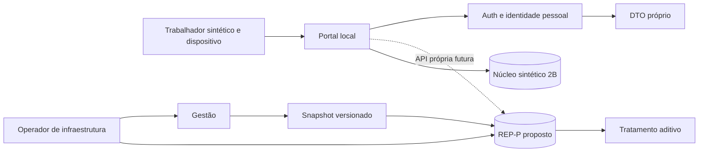

# Modelo de ameaças versionável — Metallo Colaborador e futuro REP-P

**Evidência vigente, 27/09/2026:** Marcos 1A/T05/T15, 1B, 1C e núcleo 2B foram validados exclusivamente no laboratório. A referência é a baseline imutável METALLO-2B-LAB-20260927-R1; provas, dois pareceres Grok e limites estão no [documento 34](34_MARCO_2B_PONTO_EXPERIMENTAL.md). O [Marco 2C](35_MARCO_2C_REVOGACAO_RECUPERACAO_RESILIENCIA.md) acrescenta somente planejamento de revogação/recuperação. As afirmações antigas sobre Docker pendente ou inexistência de Auth/API pessoal não descrevem mais o laboratório atual. Não houve nova execução de testes neste complemento.

**Revisão:** 27/09/2026. **Escopo:** arquitetura/fundação pessoal e núcleo sintético local; não é certificação de segurança ou conformidade. O Metallo ainda não funciona na empresa. Todos os registros mencionados pelo responsável, incluindo cadastros EPI, perfis administrativos, histórico e movimentações, são testes. Portal e ponto experimental existem somente em laboratório; REP-P não existe. **SIMULAÇÃO SEM VALOR OFICIAL.** O conteúdo anterior foi conservado abaixo como histórico; o mapa 2C no final registra as ameaças residuais atuais sem reabrir o fechamento 2B.

## Sistema e fronteiras

| Domínio | Capacidades existentes ou propostas | Fronteira de confiança |
| --- | --- | --- |
| Web/Mobile Gestão | Clientes com sessão Supabase; operações, EPI, equipes e obras. | Cliente não é confiável; RLS e RPC devem validar cada operação. |
| Edge Function `create-employee` | Provisiona usuário/perfil operacional com segredo de serviço no servidor. | Não deve provisionar acesso pessoal; validar administrador no servidor. |
| Banco Gestão | Auth, `profiles`, `epi_employees`, políticas e RPCs operacionais. | `collaborator` pertence à Gestão; ativo nessa fronteira não significa titular pessoal. |
| Fundação 1A local | Conta marcada para portal, vínculo privado auditado, DTO mínimo e revogação no banco. | `auth.uid()` → conta portal → vínculo **ativo** → funcionário; não confiar só em claim. |
| Núcleo 2B local | PGlite separado, API loopback, Auth/JWT e vínculo atuais, tempo do servidor e idempotência. | Sem transação distribuída com Auth; app/admin Gestão não editam original pela API; infraestrutura pode alterar arquivo/código. |
| Futuro REP-P | Originais, NSR, comprovantes, exportações, assinaturas e recuperação, preferencialmente em projeto dedicado. | Dados da Gestão entram por snapshot/evento versionado; Gestão não altera originais. |

**Ativos:** correspondência conta↔pessoa, EPI/ASO, credenciais e logs; no futuro, originais e sequência NSR, comprovantes, assinatura/chaves, snapshots, exportações e disponibilidade. O dispositivo e entradas do cliente são controláveis pelo usuário. Uma conta da Gestão, administrador operacional, DP e operador de infraestrutura possuem poderes distintos. Não presumir que o mesmo ator deve acumular todos.

## Invariantes de autorização e evidência

1. O portal lê só o titular vinculado ativamente; nenhuma API aceita `employee_id` arbitrário para decidir titularidade. ASO e dados de saúde não entram no DTO. Uma conta historicamente ligada a João não passa para Maria.
2. A revogação no banco bloqueia leitura pessoal inclusive com access token ainda válido. Revogar refresh sessions e impedir novo login exigem fluxo Auth comprovado; um teste apenas de RLS não prova isso.
3. `run_site_operation`, hora enviada pelo cliente, fila `SharedPreferences` e UUID operacional da Gestão não constituem API ou registro de ponto.
4. Originais REP-P futuros são aditivos: papéis de trabalhador, gestor, tratamento e administração operacional não recebem UPDATE/DELETE. Retificação é evento separado. O servidor determina tempo e NSR, com idempotência e concorrência testadas.
5. Cada marcação futura carrega snapshot versionado do trabalhador, vínculo, empregador, estabelecimento e coletor, e equipe/obra quando usada. Alteração posterior da Gestão não reescreve a marcação.
6. A preferência histórica de snapshot sem consulta síncrona pertence ao futuro REP-P. No 2B existe consulta síncrona; o 2C propõe mantê-la e negar novas marcações quando a autorização não puder ser comprovada. Indisponibilidade, atraso e reconciliação precisam de política própria antes de uso real.
7. Chaves de serviço/assinatura ficam fora de APK, navegador e repositório. Backup deve abranger DB, Auth/configuração, Storage e verificação de integridade; o ensaio PGlite atual não prova restauração REP-P.
8. GPS é sinal sujeito a erro/falsificação; não gera punição automática. Hora do aparelho não define ponto. Play Protect não equivale a Play Integrity. GPS/foto/BYOD dependem de RIPD e revisão de privacidade antes da coleta real.

## Cenários de ameaça e estado dos controles

**Histórico da fundação em 26/09/2026:** as duas matrizes seguintes preservam a análise anterior aos ensaios reais. Pendências de Auth/REST e inexistência de API nelas mencionadas foram superadas no escopo local descrito no documento 34. Não são uma lista atual de falhas abertas do 2B; consultar o mapa A–H adiante.

### Atores e controles atuais versus futuros

| Ator/falha | Capacidade ou erro plausível | Controle já verificável | Controle ainda necessário |
| --- | --- | --- | --- |
| Trabalhador malicioso | Troca ID, altera app ou reenvia pedido. | DTO local sem ID de entrada; SQL João/Maria com RLS. | Auth/REST real, API de ponto idempotente, proteção de replay. |
| Conta/token roubado | Usa JWT ainda válido ou refresh após desligamento. | Vínculo revogado bloqueia DTO no banco local. | Revogar refresh sessions, impedir novo login, testar JWT antigo e rotação de credenciais. |
| Administrador/encarregado malicioso | Vincula pessoa errada ou tenta atuar sobre ponto e tratamento. | Vínculo registra ator e método; conta não pode ser reutilizada. | DP/segunda confirmação sensível; separar tratamento, original, auditoria e ICP. |
| Erro do DP | Homônimo ou matrícula incorreta. | UUID, nome e matrícula exigidos no laboratório. | Conferência humana documentada e canal de correção com histórico. |
| `service_role` vazada | Bypassa RLS e altera dados operacionais. | Chave de serviço só em função servidor no código local. | Cofre, rotação, escopo, logs, revisão de implantações e resposta a incidente. |
| Migration incorreta | Altera grants/policies ou contamina Gestão/REP-P. | Migration 1A apenas local; comparador e testes sintéticos. | Ambiente descartável fiel, revisão SQL e gate de aprovação por mudança. |
| Sincronização Gestão↔REP-P | Evento atrasado, duplicado, fora de ordem ou perdido. | Contrato arquitetural documentado. | Outbox/inbox, versões, reconciliação, simulações e decisão de contingência. |
| Indisponibilidade/restore divergente | Snapshot antigo ou comprovante ausente após retorno. | Plano de backup e ensaio PGlite sintético. | Restore integral DB/Auth/Storage/integração com hashes e limites aprovados. |
| Chave ICP comprometida | Assinatura de prova indevida. | REP-P/ICP ainda inexistentes. | Custódia segregada, rotação, dupla autorização e auditoria independente. |

O [inventário da superfície do portal](25_INVENTARIO_SUPERFICIE_PORTAL_MARCO_1A.md) lista cada tabela/RPC/Edge Function atualmente observada. O [catálogo remoto](../06_TESTES_E_QUALIDADE/fixtures/supabase-remoto-catalogo-20260926.json) não contém linhas de usuários nem segredos; o laboratório PGlite diverge em grants e gatilhos Auth, portanto os controles de acesso ainda exigem ensaio fiel.

| Cenário | Consequência | Controle atual / lacuna |
| --- | --- | --- |
| João troca `employee_id` ou consulta Maria por REST/RPC. | Exposição de dados de colega. | DTO local sem parâmetro e perfil de Gestão inativo; testes SQL cruzados passaram. REST/Auth e schema fiel pendentes. |
| Admin ativa conta pessoal como `collaborator` da Gestão. | Políticas operacionais amplas passam a valer. | Trigger local impede ativar conta registrada no portal; ainda não implantado. |
| Helper `SECURITY DEFINER` retorna equipe arbitrária. | Revela associação operacional fora do recorte pessoal. | `stock_team`/`employee_work_team` locais negam conta portal; regressão Gestão básica passou. Revisar todo catálogo no ambiente fiel. |
| Conta revogada conserva token/sessão. | Leitura indevida depois do desligamento. | Vínculo revogado nega DTO no mesmo sujeito SQL; Auth refresh/ban/login pendentes. |
| Operador vincula homônimo errado. | Conta vê dados da pessoa errada. | UUID, nome e matrícula exigidos e auditados; DP/dupla conferência de alto risco ainda não implementados. |
| Administrador de Gestão altera originais ou auditoria REP-P. | Integridade da prova comprometida. | REP-P inexistente; preferir domínio e credenciais dedicados, segregação de funções e controles de infraestrutura. |
| Retries/concor­rência duplicam ponto ou NSR. | Sequência e prova inconsistentes. | API de ponto inexistente; definir chave de idempotência, transação e testes concorrentes. |
| Relógio/GPS falsificado ou falha offline. | Registro temporal ou decisão injusta. | Ponto inexistente; tempo servidor, política de falha e contestação humana futuros. |
| Restore de DB sem Storage/Auth. | Comprovantes ou capacidade de verificar inacessíveis. | Plano documental e ensaio sintético; restore integral futuro obrigatório. |

**Ameaça interna:** o responsável que propõe/vincula identidade não deve sozinho controlar tratamento de ponto, chave ICP, originais e auditoria. Para alta ambiguidade, DP propõe e outra pessoa confirma. A separação exata de papéis, custódia de chave e revisão de acesso dependem da estrutura real da empresa.

## Evidência, limites e decisões abertas

Fontes locais: [migration 1A](../04_BANCO_E_SUPABASE/supabase/migrations/20260925120000_employee_identity_foundation.sql), [testes 1A](../06_TESTES_E_QUALIDADE/identidade-colaborador-banco.test.mjs), [tratamento dos 17 achados](24_TRATAMENTO_AUDITORIA_SUPERGROK_MARCO_0.md), [auditoria RPC](21_AUDITORIA_SECURITY_DEFINER.md), [reconciliação](20_RECONCILIACAO_MIGRATIONS_E_TIPOS.md), [plano de recuperação](PLANO_DE_BACKUP_E_RECUPERACAO.md) e [contrato proposto](CONTRATO_GESTAO_REP_P.md). A revisão foi sequencial; nenhuma vulnerabilidade do inexistente REP-P foi explorada ou validada em produção.

Decisões humanas pendentes: identificador empresarial estável, recontratação, Auth REP-P, disponibilidade na falha de Gestão, CNPJ/estabelecimentos e NSR, BYOD, ICP, CCT/ACT, retenção, DPA/região/plano, responsável por backup/restore e política de dual control. Não inferir respostas desses documentos.

## Marco 2C — riscos residuais do nucleo sintetico

### Riscos A–H → ameaça → cenário → controle → aprovação futura

São riscos herdados/documentados ou hipóteses de resiliência, sem nova exploração ou falha crítica/alta demonstrada nesta rodada. Provas anteriores não são descartadas; o objetivo é definir contraprovas futuras mais fortes. IDs de testes referem-se à seção 12 do documento 35.

| Risco | Ameaça concreta / cenário reproduzível futuro | Controle proposto | Teste e critério de aprovação |
| --- | --- | --- | --- |
| A — janela autorização→commit | Revogar após resposta Auth de T4 e liberar o commit; pode haver original após revogação na origem | Consultas atuais + bloqueio/versão local serializados; distinguir Rₐ/Rₙ e registrar caso residual sem editar original | R01/R04: bloquear todos que perdem o corte Rₙ; expor limites antes de Rₙ, sem declarar atomicidade global |
| B — administrador da infraestrutura | Editar/apagar original e recomputar hash em cópia descartável; substituir banco por cópia antiga | Privilégios operacionais mínimos, comparação com âncora externa, quarentena e controle de recuperação | S03/B02: alteração/truncamento detectados em relação ao corte confiável; independência do custodiante explicitada |
| C — outros runtimes/concorrência | Dois writers disputam mesma chave ou revogação; locks locais não se coordenam | Topologias autorizadas separadamente; unique/idempotência transacional, locks/versionamento compartilhados quando houver | C01/C02 e plano de topologias: no máximo um original; segundo processo no diretório PGlite recusado; nenhum sucesso extrapolado |
| D — funções privilegiadas | Helper aceita sujeito de cliente, herda grant amplo ou `search_path` controlável | Menor privilégio, owner/grants/argumentos e caller revisados; manutenção fora da API pessoal | P01: matriz anon/João/Maria/admin/serviço, sem impersonação nem acesso cruzado; auditar função efetiva |
| E — token residual | Copiar JWT sintético e reutilizar após logout/ban, inclusive com refresh | Verificar sessão e vínculo, versão/bloqueio local; TTL como limite auxiliar | R02: negativas por escopo correto; refresh não reativa vínculo; JWT válido não substitui sessão ativa |
| F — logout/sessões | Logout A, resposta atrasada repõe perfil; dispositivo B permanece contra expectativa global | Semântica local/global explícita, limpeza entre abas, descarte de resposta antiga e corte no servidor | L01: A/B/global/troca de conta; nenhuma resposta antiga revela colega ou cria confirmação falsa |
| G — evolução do hash | Upgrade reinterpreta serialização e regrava hash de eventos antigos | Verificadores versionados e bytes/vetores legados; desconhecido falha seguro | H01: v1 continua verificável sem mutação; adulteração e versão inválida detectadas |
| H — restore/recuperação incompletos | Matar processo em cada fase; restaurar backup anterior a evento/revogação; storage read-only/cheio | Startup sem criação/reparo silencioso, E/R coerentes, backup consistente, âncora de geração e quarentena | C01/S01–S03/B01–B03: N e tuplas exatas do corte; retry sem duplicar; rollback temporal impede retomada |

### Administrador privilegiado: ação → detecção → prevenção → evidência

O proprietário do sistema operacional ou banco pode alterar dados, código e logs do próprio domínio. RLS/trigger negam operações comuns, mas não são fronteira suficiente contra esse ator. Owner/superuser têm exceções de RLS documentadas pelo PostgreSQL. [Referência primária](https://www.postgresql.org/docs/current/ddl-rowsecurity.html). As medidas abaixo detectam adulteração **em relação a referência não controlada pelo atacante**; sem isso, não prometer detecção universal.

| Ação em cópia descartável | Detecção proposta | Prevenção possível / limite | Evidência externa necessária |
| --- | --- | --- | --- |
| UPDATE do original | Hash/tupla diverge do inventário confiável | Negar a papéis ordinários; dono pode remover defesa | Hash do corte/registro preservado fora do domínio |
| DELETE de original ou truncar final | Conjunto de IDs/chaves e total divergem; verificação E↔R | Trigger de linha não cobre todos os comandos privilegiados; revisão de grants/DDL | Inventário completo/último corte, não só hash das linhas que sobraram |
| DROP/desabilitar trigger | Catálogo/corpo/permissões diferem antes de startup reparar | App sem DDL; dono pode alterar | Referência de schema/hash aprovada e logs de mudança fora do banco |
| DROP table / TRUNCATE | Falha de catálogo, contagem/relacionamentos/âncora | Negar DDL/TRUNCATE operacional; não recriar vazio automaticamente | Manifesto e backup restaurável independente |
| Alterar payload e recomputar hash | Comparação externa falha; hash interno isolado pode passar | Custódia independente e verificação antes de admissão | Âncora/journal com outro controle administrativo |
| Restaurar backup antigo | Geração/cursor/máximos/corte abaixo da referência confiável | Readiness falsa e retomada explícita; arquivo local do próprio DBA pode ser adulterado | Catálogo monotônico de cortes/gerações fora do restore |
| Alterar contexto/versão de autorização | Divergência com origem/inbox/âncora; origem da mensagem inválida | Serviço de contexto restrito, caller validado; dono do processo ainda ameaça | Autoridade atual + trilha/versão independente |
| Apagar log ou modificar verificador | Hash da distribuição/configuração diverge; ausência de sequência externa | Segregação de implantação e revisão; dono único pode contornar | Referência de código e recebimento de logs em domínio distinto |

Hash encadeado, Merkle e assinatura podem apoiar verificação, mas não salvam dado perdido nem tornam honesto um administrador que controla a chave/âncora. Escolha, intervalo de ancoragem e custódia são decisões posteriores; ICP-Brasil e prova jurídica não integram 2C.

### Sessão roubada e fronteiras de confiança

Atacante de ensaio possui **somente JWT sintético** de João ou também refresh sintético, em dois casos separados. Não possui credencial de manutenção. Ações: POST novo, retry conhecido, intenção alheia, refresh, corrida com logout e com revogação. Critérios: segredo não sai em logs; nenhuma autorização por campo editável; João/Maria isolados; sessão revogada negada depois do corte definido; pedido já confirmado é preservado. Sem captura de tráfego ou dados de pessoas reais.

Retirar sessão/refresh no Auth não apaga a cópia criptográfica já emitida. Ban deve ser ensaiado separadamente: a documentação pública não o define como revogação integral de sessões existentes. [Gestão de usuários Supabase](https://supabase.com/docs/guides/auth/managing-user-data). O estado combinado de identidade/vínculo e sessão é a proposta de defesa; não atribuir automaticamente essa garantia ao `/auth/v1/user` usado no 2B.

O administrador da Gestão, o executor de manutenção, o dono do Windows/PGlite e o auditor são atores distintos no modelo, mesmo que no laboratório uma pessoa exerça várias funções. A segregação efetiva deve ser comprovada antes de piloto; no laboratório, declarar a limitação em vez de inventar independência.
